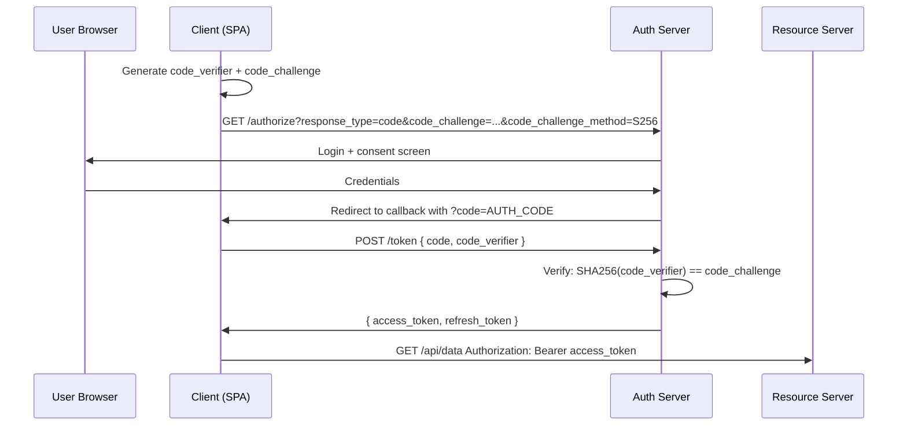

# OAuth 2.0 and PKCE

OAuth 2.0 is an authorization framework that lets a user grant a third-party application limited access to their resources without sharing credentials. PKCE (Proof Key for Code Exchange) is the modern extension that makes public clients — SPAs and mobile apps — secure without a client secret.

## The Authorization Code flow with PKCE



```ts
// Step 1 — generate PKCE pair
function generateCodeVerifier(): string {
  const array = new Uint8Array(32);
  crypto.getRandomValues(array);
  return btoa(String.fromCharCode(...array))
    .replace(/\+/g, '-').replace(/\//g, '_').replace(/=/g, '');
}

async function generateCodeChallenge(verifier: string): Promise<string> {
  const data = new TextEncoder().encode(verifier);
  const digest = await crypto.subtle.digest('SHA-256', data);
  return btoa(String.fromCharCode(...new Uint8Array(digest)))
    .replace(/\+/g, '-').replace(/\//g, '_').replace(/=/g, '');
}

// Step 2 — redirect to authorization server
async function startLogin() {
  const verifier = generateCodeVerifier();
  const challenge = await generateCodeChallenge(verifier);
  sessionStorage.setItem('pkce_verifier', verifier);

  const params = new URLSearchParams({
    response_type: 'code',
    client_id: CLIENT_ID,
    redirect_uri: REDIRECT_URI,
    scope: 'openid profile email',
    code_challenge: challenge,
    code_challenge_method: 'S256',
    state: crypto.randomUUID(), // CSRF protection
  });

  window.location.href = `${AUTH_SERVER}/authorize?${params}`;
}

// Step 3 — exchange code for tokens
async function handleCallback(code: string): Promise<Tokens> {
  const verifier = sessionStorage.getItem('pkce_verifier')!;
  sessionStorage.removeItem('pkce_verifier');

  const response = await fetch(`${AUTH_SERVER}/token`, {
    method: 'POST',
    headers: { 'Content-Type': 'application/x-www-form-urlencoded' },
    body: new URLSearchParams({
      grant_type: 'authorization_code',
      code,
      redirect_uri: REDIRECT_URI,
      client_id: CLIENT_ID,
      code_verifier: verifier,
    }),
  });

  return response.json();
}
```

## Why PKCE defeats code interception attacks

Without PKCE, if an attacker intercepts the `?code=` in the redirect URL (via a malicious browser extension or open redirect), they can exchange it for tokens using just the `client_id` (public). With PKCE, the auth server demands the `code_verifier` that only the legitimate client knows. Interception is useless.

## OAuth grant types

| Grant type | Use case | Notes |
|-----------|----------|-------|
| Authorization Code + PKCE | SPAs, mobile apps | The right choice for anything running in a browser |
| Authorization Code (+ secret) | Server-side web apps | Client secret is safe on the server |
| Client Credentials | Machine-to-machine (no user) | Only for backend service-to-service |
| Implicit | ~~SPAs~~ (deprecated) | Never use — tokens in URL fragment, no PKCE |
| Resource Owner Password | ~~First-party legacy~~ | Never use — user hands credentials to the client |

## Scopes and consent

Scopes are space-separated strings the client requests: `openid profile email offline_access`. The auth server shows a consent screen listing what the app is asking for. `offline_access` requests a refresh token.

```ts
// Request minimal scopes — principle of least privilege
const scopes = [
  'openid',       // ID token
  'profile',      // name, picture
  'email',        // email
  // Not requesting 'calendar' unless the app needs it
].join(' ');
```

## Related

- See also: [Auth → JWT and Sessions](#/codex/auth-jwt-and-sessions) for token formats.
- See also: [Auth → OpenID Connect and Identity](#/codex/auth-openid-connect) for ID tokens.
- See also: [Security → CSRF and XSS Defences](#/codex/security-csrf-and-xss) for state parameter validation.

## Sources

- [RFC 7636 — PKCE](https://datatracker.ietf.org/doc/html/rfc7636)
- [RFC 6749 — OAuth 2.0](https://datatracker.ietf.org/doc/html/rfc6749)
- [OAuth 2.0 for Browser-Based Apps](https://datatracker.ietf.org/doc/html/draft-ietf-oauth-browser-based-apps)
- [auth0 — OAuth 2.0 PKCE](https://auth0.com/docs/get-started/authentication-and-authorization-flow/authorization-code-flow-with-pkce)
