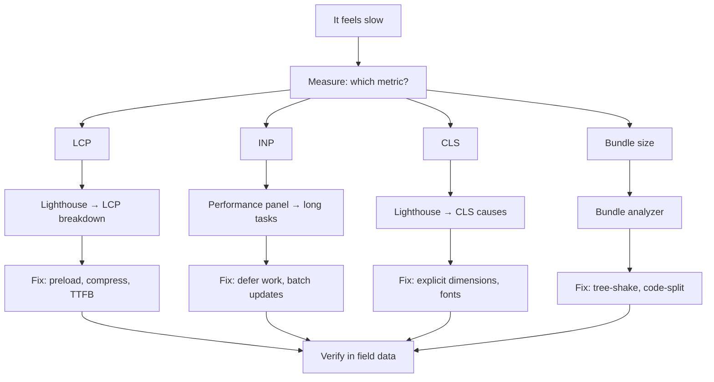

# Performance Debugging Runbook

A systematic workflow for diagnosing and fixing frontend performance problems. "It feels slow" is the starting symptom; this runbook turns it into a specific fix.

## Step 1 — Reproduce in the right conditions

Lab conditions differ from the field. Set up a realistic environment first:

```bash
# 1. Disable extensions — they affect performance measurements
# Chrome: Open in Incognito mode (extensions disabled by default)

# 2. Simulate the user's hardware
# DevTools → Performance → Throttle CPU: 4x slowdown (simulates mid-range mobile)
# DevTools → Network: Throttle to "Fast 4G"

# 3. Disable caching to measure cold load
# DevTools → Network → Disable cache (only while DevTools is open)

# 4. Use a production build — dev builds are 2-10x slower
npm run build && npm run serve
```

## Step 2 — Identify the metric

What are you actually measuring? Don't debug "it's slow" — debug a specific metric:

| Symptom | Metric | Tool |
|---------|--------|------|
| Page takes long to show content | LCP | Lighthouse, WebPageTest |
| Interactions feel laggy | INP | Chrome DevTools Performance panel |
| Layout shifts on load | CLS | Lighthouse |
| Slow initial JavaScript | Time to Interactive | Lighthouse bundle analysis |
| Janky scrolling/animation | Dropped frames | DevTools Performance |
| Memory grows over time | Heap size | DevTools Memory panel |

## Step 3 — LCP diagnosis workflow

```
1. Open Lighthouse (DevTools → Lighthouse → Run audit)
2. Find the LCP element — highlighted in the report
3. Check the LCP sub-breakdown:
   - TTFB high (>800ms) → server is slow → CDN, caching, DB queries
   - Resource load delay (>0ms) → image discovered late → add preload
   - Resource load time (>0ms) → image is large → compress, resize, serve WebP
   - Element render delay → render-blocking scripts → defer/async

4. Fix order of priority:
   a. Eliminate render-blocking CSS/JS
   b. Preload the LCP image: <link rel="preload" as="image" href="hero.webp" fetchpriority="high">
   c. Set explicit width/height to prevent layout shift
   d. Serve WebP/AVIF from a CDN with correct Cache-Control
```

## Step 4 — INP diagnosis workflow

```
1. Open Performance panel → Record → Interact with the page → Stop
2. Look at the Main track for long tasks (red triangles, >50ms)
3. Click a long task → expand the call stack in the flame chart
4. Identify the hot function (widest bar in the task)

Common causes and fixes:
- Event handler doing too much → break with setTimeout or startTransition
- Synchronous state update causing full re-render → batch with React 18 automatic batching
- Third-party script running → block + measure, consider defer
- Layout forced by JS read/write interleaving → batch reads first, then writes

5. Verify fix: re-record and check the long task is gone
```

## Step 5 — Bundle analysis

```bash
# webpack-bundle-analyzer
npm install --save-dev webpack-bundle-analyzer
npx webpack-bundle-analyzer dist/static/js/*.js.map

# Next.js built-in
ANALYZE=true npm run build
# Opens treemap in browser

# Check for duplicate packages
npx duplicate-package-checker-webpack-plugin

# What's actually in a module?
npx bundlephobia lodash
# → "lodash: 71.5KB gzipped — do you need the whole thing?"
```

## Step 6 — Dropped frames / animation jank

```
1. Performance panel → check "FPS" chart at the top
   - Green bars at 60fps = smooth
   - Red/drops = jank
2. Find the frame that dropped → expand the Main track
3. Look for purple "Layout" or "Recalculate Style" inside rAF callbacks
   → you're reading layout properties (offsetWidth) inside animation callbacks
4. Fix: read all layout values before writing, or use CSS transform instead of left/top
```

## Step 7 — Verify with field data

Lab fixes must translate to real-user improvements. Check the Chrome User Experience Report (CrUX):

```bash
# PageSpeed Insights — real CrUX data for your URL
curl "https://www.googleapis.com/pagespeedonline/v5/runPagespeed?url=https://example.com&strategy=mobile"

# web-vitals npm package — instrument your app
import { onLCP, onINP, onCLS } from 'web-vitals';
onLCP(({ value }) => analytics.track('lcp', { value }));
```

## Runbook summary



## Related

- See also: [Debugging → Chrome DevTools Deep Dive](#/codex/debugging-chrome-devtools-deep-dive) for DevTools mechanics.
- See also: [Performance → Core Web Vitals](#/codex/performance-core-web-vitals) for metric thresholds.
- See also: [Performance → Runtime Perf Profiling](#/codex/performance-runtime-perf-profiling) for flame chart reading.

## Sources

- [Chrome DevTools — Performance features](https://developer.chrome.com/docs/devtools/performance/reference)
- [web.dev — Diagnose slow interactions](https://web.dev/articles/diagnose-slow-interactions-in-the-lab)
- [web.dev — Optimize LCP](https://web.dev/articles/optimize-lcp)
- [PageSpeed Insights API](https://developers.google.com/speed/docs/insights/v5/get-started)
