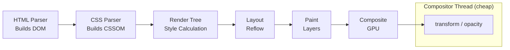

# Browser Rendering Pipeline

The browser converts HTML, CSS, and JavaScript into pixels through a sequence of stages. Knowing which stages are triggered by which operations is the difference between writing smooth animations and accidentally causing layout thrash.

## The pipeline stages

**Parse** — the HTML parser builds the DOM tree and the CSS parser builds the CSSOM. These can happen in parallel, but JavaScript blocks HTML parsing unless the script tag has `async` or `defer`. The CSSOM must be fully built before the render tree is constructed.

**Style** — the browser combines DOM and CSSOM into a render tree, computing the final computed style for every visible element.

**Layout** (reflow) — the browser calculates the size and position of each element. A change to any geometric property (`width`, `height`, `margin`, `padding`, `top`, `left`, `font-size`) triggers a layout pass for the affected element and potentially its ancestors and siblings.

**Paint** — the browser fills in pixels on layers. Each layer is painted independently.

**Composite** — the browser's compositor thread combines the painted layers and sends the final frame to the GPU.

## Why `transform` and `opacity` are cheap

The critical insight is that `transform` and `opacity` run entirely on the compositor thread — they bypass layout and paint entirely. This is why GPU-accelerated animations stay at 60fps even when the main thread is busy.

```css
/* ❌ Triggers layout → paint → composite on every frame */
.panel {
  transition: left 0.3s ease;
}

/* ✅ Skips layout and paint — compositor-only */
.panel {
  transition: transform 0.3s ease;
}
```

The practical rule: animate `transform` and `opacity`. Everything else — `top`, `left`, `width`, `height`, `background-color` — forces at least a paint pass, and width/height changes force a full layout.

## Promoting a layer with `will-change`

You can give the browser a hint to promote an element to its own compositor layer before the animation starts:

```css
.drawer {
  will-change: transform;
}
```

Use this sparingly. Each compositor layer consumes GPU memory. Blanket `will-change: transform` on everything is a common cause of memory pressure on low-end devices.

## When layout thrash happens

Layout thrash occurs when you interleave reads and writes to the DOM in a loop:

```ts
// ❌ Causes layout thrash — each read forces layout to flush pending writes
const widths = items.map((el) => {
  el.style.width = '100px'; // write
  return el.getBoundingClientRect().width; // read — forces layout
});

// ✅ Batch reads before writes
const rects = items.map((el) => el.getBoundingClientRect()); // all reads first
items.forEach((el) => { el.style.width = '100px'; });        // then all writes
```

`getBoundingClientRect`, `offsetWidth`, `offsetHeight`, `scrollTop`, and `clientWidth` all force the browser to flush pending layout changes before returning. Avoid calling them in loops between DOM mutations.

## `requestAnimationFrame` batching

To schedule DOM mutations for the next paint:

```ts
function smoothUpdate(elements: HTMLElement[], targetHeight: number) {
  requestAnimationFrame(() => {
    elements.forEach((el) => {
      el.style.height = `${targetHeight}px`;
    });
  });
}
```

Everything scheduled inside a single `rAF` callback runs before the next paint. Nested `rAF` calls defer to the frame after next.

## Related

- See also: [Foundations → DOM Internals](#/codex/foundations-dom-internals) for `getBoundingClientRect` costs in more detail.
- See also: [Performance → Runtime Perf Profiling](#/codex/performance-runtime-perf-profiling) for reading flame charts to confirm which stages are triggering.



## Sources

- [web.dev — Rendering Performance](https://web.dev/articles/rendering-performance)
- [Chrome Developers — Inside look at modern web browser (part 3)](https://developer.chrome.com/blog/inside-browser-part3)
- [MDN — How browsers work](https://developer.mozilla.org/en-US/docs/Web/Performance/How_browsers_work)
- [MDN — `will-change`](https://developer.mozilla.org/en-US/docs/Web/CSS/will-change)
