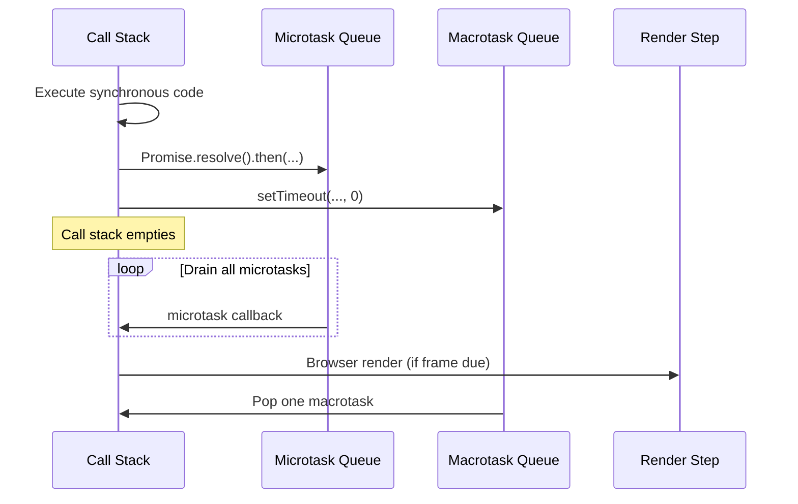

# Event Loop

JavaScript is single-threaded. The event loop is the mechanism that lets it handle asynchronous operations without blocking. Understanding it precisely matters for predicting callback order and for diagnosing why your animation runs at half speed after a heavy computation.

## The components

**Call stack** — a LIFO stack of execution contexts. When a function is called, a frame is pushed. When it returns, the frame is popped. Synchronous code runs here.

**Microtask queue** — holds callbacks from Promise `.then`/`.catch`/`.finally` chains and `queueMicrotask`. The microtask queue is drained *completely* after every task before the next task starts. This means microtasks can starve the event loop if they keep enqueuing more microtasks.

**Macrotask queue** (task queue) — holds callbacks from `setTimeout`, `setInterval`, `setImmediate` (Node), I/O, and UI events. One macrotask is run per event loop iteration.

**Render steps** — between tasks, the browser may run style, layout, and paint if enough time has passed for the target frame rate (typically every 16ms at 60fps). `requestAnimationFrame` callbacks run as part of the render step.

## Order of execution

```ts
console.log('1 — synchronous');

setTimeout(() => console.log('4 — macrotask'), 0);

Promise.resolve()
  .then(() => console.log('2 — microtask'))
  .then(() => console.log('3 — second microtask'));

console.log('1b — still synchronous');
```

Output: `1 — synchronous`, `1b — still synchronous`, `2 — microtask`, `3 — second microtask`, `4 — macrotask`.

The call stack must be empty before microtasks run. All microtasks run before the next macrotask.

## `queueMicrotask`

Adds a function to the microtask queue without Promise overhead:

```ts
function deferWork(fn: () => void) {
  queueMicrotask(fn);
}
```

Useful when you need something to run after the current synchronous block but before any `setTimeout` callbacks. Avoid it for long-running work — it still blocks rendering.

## Microtask starvation

```ts
function recursiveMicrotask() {
  Promise.resolve().then(() => {
    doWork();
    recursiveMicrotask(); // ❌ never yields to the render step
  });
}
```

The render step never runs because the microtask queue is never empty. Use `setTimeout(fn, 0)` or `scheduler.yield()` (see Performance → INP) to break the work into tasks.

## Animation frame timing

`requestAnimationFrame` callbacks run *before* paint, inside the render step:

```ts
let scheduled = false;

function scheduleRedraw(canvas: HTMLCanvasElement) {
  if (scheduled) return;
  scheduled = true;
  requestAnimationFrame((timestamp) => {
    scheduled = false;
    redraw(canvas, timestamp);
  });
}
```

The `timestamp` is the same for all `rAF` callbacks in the same frame — useful for synchronising multiple animations without separate `Date.now()` calls.

## Long tasks and responsiveness

Any synchronous block that runs for more than 50ms is a "long task" and will delay paint and input handling. The browser cannot interrupt a running task. Break heavy computation with `setTimeout` (macrotask boundary) or `scheduler.yield` (gives back control with minimum delay):

```ts
async function processLargeDataset(items: DataRow[]) {
  for (let i = 0; i < items.length; i++) {
    process(items[i]);
    if (i % 100 === 0) {
      await new Promise((resolve) => setTimeout(resolve, 0)); // yield to event loop
    }
  }
}
```

## The loop visualised



## Related

- See also: [Performance → INP & Input Latency](#/codex/performance-inp-and-input-latency) for `scheduler.yield` and long task budgets.
- See also: [React → Concurrent Rendering & Suspense](#/codex/react-concurrent-rendering-and-suspense) for how React 18 uses this to interleave rendering with user input.

## Sources

- [MDN — Event loop](https://developer.mozilla.org/en-US/docs/Web/JavaScript/Event_loop)
- [HTML Living Standard — Event loop processing model](https://html.spec.whatwg.org/multipage/webappapis.html#event-loop-processing-model)
- [Jake Archibald — Tasks, microtasks, queues and schedules](https://jakearchibald.com/2015/tasks-microtasks-queues-and-schedules/)
- [MDN — `queueMicrotask()`](https://developer.mozilla.org/en-US/docs/Web/API/queueMicrotask)
