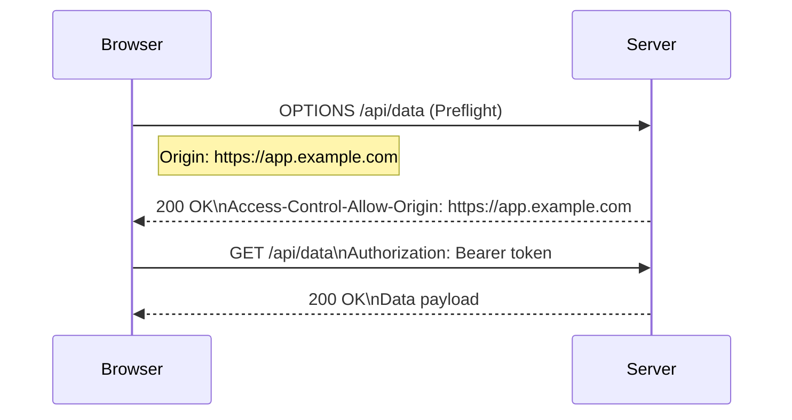

# HTTP Fundamentals

Frontend engineers interact with HTTP daily but rarely need to understand the protocol deeply — until a caching bug takes half a day to diagnose or a CORS preflight starts failing in production. This entry covers the parts that actually matter.

## HTTP/2 multiplexing

HTTP/1.1 had head-of-line blocking: each connection could carry one request at a time. Browsers compensated by opening 6 connections per origin. HTTP/2 multiplexes multiple streams over a single TCP connection, eliminating the 6-connection limit and making domain sharding counterproductive.

Practical implication: bundling every resource into one giant file is no longer mandatory for HTTP/2 origins. Smaller chunks with good caching headers often outperform a monolith.

## HTTP/3 and QUIC

HTTP/3 replaces TCP with QUIC (UDP-based). Key benefit: no head-of-line blocking at the transport layer. With HTTP/2 over TCP, a single lost packet blocks all streams. QUIC streams are independent — a lost packet only blocks its own stream.

Frontend engineers rarely configure HTTP/3 directly, but understanding that QUIC eliminates the connection overhead of TLS handshake (0-RTT resumption) explains why switching CDN providers can dramatically change latency numbers.

## Caching headers

The most important cache headers and what they mean:

```
Cache-Control: public, max-age=31536000, immutable
```

- `public` — CDNs can cache this response (not just the browser).
- `max-age=31536000` — cache for one year (in seconds).
- `immutable` — tells the browser not to revalidate even on forced reload, since the content will never change. Use only on content-addressed URLs (e.g. `bundle.abc123.js`).

```
Cache-Control: no-cache
```

Counterintuitively, `no-cache` does *not* mean "don't cache." It means "cache but revalidate before use." The browser stores the response and sends a conditional request (`If-None-Match` or `If-Modified-Since`) on reuse. If the server returns 304, the cached version is used.

```
Cache-Control: no-store
```

This one actually prevents caching. Use it for sensitive data (session tokens, private API responses).

**Content-addressed caching strategy**: give bundled assets a content hash in the filename (`main.a8f3bc2.js`) and serve them with `Cache-Control: public, max-age=31536000, immutable`. Serve the HTML with `Cache-Control: no-cache` so the fingerprinted references always update.

## CORS preflight rules

CORS applies to cross-origin requests — requests where the scheme, host, or port differs from the page's origin.

**Simple requests** (no preflight): `GET`, `HEAD`, `POST` with certain content types (`application/x-www-form-urlencoded`, `multipart/form-data`, `text/plain`) and no custom headers.

**Preflighted requests**: anything else. The browser sends an `OPTIONS` request first:

```
OPTIONS /api/data HTTP/2
Origin: https://app.example.com
Access-Control-Request-Method: PUT
Access-Control-Request-Headers: Content-Type, Authorization
```

The server must respond with the appropriate `Access-Control-Allow-*` headers:

```
Access-Control-Allow-Origin: https://app.example.com
Access-Control-Allow-Methods: GET, POST, PUT, DELETE
Access-Control-Allow-Headers: Content-Type, Authorization
Access-Control-Max-Age: 86400
```

`Access-Control-Max-Age` tells the browser to cache the preflight result for the specified seconds (86400 = one day), avoiding a preflight on every request.

A common mistake: setting `Access-Control-Allow-Origin: *` works for anonymous requests but breaks when `credentials: 'include'` is needed (cookies, auth headers). Credentialed requests require an explicit origin, not `*`.

## Related

- See also: [Performance → LCP Deep Dive](#/codex/performance-lcp-deep-dive) for how caching headers affect page load metrics.
- See also: [Foundations → Browser Rendering Pipeline](#/codex/foundations-browser-rendering-pipeline) for request waterfall timing.



## Sources

- [MDN — HTTP](https://developer.mozilla.org/en-US/docs/Web/HTTP)
- [MDN — CORS](https://developer.mozilla.org/en-US/docs/Web/HTTP/CORS)
- [RFC 9110 — HTTP Semantics](https://www.rfc-editor.org/rfc/rfc9110)
- [web.dev — HTTP/3 is now a standard](https://web.dev/articles/http3)
