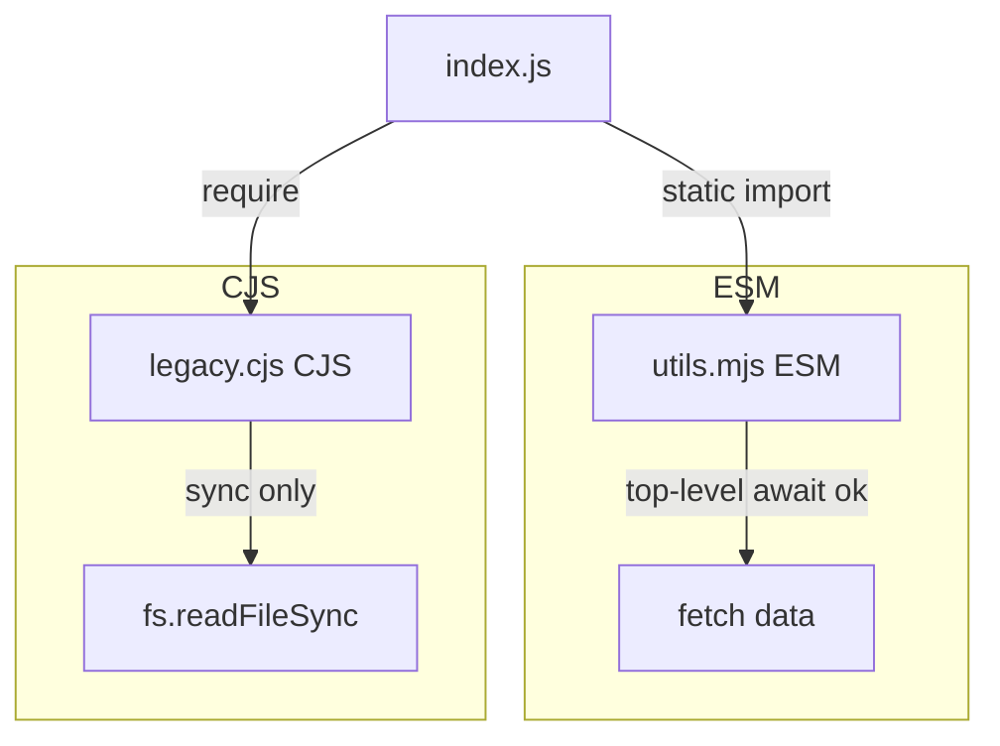

# Modules: ESM vs CJS

ES Modules (ESM) and CommonJS (CJS) are two incompatible module systems that coexist in the Node.js and bundler ecosystem. Understanding their differences is essential for building libraries, configuring bundlers, and debugging the cryptic errors that occur at their boundaries.

## The fundamental difference

**CommonJS** — synchronous, dynamic, evaluated at runtime:

```js
// Values are resolved when require() executes
const { readFile } = require('fs');
const config = require('./config'); // evaluated NOW
const plugin = require(`./plugins/${name}`); // dynamic string — valid CJS
```

**ESM** — static, declarative, resolved at parse time:

```ts
// Import declarations are hoisted and resolved before execution
import { readFile } from 'node:fs/promises';
import type { Config } from './config.js'; // type-only, erased at build

// Dynamic import() is available but it's a function call, not a declaration
const plugin = await import(`./plugins/${name}.js`);
```

The static nature of ESM import declarations is what enables tree-shaking. A bundler can analyse imports at build time and eliminate dead code before execution.

## Why CJS breaks tree-shaking

```js
// CJS — exports is a runtime object; bundler cannot know at build time what's used
module.exports = {
  formatDate: (d) => d.toISOString(),
  formatCurrency: (n) => `€${n.toFixed(2)}`,
  formatDistance: (m) => `${m}km`,
};

// Import — even if you only use formatDate, the bundler must include all three
const { formatDate } = require('./format');
```

With ESM, each named export is a distinct binding the bundler can track statically:

```ts
// ESM — bundler knows exactly which exports are imported at build time
export function formatDate(d: Date) { return d.toISOString(); }
export function formatCurrency(n: number) { return `€${n.toFixed(2)}`; }
export function formatDistance(m: number) { return `${m}km`; }

// Only formatDate is included in the bundle
import { formatDate } from './format.js';
```

## Dual packages — `package.json` exports field

Libraries that need to support both ESM and CJS consumers use the `exports` field:

```json
{
  "name": "@myorg/utils",
  "exports": {
    ".": {
      "import": "./dist/esm/index.js",
      "require": "./dist/cjs/index.cjs",
      "types": "./dist/types/index.d.ts"
    },
    "./format": {
      "import": "./dist/esm/format.js",
      "require": "./dist/cjs/format.cjs"
    }
  }
}
```

The `exports` field replaces `main` for modern consumers. It also enables subpath exports, letting consumers import `@myorg/utils/format` directly without barrel files.

**The dual package hazard**: if a consumer mixes CJS and ESM imports of the same package, they get two separate instances. For packages that use singletons (like React), this causes subtle bugs — two React instances cannot share context.

## ESM in the browser

```html
<script type="module" src="./app.js"></script>
```

Browser ESM: supports `import`/`export`, top-level `await`, `import.meta.url`. Automatically deferred (like `defer`). Does not require a bundler for development — Vite's dev server serves raw ESM.

## `import.meta`

ESM-specific metadata:

```ts
import.meta.url;        // URL of the current module
import.meta.env;        // bundler-injected env vars (Vite/Webpack)
import.meta.resolve?.('lodash'); // resolve module path without importing
```

Useful for finding the current file's directory in Node ESM (the `__dirname` replacement):

```ts
import { fileURLToPath } from 'node:url';
import { dirname, resolve } from 'node:path';

const __dirname = dirname(fileURLToPath(import.meta.url));
const configPath = resolve(__dirname, '../config.json');
```

## Related

- See also: [Bundlers → Tree-Shaking & Side Effects](#/codex/bundlers-tree-shaking-and-side-effects) for the `sideEffects` field.
- See also: [Bundlers → Webpack Architecture](#/codex/bundlers-webpack-architecture) for how webpack resolves modules.



## Sources

- [MDN — JavaScript modules](https://developer.mozilla.org/en-US/docs/Web/JavaScript/Guide/Modules)
- [Node.js — Modules: ECMAScript modules](https://nodejs.org/api/esm.html)
- [V8 blog — JavaScript modules](https://v8.dev/features/modules)
- [web.dev — JavaScript modules](https://web.dev/articles/javascript-modules)
