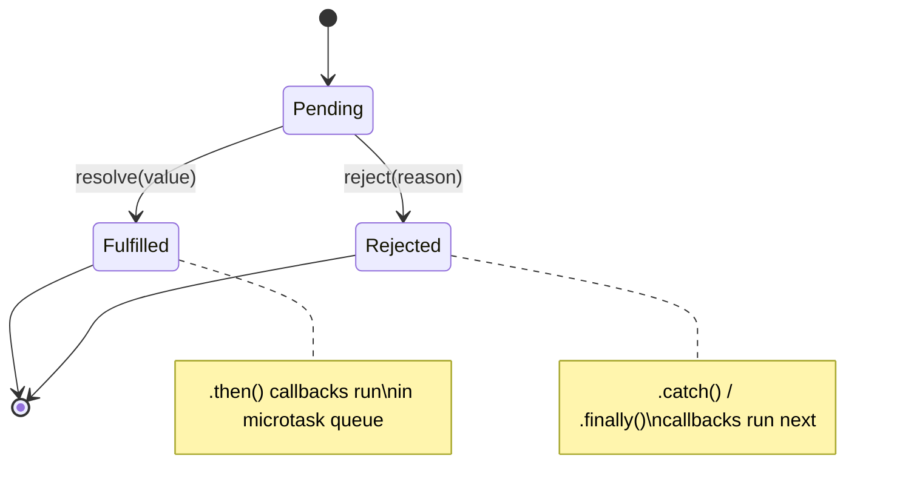

# Promises & async/await

Promises represent asynchronous values. `async/await` is syntax sugar over Promises — the runtime desugars every `await` into a `.then()` callback. Knowing this desugaring is essential for predicting microtask order and for debugging async bugs that appear non-deterministic.

## Microtask scheduling

Every `.then()` callback is a microtask (see Foundations → Event Loop). This means Promise callbacks always run after the current synchronous code completes, but before any `setTimeout`:

```ts
console.log('A');
Promise.resolve('B').then(console.log);
console.log('C');
// Output: A, C, B
```

`async/await` desugars to the same scheduling:

```ts
async function run() {
  console.log('A');
  await Promise.resolve(); // equivalent to .then(() => {})
  console.log('C');        // microtask — runs after current sync block
}

run();
console.log('B');
// Output: A, B, C
```

## Parallel vs serial execution

```ts
// ❌ Serial — each await waits for the previous to complete
async function loadDashboard(userId: string) {
  const profile = await fetchProfile(userId);   // waits
  const orders = await fetchOrders(userId);      // waits for profile first
  const reviews = await fetchReviews(userId);    // waits for orders first
  return { profile, orders, reviews };           // total: 3 sequential round trips
}

// ✅ Parallel — all three requests start simultaneously
async function loadDashboard(userId: string) {
  const [profile, orders, reviews] = await Promise.all([
    fetchProfile(userId),
    fetchOrders(userId),
    fetchReviews(userId),
  ]);
  return { profile, orders, reviews }; // total: 1 round trip (slowest of the three)
}
```

`await` inside a loop is a common parallelism mistake — use `Promise.all(array.map(...))` instead.

## `Promise.allSettled` — when you need all results regardless of failure

```ts
const results = await Promise.allSettled([
  fetchWidget('weather'),
  fetchWidget('finance'),
  fetchWidget('news'),
]);

const widgets = results
  .filter((r): r is PromiseFulfilledResult<Widget> => r.status === 'fulfilled')
  .map((r) => r.value);

const failed = results
  .filter((r): r is PromiseRejectedResult => r.status === 'rejected')
  .map((r) => r.reason);
```

`Promise.all` rejects immediately when any input rejects (short-circuits). `Promise.allSettled` waits for all to settle and returns an array of result objects — no short-circuit. Use it when partial success is acceptable.

## AbortController for cancellable requests

```ts
class DataLoader {
  private controller: AbortController | null = null;

  async load(url: string) {
    this.controller?.abort(); // cancel previous request
    this.controller = new AbortController();

    try {
      const response = await fetch(url, { signal: this.controller.signal });
      return await response.json();
    } catch (err) {
      if (err instanceof DOMException && err.name === 'AbortError') {
        return null; // expected cancellation — not an error
      }
      throw err;
    }
  }
}
```

Pass the `AbortSignal` through every async call in the chain so all work stops when cancelled. In React, call `controller.abort()` in `useEffect`'s cleanup function.

## Error handling — catch vs try/catch

Both forms are equivalent. The `try/catch` form is generally clearer for complex flows:

```ts
// Equivalent forms
fetchUser(id).then(setUser).catch(setError);

try {
  const user = await fetchUser(id);
  setUser(user);
} catch (err) {
  setError(err instanceof Error ? err : new Error('Unknown error'));
}
```

Unhandled Promise rejections cause warnings (Node) or console errors (browser). Always chain a `.catch()` or wrap in `try/catch`. In React event handlers (which are not async by default), unhandled rejections in fire-and-forget Promises are common:

```ts
// ❌ Unhandled rejection if saveRecord() throws
const handleSave = () => { saveRecord(formData); };

// ✅ Handle errors explicitly
const handleSave = () => {
  saveRecord(formData).catch((err) => showErrorToast(err.message));
};
```

## Related

- See also: [Foundations → Event Loop](#/codex/foundations-event-loop) for the microtask queue and macrotask distinction.
- See also: [JavaScript → Iterators & Generators](#/codex/javascript-iterators-and-generators) for async generators and streaming.



## Sources

- [MDN — Promise](https://developer.mozilla.org/en-US/docs/Web/JavaScript/Reference/Global_Objects/Promise)
- [MDN — async function](https://developer.mozilla.org/en-US/docs/Web/JavaScript/Reference/Statements/async_function)
- [V8 blog — Faster async functions and promises](https://v8.dev/blog/fast-async)
- [MDN — Using promises](https://developer.mozilla.org/en-US/docs/Web/JavaScript/Guide/Using_promises)
