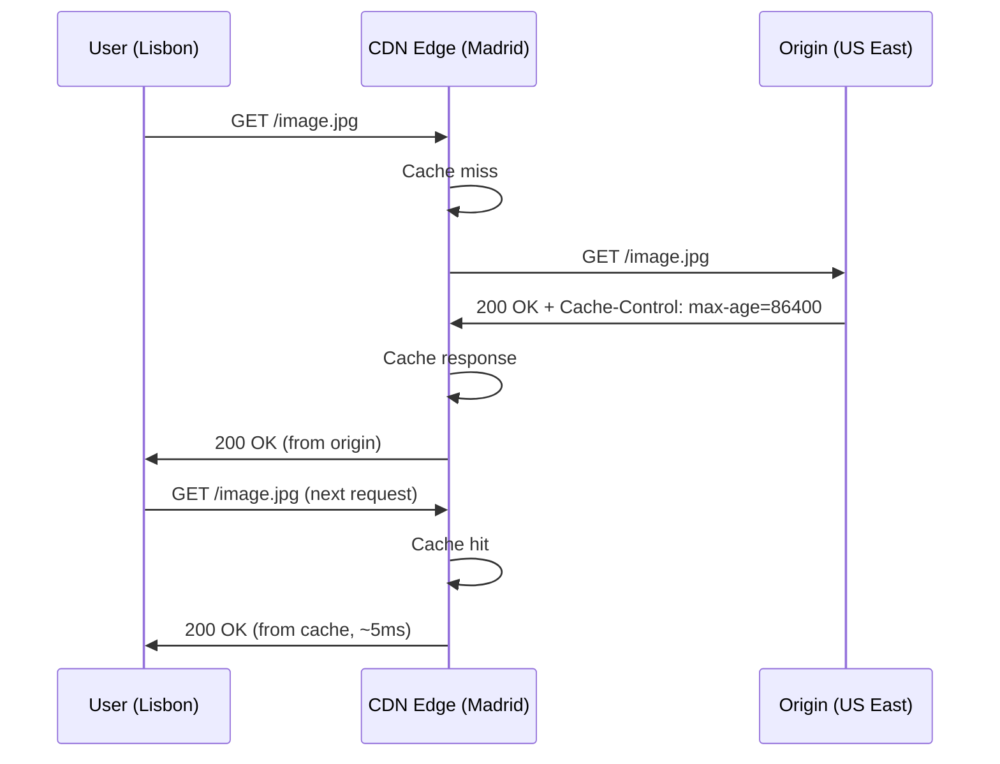

# CDNs and Edge Computing

A CDN (Content Delivery Network) is a distributed network of servers that caches your content close to users. Edge computing extends this by running code at the CDN nodes — logic executes a few milliseconds from the user rather than hundreds of milliseconds away in a central datacenter.

## How CDNs work



The key insight: CDN reduces **time-to-first-byte** by eliminating the round-trip to origin. For static assets, this cuts 200–500ms off every uncached load.

## Cache-Control for CDN

```http
# Static assets with content hash — cache forever at CDN and browser
Cache-Control: public, max-age=31536000, immutable, s-maxage=31536000

# API responses — CDN cache for 60s, browser must revalidate
Cache-Control: public, s-maxage=60, max-age=0, stale-while-revalidate=300

# User-specific content — browser only, not CDN
Cache-Control: private, max-age=300

# Never cache
Cache-Control: no-store
```

`s-maxage` overrides `max-age` specifically for shared caches (CDN). Set it independently for fine-grained control.

## Edge Functions

Edge Functions run server-side logic at CDN nodes. Common uses: A/B testing, feature flags, auth checks, personalisation, and request/response transformation — all without a round-trip to origin.

```ts
// Cloudflare Workers / Vercel Edge Middleware
export async function middleware(request: NextRequest) {
  const url = request.nextUrl.clone();

  // Geo-routing at the edge — no origin round-trip
  const country = request.geo?.country ?? 'US';
  if (country === 'PT' && !url.pathname.startsWith('/pt')) {
    url.pathname = `/pt${url.pathname}`;
    return NextResponse.redirect(url);
  }

  // A/B test — assign variant in cookie if absent
  const variant = request.cookies.get('variant')?.value
    ?? (Math.random() < 0.5 ? 'a' : 'b');

  const response = NextResponse.next();
  response.cookies.set('variant', variant, { maxAge: 60 * 60 * 24 * 7 });
  return response;
}

export const config = { matcher: '/((?!_next/static|favicon.ico).*)' };
```

## Cache invalidation

The hardest problem in CDN management. Three approaches:

```bash
# 1. Purge by URL (immediate, targeted)
curl -X DELETE "https://api.cloudflare.com/client/v4/zones/{zone}/purge_cache" \
  -H "Authorization: Bearer $CF_TOKEN" \
  -d '{"files": ["https://example.com/api/data"]}'

# 2. Purge by tag (requires tagged cache responses)
# Cache-Tag: product-123, category-electronics
curl -X DELETE .../purge_cache -d '{"tags": ["product-123"]}'

# 3. Version the URL (most reliable — no purge needed)
# /api/data?v=2026-04-29
# Old URL serves old cache; new URL fetches from origin
```

The most reliable invalidation strategy is content-addressed URLs — when content changes, the URL changes (filename hash or query version). No explicit purge needed.

## Edge vs serverless vs traditional servers

| | CDN Edge | Serverless (Lambda) | Traditional |
|--|---------|---------------------|-------------|
| Cold start | ~0ms | 50–500ms | ~0ms |
| Location | 200+ PoPs | 2–10 regions | 1–few regions |
| Runtime | V8 isolates (no Node.js APIs) | Full Node.js | Full Node.js |
| Duration limit | 5–50ms CPU | 15 min | Unlimited |
| Cost at scale | Very low | Low | Higher |

Edge functions lack Node.js built-ins (`fs`, `crypto.createCipher`, etc.) — use the Web Crypto API and `fetch` only.

## Related

- See also: [Networking → HTTP Caching](#/codex/networking-http-caching) for Cache-Control mechanics.
- See also: [Performance → LCP Deep Dive](#/codex/performance-lcp-deep-dive) for CDN impact on LCP.
- See also: [Networking → HTTPS and TLS](#/codex/networking-https-and-tls) for TLS termination at the edge.

## Sources

- [Cloudflare — How CDNs work](https://www.cloudflare.com/learning/cdn/what-is-a-cdn/)
- [Vercel — Edge Functions](https://vercel.com/docs/functions/edge-functions)
- [web.dev — Content delivery networks](https://web.dev/articles/content-delivery-networks)
- [Cloudflare Workers docs](https://developers.cloudflare.com/workers/)
