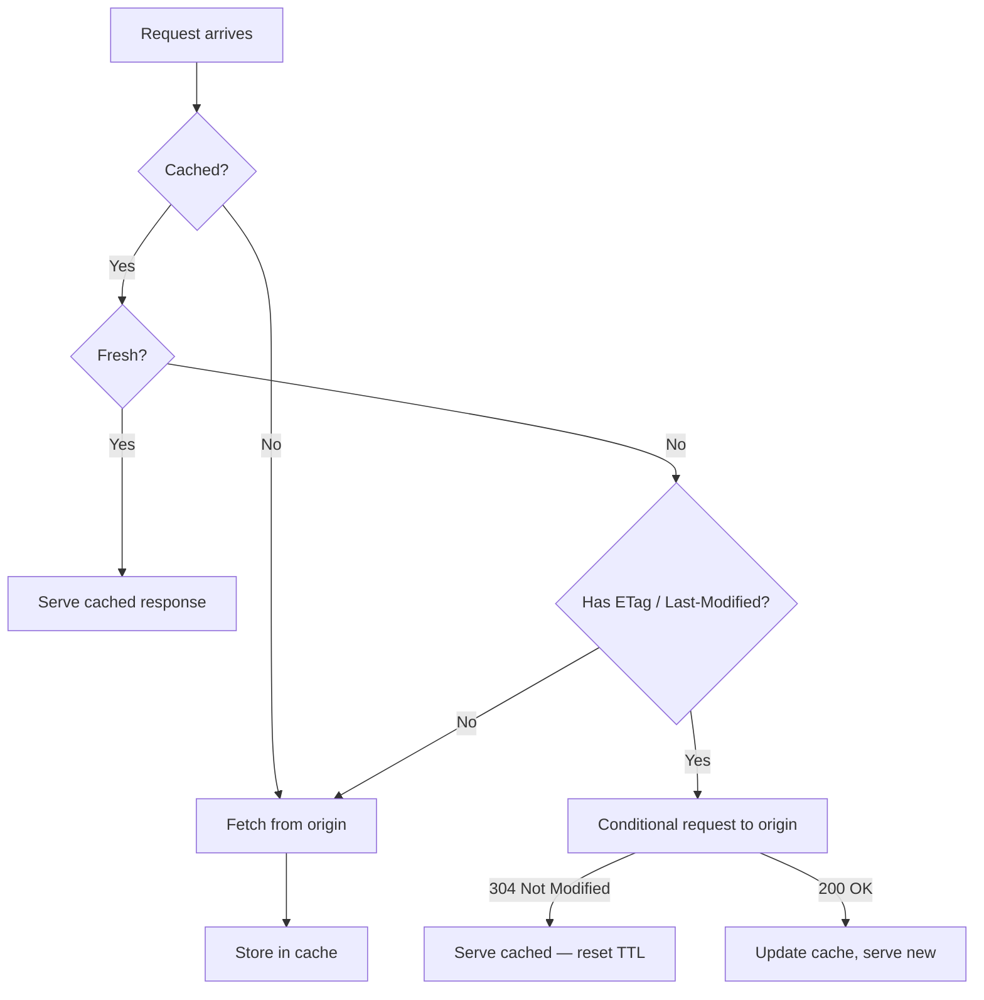

# HTTP Caching

HTTP caching reduces latency and server load by storing responses and reusing them for subsequent requests. Getting caching right means the difference between a page that loads in 200ms and one that loads in 2s — and between a CDN that absorbs 90% of your traffic and one that passes it all through.

## Cache-Control directives

```http
Cache-Control: max-age=3600, stale-while-revalidate=86400, public
Cache-Control: no-cache, must-revalidate
Cache-Control: no-store
Cache-Control: private, max-age=0
```

| Directive | Meaning |
|-----------|---------|
| `max-age=N` | Cache for N seconds; must revalidate after |
| `s-maxage=N` | Same but for shared caches (CDN) only |
| `public` | Can be cached by CDN and browsers |
| `private` | Only browser cache — don't cache on CDN |
| `no-cache` | Must revalidate with server before using cached copy |
| `no-store` | Never cache — not even in browser |
| `immutable` | Content will never change — skip revalidation entirely |
| `stale-while-revalidate=N` | Serve stale for up to N seconds while fetching fresh |
| `stale-if-error=N` | Serve stale for N seconds on server error |

## The caching decision tree



## Fingerprinted assets — the `immutable` strategy

Build tools add content hashes to asset filenames (`main.a3f9c2.js`). The hash changes when content changes, so these files can be cached forever:

```http
# For fingerprinted assets (JS, CSS with hashes in filenames)
Cache-Control: public, max-age=31536000, immutable

# For the HTML document — must always revalidate to pick up new asset URLs
Cache-Control: no-cache
```

```ts
// Next.js config — set headers per path
const headers = [
  {
    source: '/_next/static/:path*',
    headers: [{ key: 'Cache-Control', value: 'public, max-age=31536000, immutable' }],
  },
  {
    source: '/(.*)',
    headers: [{ key: 'Cache-Control', value: 'no-cache' }],
  },
];
```

## Conditional requests — ETag and Last-Modified

ETags allow efficient cache revalidation without re-downloading unchanged content:

```http
# Server response with ETag
HTTP/1.1 200 OK
ETag: "abc123"
Last-Modified: Tue, 29 Apr 2025 12:00:00 GMT
Cache-Control: no-cache

# Browser revalidation request (after cache expires)
GET /api/data
If-None-Match: "abc123"
If-Modified-Since: Tue, 29 Apr 2025 12:00:00 GMT

# Server: unchanged — saves bandwidth
HTTP/1.1 304 Not Modified
```

## Vary header — key caching by request headers

`Vary` tells caches to store separate copies based on request headers:

```http
# Store separate caches for each Accept-Encoding value
Vary: Accept-Encoding

# Store separate caches per Accept-Language — common for i18n
Vary: Accept-Language

# Store separate caches per Accept — for content negotiation
Vary: Accept
```

Avoid `Vary: Cookie` — it bypasses all CDN caches since every user has a unique cookie value.

## Stale-while-revalidate

The best UX pattern for data that updates regularly: serve immediately from cache, refresh in the background:

```ts
// In a service worker or edge function
const CACHE = 'v1';

async function handleRequest(req: Request): Promise<Response> {
  const cached = await caches.match(req);
  const fresh = fetch(req).then(async (res) => {
    const cache = await caches.open(CACHE);
    cache.put(req, res.clone());
    return res;
  });

  return cached ?? fresh;
}
```

## Related

- See also: [Foundations → HTTP Fundamentals](#/codex/foundations-http-fundamentals) for HTTP/2 and connection management.
- See also: [Performance → LCP Deep Dive](#/codex/performance-lcp-deep-dive) for cache impact on LCP.
- See also: [Networking → CDNs and Edge Computing](#/codex/networking-cdns-and-edge) for distributed caches.

## Sources

- [MDN — HTTP caching](https://developer.mozilla.org/en-US/docs/Web/HTTP/Caching)
- [web.dev — HTTP cache](https://web.dev/articles/http-cache)
- [web.dev — Prevent unnecessary network requests](https://web.dev/articles/cache-api-quick-guide)
- [RFC 9111 — HTTP Caching](https://datatracker.ietf.org/doc/html/rfc9111)
