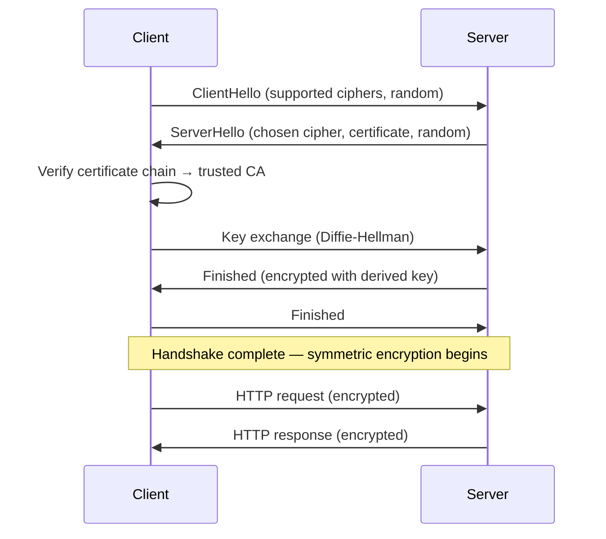

# HTTPS and TLS

TLS (Transport Layer Security) encrypts the connection between client and server, providing confidentiality, integrity, and authentication. HTTPS is HTTP over TLS. Understanding TLS matters for diagnosing certificate errors, configuring servers correctly, and knowing what "secure" actually means.

## The TLS handshake (TLS 1.3)



TLS 1.3 reduced the handshake to 1 round-trip (from 2 in TLS 1.2), and 0-RTT resumption for returning connections.

## Certificate chain of trust

```
Root CA (DigiCert, Let's Encrypt, etc.) — trusted by OS/browser
  └── Intermediate CA
        └── Your server certificate (example.com)
```

The browser verifies that every certificate in the chain is signed by the next one up, and the root is in its trust store. A missing intermediate certificate is a common misconfiguration that causes handshake failures for some clients.

```bash
# Check the full certificate chain
openssl s_client -connect example.com:443 -showcerts

# Verify expiry
echo | openssl s_client -connect example.com:443 2>/dev/null | openssl x509 -noout -dates
```

## Let's Encrypt with automatic renewal

```nginx
# nginx + certbot
server {
    listen 80;
    server_name example.com;
    location /.well-known/acme-challenge/ { root /var/www/certbot; }
    location / { return 301 https://$host$request_uri; }
}

server {
    listen 443 ssl;
    server_name example.com;
    ssl_certificate /etc/letsencrypt/live/example.com/fullchain.pem;
    ssl_certificate_key /etc/letsencrypt/live/example.com/privkey.pem;

    # TLS hardening
    ssl_protocols TLSv1.2 TLSv1.3;
    ssl_prefer_server_ciphers off;  # let client pick in TLS 1.3
    ssl_session_cache shared:SSL:10m;
    ssl_session_timeout 1d;

    # HSTS
    add_header Strict-Transport-Security "max-age=63072000; includeSubDomains; preload" always;
}
```

## HSTS — HTTP Strict Transport Security

HSTS tells the browser to always use HTTPS for this domain, even if the user types `http://`:

```http
Strict-Transport-Security: max-age=63072000; includeSubDomains; preload
```

`preload` + submitting to the [HSTS preload list](https://hstspreload.org/) hardcodes your domain into browsers — even a first-visit HTTP request never happens.

## Certificate Transparency

All CAs must log every issued certificate to public Certificate Transparency logs. This means any certificate issued for your domain is publicly auditable. Monitor for unexpected certificates:

```bash
# Check all certs issued for your domain
curl "https://crt.sh/?q=example.com&output=json" | jq '.[].name_value'
```

## Related

- See also: [Auth → Cookie Security](#/codex/auth-cookie-security) for the `Secure` attribute.
- See also: [Foundations → HTTP Fundamentals](#/codex/foundations-http-fundamentals) for HTTP/2 and HTTP/3 over TLS.
- See also: [Networking → HTTP Caching](#/codex/networking-http-caching) for cache behavior with HTTPS.

## Sources

- [MDN — HTTPS](https://developer.mozilla.org/en-US/docs/Glossary/HTTPS)
- [Cloudflare — What is TLS?](https://www.cloudflare.com/learning/ssl/transport-layer-security-tls/)
- [Let's Encrypt — How it works](https://letsencrypt.org/how-it-works/)
- [SSL Labs — Server test](https://www.ssllabs.com/ssltest/)
