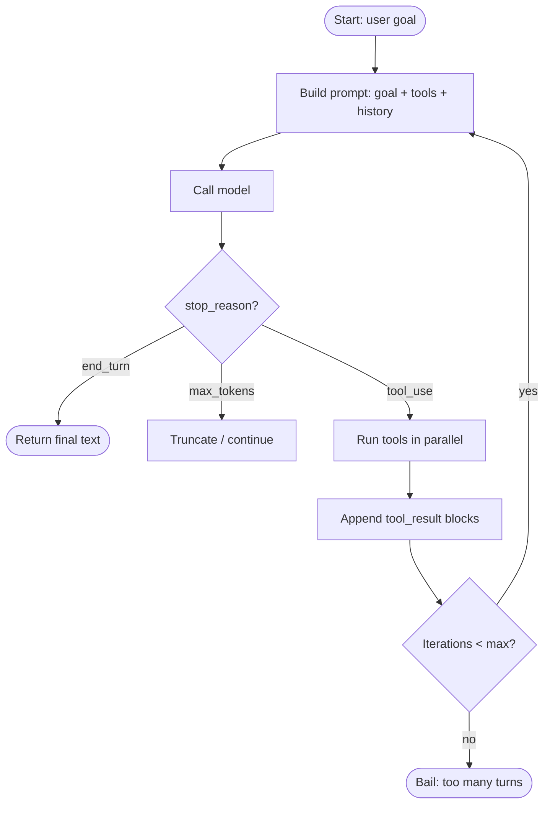

# Loops & Tools

Designing the *loop* is half the work. Designing the *tools* is the other half. They co-evolve.

## The basic loop, expanded



Always cap iterations. Always handle the unexpected `stop_reason`.

## Designing tools

### Few + sharp > many + fuzzy

The model picks better when the choices are obviously distinct. Three well-described tools beats ten overlapping ones.

### Description carries the weight

Tool *names* matter less than *descriptions*. The model reads descriptions to decide when to fire. Be explicit about scope, edge cases, and what *not* to use the tool for.

```ts
{
  name: "search_docs",
  description: `
    Search the company documentation. Returns up to 10 matching passages.
    USE for: finding policies, runbooks, architecture decisions.
    DON'T USE for: real-time data, customer records, code search (use search_code).
  `,
  inputSchema: { ... },
}
```

### Strict schemas

```ts
inputSchema: {
  type: "object",
  properties: {
    query:    { type: "string", maxLength: 200 },
    top_k:    { type: "integer", minimum: 1, maximum: 20, default: 5 },
    section:  { type: "string", enum: ["policies", "runbooks", "architecture"] },
  },
  required: ["query"],
}
```

Models respect schemas. Use them to keep arguments well-formed.

### Idempotent tools

The model may retry. Make repeated calls safe. If a tool causes a side effect (write a file, send an email), make the side effect either explicit-once or idempotent-on-args.

### Return shape

Always return JSON, not prose. The model parses tool results as data.

```ts
return JSON.stringify({ ok: true, count: 5, items: [...] });
```

Truncate huge responses. A 50k-token tool result eats your context — tools should *summarise* huge data, not dump it.

## Loop tactics

### Compaction

Long agents accumulate huge histories. Compact every N turns:

```ts
if (messages.length > 30) {
  const summary = await summarise(messages.slice(0, -10));
  messages = [{ role: "assistant", content: summary }, ...messages.slice(-10)];
}
```

Or use the SDK's built-in compaction.

### Parallel tool calls

When the model emits multiple `tool_use` blocks in one turn, run them **in parallel**:

```ts
const results = await Promise.all(
  toolCalls.map(call => execute(call))
);
```

Saves wall-clock time when tool calls are independent.

### Reflection

After every N turns or on a stop condition, ask the model to *self-review*:

```
Stop. Review your progress so far:
- What's been accomplished?
- What's left?
- Any decisions you'd like to revisit?
Then continue or finish.
```

Cheap to add, surprisingly effective on long tasks.

### Bail-outs

```ts
const MAX_TURNS = 25;
let turn = 0;
while (true) {
  if (++turn > MAX_TURNS) throw new Error("agent_max_turns_exceeded");
  ...
}
```

Plus per-tool budgets if any tool is expensive: "no more than 5 web searches per task."

## Streaming an agent loop to the user

Show what the agent is doing, not just the final answer. Stream three signals:

1. **Tool calls** ("→ reading `auth.ts`…")
2. **Tool results, summarised** ("got 200 lines")
3. **Final answer** (the user-visible deliverable)

Hides nothing. Builds trust. Makes debugging easy.

## Practice

Take your tool-using script. Add: (a) a `MAX_TURNS = 20` safety belt, (b) parallel execution of tool calls in the same turn, (c) compaction when history exceeds 20 turns. You now have a production-shape loop in ~80 lines.
