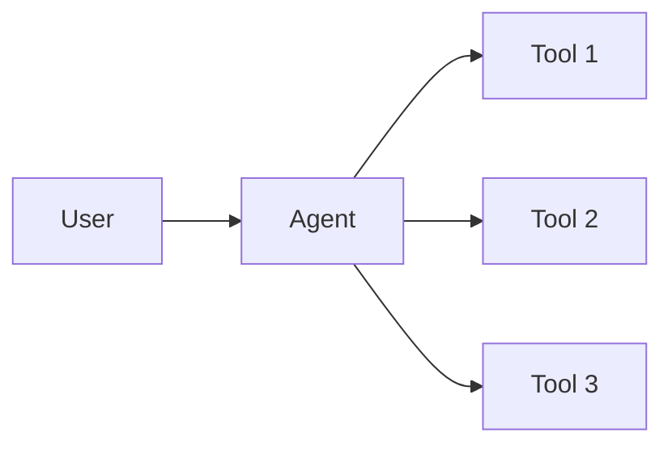
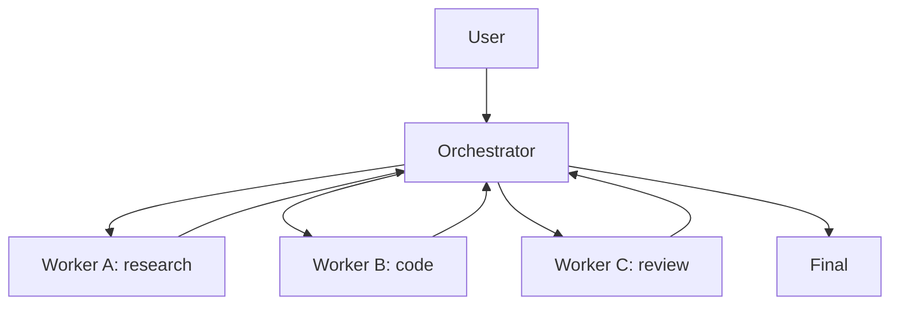
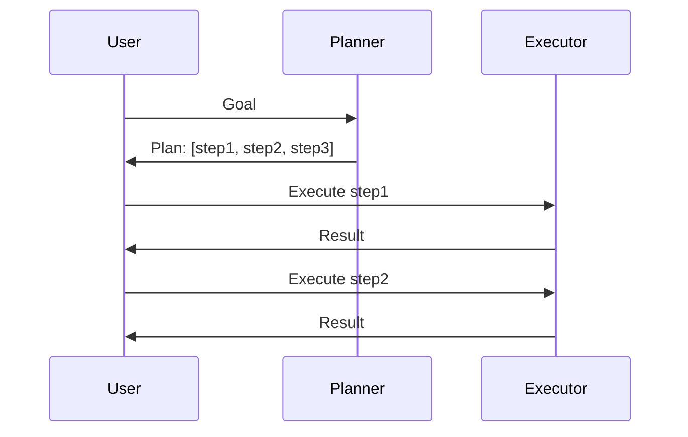
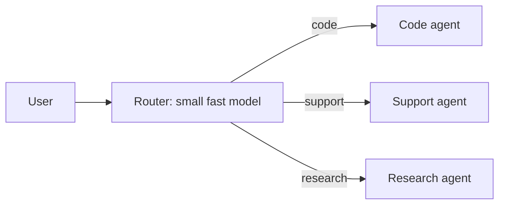
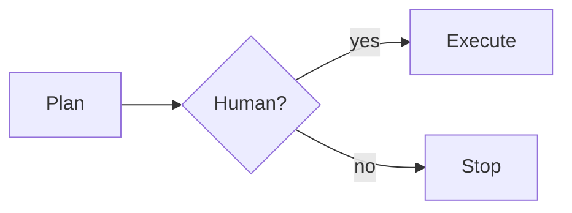
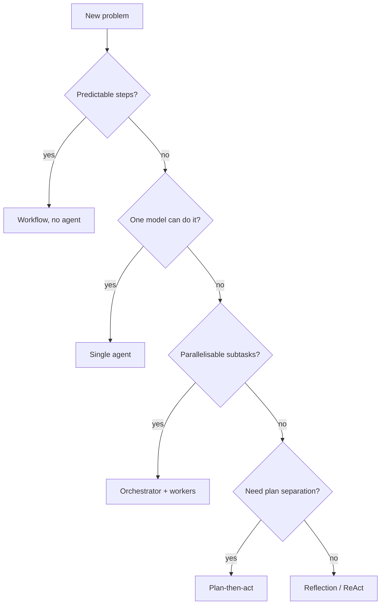

# Agent Patterns

A handful of named patterns cover most agentic systems. Pick the simplest one that fits.

## 1. Single agent, tools

The default. One model, one loop, N tools. Use this until you can't.

Reach for it: most tasks. **It's almost always enough.**

## 2. Orchestrator + workers

A supervisor agent decomposes a goal and delegates to specialist subagents. The supervisor synthesises results.

Reach for it: tasks that decompose cleanly into independent subtasks (especially parallelisable). Caveat: expensive — each worker is a full inference + history.

## 3. Plan-then-act

Two phases:

1. **Plan** — model produces a step list (no tools, just thinking).
2. **Act** — separate tool-using loop executes the plan.

Reach for it: when planning is expensive and execution is mechanical. Lets you review the plan before paying for execution.

## 4. Reflective / iterative refinement

Agent produces an answer → critic agent (or same agent in a different role) reviews → original revises. Repeat N times or until critic is satisfied.

Reach for it: tasks with a clear "good" signal — code (does the test pass?), prose (LLM-as-judge for clarity), translations (back-translate and compare).

## 5. ReAct (Reason + Act)

The model interleaves *thought* tokens with *action* tokens. Each step is "Thought: … / Action: tool(args) / Observation: …" The reasoning is in the conversation itself.

This is essentially how Claude Code works under the hood — the model thinks, calls a tool, sees the result, thinks again. Combine with extended thinking and you get explicit reasoning blocks.

## 6. Tool-router

A lightweight first call decides *which* specialist agent / tool / pipeline to dispatch the request to. Cheap classifier in front, heavy specialist behind.

Reach for it: high-volume, varied workloads (customer support, ticket triage). Saves cost by reserving the heavy model for the cases that need it.

## 7. Human-in-the-loop

Insert mandatory human approval gates at risky steps:

Reach for it: anything destructive, expensive, or customer-facing. Don't ship "fully autonomous" for the sake of it.

## 8. Multi-agent debate

Two (or more) agents take opposing positions and debate; a judge picks. Useful for ambiguous decisions where playing devil's advocate surfaces blind spots.

Reach for it: research, threat modelling, design reviews. Caveat: expensive.

## 9. Memory-augmented

The agent has read/write access to a *persistent* memory store (vector DB, Postgres). Across sessions it accumulates state.

Reach for it: long-lived agents (your personal assistant, an on-call bot). Implementation varies — see the next page on safety.

## How to pick

> **Default to single-agent, tools, and a clear stop.** Add complexity only when single-agent measurably fails.

## Practice

Look at the agent spec you wrote on the "What is an Agent?" page. Match it to a pattern from this page. Now redesign it as the *next-simplest* pattern and ask: would that be enough? If yes — build that one.
