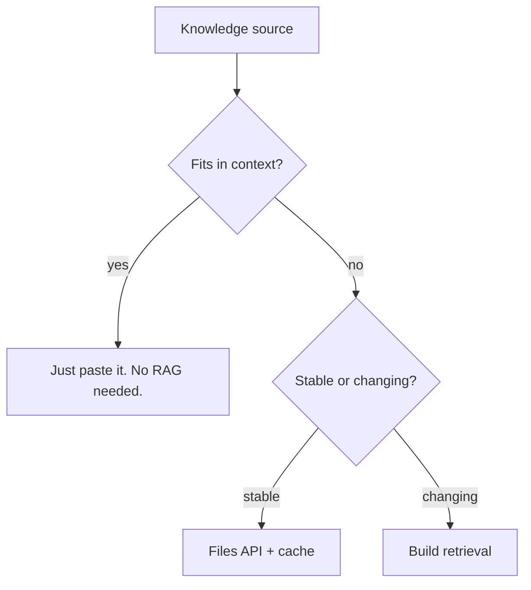
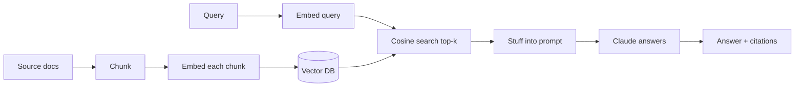

# Retrieval (RAG)

When your knowledge base is bigger than the context window — or when you need *citations* — you need retrieval. RAG (Retrieval-Augmented Generation) is the pattern: embed your corpus, fetch the relevant chunks at query time, stuff them into the prompt, answer.

## When you need RAG



Reach for RAG when:

- Your corpus is too big for the context window (1M tokens still has limits).
- The corpus changes — vendor docs, internal wikis, support tickets.
- You need verifiable answers ("cite which doc this came from").

**Don't reach for RAG when:**

- Your "knowledge base" fits in 50k tokens — just put it in a cached system prompt.
- You're indexing your own codebase for Q&A — try the agent-with-grep pattern first (`Recipes → Repo-aware Q&A`). It's simpler and often enough.

## The pipeline



Two phases: **index** (offline) and **query** (online).

## Indexing

```ts
import OpenAI from "openai";   // or any embedding model
const openai = new OpenAI();

async function embed(text: string): Promise<number[]> {
  const r = await openai.embeddings.create({
    model: "text-embedding-3-small",
    input: text,
  });
  return r.data[0].embedding;
}

function chunk(text: string, target = 800): string[] {
  // Naïve: split on paragraph boundaries; merge to ~target tokens (~3200 chars).
  const paras = text.split(/\n{2,}/);
  const out: string[] = []; let buf = "";
  for (const p of paras) {
    if ((buf + p).length > target * 4 && buf) { out.push(buf); buf = p; }
    else buf = buf ? buf + "\n\n" + p : p;
  }
  if (buf) out.push(buf);
  return out;
}

// For each doc:
for (const doc of docs) {
  for (const c of chunk(doc.text)) {
    const v = await embed(c);
    await db.insert({ docId: doc.id, text: c, embedding: v, source: doc.url });
  }
}
```

Storage: **PGVector** (Postgres extension) is great for most teams; Chroma / Qdrant / Weaviate / Pinecone if you have specific needs.

## Querying

```ts
async function answer(question: string) {
  const qv = await embed(question);
  const hits = await db.query(`
    SELECT text, source, 1 - (embedding <=> $1) AS score
    FROM chunks
    ORDER BY embedding <=> $1
    LIMIT 5
  `, [qv]);

  const context = hits.map((h, i) =>
    `[${i + 1}] (source: ${h.source})\n${h.text}`
  ).join("\n\n");

  const res = await anthropic.messages.create({
    model: "claude-opus-4-7",
    max_tokens: 1500,
    system: [{
      type: "text",
      text: `Answer using ONLY the passages provided. Cite sources as [1], [2], etc.
If the passages don't contain the answer, say so — do not invent.`,
      cache_control: { type: "ephemeral" },
    }],
    messages: [{
      role: "user",
      content: `<context>\n${context}\n</context>\n\nQuestion: ${question}`,
    }],
  });

  return res.content[0].type === "text" ? res.content[0].text : "";
}
```

## Chunking — the unsung hero

Bad chunks → bad retrieval → bad answers. Good rules:

- **Respect document boundaries.** Don't split a function in half. Don't split a table mid-row.
- **Target ~800 tokens.** Big enough for context; small enough that one chunk = one topic.
- **Overlap by ~10%** between adjacent chunks so a query hitting a boundary still works.
- **Carry metadata.** Source URL, section heading, last-updated. The model uses headings; you use URLs for citation.
- **Pre-process.** Strip nav menus, footers, boilerplate. Pure signal.

## Hybrid retrieval

Pure vector search is good at *semantic* matches but weak at *exact* terms (function names, error codes). Hybrid combines:

- **Dense (vector) search** for "how do I auth?"
- **Sparse (keyword/BM25) search** for "ERROR_INVALID_CALLBACK"

Most modern stores support both. Run both, merge with reciprocal rank fusion (RRF), pass top-k to the model. Big quality jump for ~30 lines of code.

## Reranking

Top-k retrieval is approximate. Re-rank the top 30 with a smarter (slower) model — Cohere `rerank-3` or a small Claude prompt — and pick the top 5 from those. Cheap quality boost.

## Citations

The killer feature of RAG over "just LLMs": you can **show the user where the answer came from**. The pattern:

1. Tag each chunk in the prompt with `[1]`, `[2]`, …
2. Tell the model: "Cite sources as [n]".
3. After getting the answer, render `[n]` as a clickable link to the source URL.

Users trust answers they can verify. Engineers trust answers more than vibes.

## Evals

RAG is *the* place where evals earn their keep. Build a dataset of `(question, expected_doc_id, gold_answer)` triples. Score:

- **Retrieval recall@k** — was the gold doc in the top k?
- **Answer accuracy** — did the answer match expected?
- **Faithfulness** — does every claim in the answer cite a real chunk?

Iterate chunk size, k, and the prompt. Score moves; you know what helped.

## Anthropic's contextual retrieval

Anthropic published a technique called **contextual retrieval** that prepends a short LLM-generated context to each chunk before embedding (e.g. "This chunk is from the Auth section of the v3 docs, discussing OAuth callbacks"). It dramatically improves retrieval recall on technical corpora. Worth reading if you're building serious RAG: search "anthropic contextual retrieval" in their docs.

## Practice

Pick a doc set you know well (your team's runbooks, a vendor's docs). Build a 100-line ingest script + a 50-line query script. Ask 10 questions you know the answers to. Score retrieval recall and answer accuracy. Iterate.
