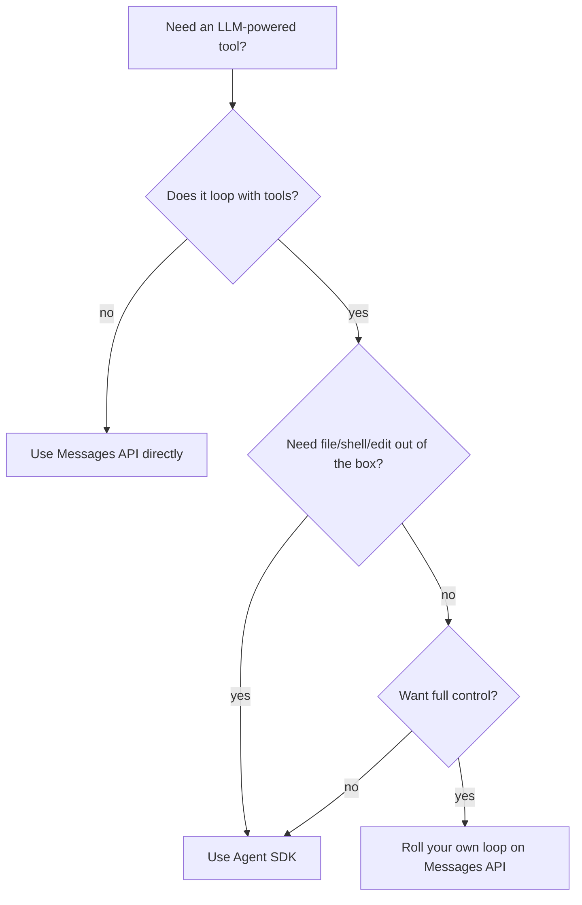

# Claude Agent SDK

The **Claude Agent SDK** packages the agent loop, tool execution, permission system, file/shell ops, and conversation management — so you don't reinvent them. It's the same engine Claude Code uses, exposed for your own apps.

## Why use it (instead of writing the loop yourself)

You *can* roll your own loop with the Messages API + `tool_use` (see the Tool Use page). For toy agents, do that. For real agents you want:

- A robust permission model.
- Built-in file/edit/write/bash tools that handle big files, diffs, sandboxing.
- Memory + compaction for long sessions.
- Good error / retry behaviour.
- Streaming, hooks, subagents.

The SDK gives you all of that.

## Install

```bash
# Python
pip install claude-agent-sdk

# TypeScript
npm install @anthropic-ai/claude-agent-sdk
```

## Hello, Agent (TypeScript)

```ts
import { Agent } from "@anthropic-ai/claude-agent-sdk";

const agent = new Agent({
  model: "claude-opus-4-7",
  systemPrompt: "You are a senior engineer. Be precise.",
  tools: ["Read", "Edit", "Bash"],         // built-in
  workingDirectory: "./",
});

const result = await agent.run("Fix the failing test in auth/login.test.ts");
console.log(result.summary);
```

That's a complete agent. It will loop, read files, edit them, run the test, and report back.

## Hello, Agent (Python)

```python
from claude_agent_sdk import Agent

agent = Agent(
    model="claude-opus-4-7",
    system_prompt="You are a senior engineer. Be precise.",
    tools=["Read", "Edit", "Bash"],
    working_directory=".",
)

result = await agent.run("Fix the failing test in auth/login.test.ts")
print(result.summary)
```

## Adding your own tools

```ts
import { Agent, defineTool } from "@anthropic-ai/claude-agent-sdk";

const queryDb = defineTool({
  name: "query_db",
  description: "Run a read-only SQL query against the staging database.",
  inputSchema: {
    type: "object",
    properties: { sql: { type: "string" } },
    required: ["sql"],
  },
  async execute({ sql }) {
    if (!sql.trim().toLowerCase().startsWith("select")) {
      throw new Error("read-only");
    }
    const rows = await db.query(sql);
    return JSON.stringify(rows);
  },
});

const agent = new Agent({
  model: "claude-opus-4-7",
  tools: ["Read", queryDb],
});
```

Tools combine: the agent gets `Read` + your custom `query_db` plus whatever else you whitelist.

## Permissions

```ts
const agent = new Agent({
  permissions: {
    mode: "acceptEdits",                // auto-approve file edits
    allow: ["Bash(pnpm test*)"],
    deny: ["Bash(rm -rf*)", "Bash(git push*)"],
  },
});
```

Same shape as Claude Code's `settings.json`. Reuse what you already know.

## Subagents from your agent

```ts
agent.run("Audit the code, then fix the worst three issues.", {
  subagents: {
    audit: { tools: ["Read", "Grep"], systemPrompt: "Read-only auditor." },
  },
});
```

The orchestrator agent decides when to spawn `audit` subagents. Each runs in isolation, returns a summary.

## Where this fits



## Common pitfalls

- **Forgetting `workingDirectory`.** The agent's filesystem tools resolve paths against it. Set it explicitly.
- **Tool whitelisting too wide.** If `Bash` is in scope, the agent can do *anything* in your shell. Constrain.
- **No iteration cap.** Set `maxTurns` to something sane (10–30). Save yourself a runaway invoice.
- **Skipping the system prompt.** A vague agent makes vague choices. Pin a role.

## Practice

Build a 60-line agent that takes a GitHub issue URL, reads the issue, scans the repo, proposes a patch, and runs the test suite. Use the SDK; don't roll your own loop. Time it. That's your new "issue → draft PR" automation.
