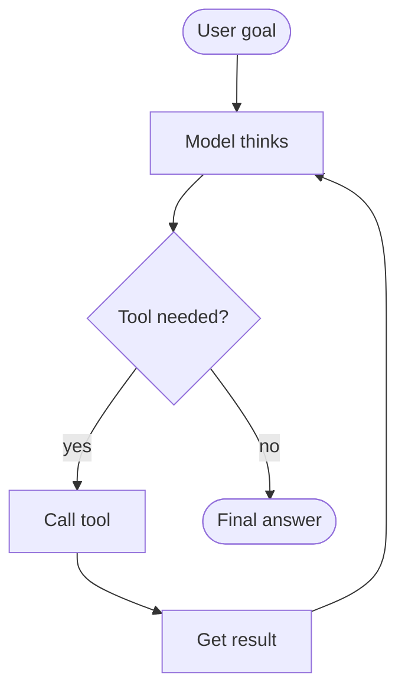
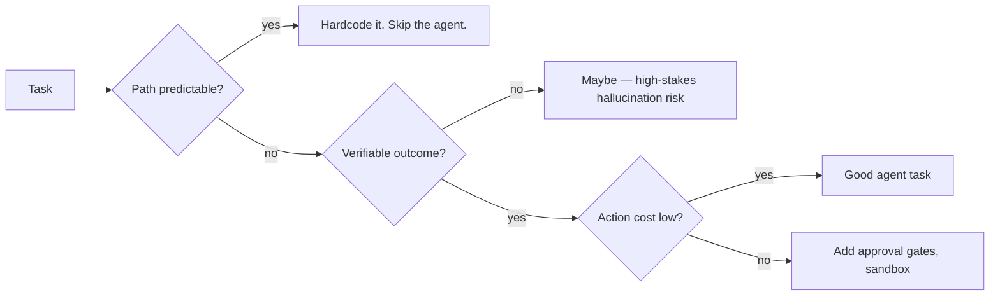

# What is an Agent?

An **agent** is an LLM running in a **loop with tools**, deciding for itself when to act, when to stop, and what to do next. The minimum sufficient definition: model + tools + a loop + a stopping condition.

## The minimal agent

That's it. Everything else — multi-agent systems, planning, reflection, memory — is a refinement of this loop.

## Agent vs assistant vs workflow

| Pattern | Who decides next step? |
|---|---|
| **Workflow** | Your code. Hardcoded steps; LLM fills slots. |
| **Assistant** | The user. One response, no autonomous loop. |
| **Agent** | The model. Loops on its own until done. |

Workflows are predictable and cheap. Agents are flexible and can handle ambiguity but cost more (tokens, latency, risk). Pick the simplest pattern that does the job.

> **Rule:** prefer workflow > agent. Reach for agency only when the path is genuinely unknown ahead of time.

## What makes a good agentic task

Good agent tasks:

- **Variable shape, verifiable outcome.** Coding (run the test). Scraping (compare to schema). Data cleaning (re-validate).
- **Cheap retries.** Rolling back is easy. Worktrees, dry-runs, reversible writes.
- **Bounded scope.** "Fix this bug." Not "improve our codebase."

Bad agent tasks:

- **Single-step lookups.** Just call the API.
- **Decisions with stakes.** Production deploys. Customer comms. Final-call architecture.
- **Open-ended exploration without a stop condition.** Burns tokens, returns slop.

## The four moving parts

1. **Model** — Claude (Opus for hard reasoning; Sonnet for cost-balanced; Haiku for speed).
2. **Tools** — what it can call: `read_file`, `run_command`, `search_web`, `query_db`, etc. Few + sharp > many + fuzzy.
3. **Loop** — your code that handles `tool_use` results and reinvokes the model.
4. **Stopping condition** — usually `stop_reason: "end_turn"`, plus a max-iterations safety belt.

## Risks unique to agents

- **Run-away loops.** Always cap iterations. Every agent ever has needed this once.
- **Hallucinated tool calls.** Validate `tool_use` args against your schema before executing.
- **Cost explosion.** Long contexts × many turns × premium model = expensive. Monitor.
- **Side-effect surprises.** Sandboxing, dry-runs, and explicit approval gates for risky calls.

## Examples in the wild

| Agent | Goal | Tools |
|---|---|---|
| **Claude Code** | Edit your repo to spec | Read, Edit, Write, Bash, Grep, ... |
| **Computer Use** | Drive a desktop to complete a task | Screenshot, click, type, scroll |
| **Browser Use** | Navigate websites | Navigate, click, fill forms, scrape |
| **Research agents** | Synthesise an answer from many sources | Web search, fetch, summarise |
| **Coding agents on PRs** | Review / fix / extend | Git, diff, file ops |

## Practice

Sketch one agent for *your* job. Define: goal, 3 tools, the stop condition, the failure modes. Don't build it yet — just write down the spec. Building comes next page.
