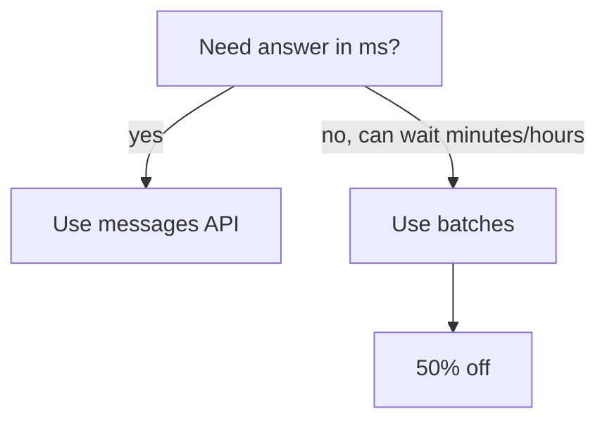

# Batch & Files

Two adjacent APIs that matter once you go beyond one-off calls.

## Batch API

Submit a **batch of independent message requests** asynchronously. The API processes them within 24 hours at **50% off**.

When to use:

- Bulk classification (10k tickets).
- Bulk extraction (PDF processing pipeline).
- Periodic re-scoring / re-summarising.
- Anything that doesn't need a real-time response.

### Submit a batch

```ts
const batch = await client.messages.batches.create({
  requests: items.map((item, i) => ({
    custom_id: `req_${i}`,
    params: {
      model: "claude-opus-4-7",
      max_tokens: 200,
      messages: [{ role: "user", content: `Classify: ${item.text}` }],
    },
  })),
});

console.log(batch.id, batch.processing_status);
```

### Poll & retrieve

```ts
let b = await client.messages.batches.retrieve(batch.id);
while (b.processing_status !== "ended") {
  await new Promise(r => setTimeout(r, 30_000));
  b = await client.messages.batches.retrieve(batch.id);
}

const results = await client.messages.batches.results(batch.id);
for await (const r of results) {
  console.log(r.custom_id, r.result);
}
```

Each result includes the `custom_id` you sent so you can match outputs back to inputs.

### Trade-offs

- **Pros:** 50% cost. No rate limits within batch. Can submit huge batches (10k+ requests).
- **Cons:** Up to 24h latency. Not for interactive UX.



## Files API

Upload files once, reference them across multiple Messages calls. Avoids re-uploading the same PDF / image / dataset on every request.

```ts
const file = await client.files.create({
  file: await fs.openAsBlob("contract.pdf"),
  purpose: "user_data",
});

// Reference in messages
const res = await client.messages.create({
  model: "claude-opus-4-7",
  max_tokens: 1024,
  messages: [{
    role: "user",
    content: [
      { type: "document", source: { type: "file", file_id: file.id } },
      { type: "text", text: "Summarise the indemnity clause." },
    ],
  }],
});
```

### When to use

- The same big PDF / dataset is queried by many users.
- The file is too big to inline-base64 efficiently.
- You want a stable id that survives across calls (and combine with prompt caching).

### Files + caching

A file referenced + a cacheable system prompt = the most cost-efficient pattern for "many users querying the same big document":

```ts
system: [{ type: "text", text: SYS, cache_control: { type: "ephemeral" } }],
messages: [{
  role: "user",
  content: [
    { type: "document", source: { type: "file", file_id: bigFile.id } },
    { type: "text", text, cache_control: { type: "ephemeral" } },  // cache up to here
    { type: "text", text: userQuestion },
  ],
}],
```

## Practice

Pick a job that processes 100+ items in a script today. Convert it from a `for` loop of `messages.create` calls to a single batch submission. Calculate cost savings (50% off the input/output tokens). Decide if the latency trade-off is acceptable.
