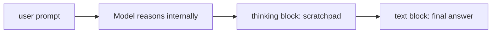

# Extended Thinking

A native API mode where the model produces a **separate, internal reasoning trace** before its visible answer. You get more accurate answers on hard problems at the cost of more tokens and a little more latency.

## When to use it

- Complex reasoning (math, logic puzzles, multi-step planning).
- Architectural decisions (compare 3 options under 5 constraints).
- Hard code review (concurrency, security).
- Anything where wrong-but-confident is expensive.

When **not** to use it: chitchat, simple lookups, format-only tasks. The thinking budget is wasted.

## How to call it

```ts
const response = await client.messages.create({
  model: "claude-opus-4-7",
  max_tokens: 4000,
  thinking: { type: "enabled", budget_tokens: 5000 },
  messages: [{ role: "user", content: HARD_PROBLEM }],
});

for (const block of response.content) {
  if (block.type === "thinking") {
    // internal reasoning — log/debug, don't show to user
    console.debug("[thinking]", block.thinking);
  }
  if (block.type === "text") {
    console.log(block.text);   // user-visible answer
  }
}
```

`budget_tokens` caps how many tokens the model is allowed to spend on internal reasoning. If it hits the cap, it wraps up and answers anyway.

## What you'll see



Two distinct content blocks. Stream them separately if your UI hides the thinking and reveals the answer.

## Tuning the budget

| Problem | budget_tokens |
|---|---|
| Small reasoning step | 1,000 |
| Multi-step plan | 3,000 — 5,000 |
| Hard math / logic | 8,000 — 16,000 |
| Pre-architecture analysis | 16,000+ |

Bigger budgets help only up to a point. Past ~16k for most tasks you're paying for marginal returns.

## Cost trade-off

Thinking tokens count toward usage. A call that burns 3,000 thinking tokens + 500 output tokens is materially more expensive than 500 output tokens alone. Use it where accuracy >> cost.

## Combining with tool use

Extended thinking + tool use is the *strong* combo. Each tool-call cycle reasons, calls a tool, gets a result, reasons again. Claude Code uses this pattern.

```ts
const response = await client.messages.create({
  model: "claude-opus-4-7",
  max_tokens: 2000,
  thinking: { type: "enabled", budget_tokens: 5000 },
  tools,
  messages,
});
```

## Streaming

Streams a `thinking` block first, then a `text` block. Hide the thinking deltas from your UI; show the answer deltas:

```ts
for await (const ev of stream) {
  if (ev.type === "content_block_delta") {
    if (ev.delta.type === "thinking_delta") { /* hidden / debug */ }
    if (ev.delta.type === "text_delta")     { showToUser(ev.delta.text); }
  }
}
```

## Showing the thinking — yes or no?

Depends on your product:

- **Developer tools / agents:** show or log it. It's the audit trail.
- **End-user chat:** usually hide. Surface a "Show reasoning" toggle if useful.
- **Compliance / explainability:** keep the thinking blocks; never throw them away.

## Practice

Take a problem you got a *plausible-but-wrong* answer to last week. Re-run with extended thinking and budget 5,000. Compare. If the new answer is right, examine the thinking trace to see *where* the model corrected itself.
