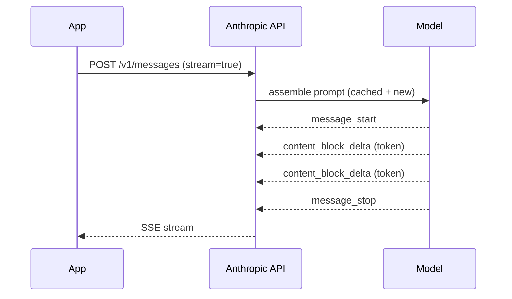

# Messages API

The Messages API is the single endpoint that drives everything: simple chats, tool use, streaming, vision, extended thinking. Master its shape and the rest is variations.

## The minimal request

```http
POST https://api.anthropic.com/v1/messages
Content-Type: application/json
x-api-key: $ANTHROPIC_API_KEY
anthropic-version: 2023-06-01

{
  "model": "claude-opus-4-7",
  "max_tokens": 1024,
  "messages": [
    {"role": "user", "content": "Hi"}
  ]
}
```

## The response shape

```json
{
  "id": "msg_01...",
  "type": "message",
  "role": "assistant",
  "model": "claude-opus-4-7",
  "content": [
    {"type": "text", "text": "Hello!"}
  ],
  "stop_reason": "end_turn",
  "usage": {
    "input_tokens": 8,
    "output_tokens": 5,
    "cache_creation_input_tokens": 0,
    "cache_read_input_tokens": 0
  }
}
```

`content` is always an array of blocks. Each block has a `type`:

| Block type | When |
|---|---|
| `text` | Normal prose / code output |
| `tool_use` | Model wants to call a tool |
| `tool_result` | (You send this back in next turn) |
| `thinking` | Internal reasoning (extended thinking only) |
| `image` | (Input only) |

`stop_reason` values:

| Reason | Means |
|---|---|
| `end_turn` | Model finished naturally |
| `max_tokens` | You hit the cap; output truncated |
| `tool_use` | Model wants to call a tool — your turn to handle it |
| `stop_sequence` | Hit a configured stop sequence |
| `pause_turn` | Long-running tool / agent loop |

## Multi-turn conversations

The API has **no memory**. You replay the whole history each turn:

```ts
let messages: Anthropic.MessageParam[] = [];

async function chat(userText: string) {
  messages.push({ role: "user", content: userText });
  const res = await client.messages.create({
    model: "claude-opus-4-7",
    max_tokens: 1024,
    messages,
  });
  const text = res.content[0].type === "text" ? res.content[0].text : "";
  messages.push({ role: "assistant", content: text });
  return text;
}
```

For long conversations, summarise older turns instead of replaying everything (token cost grows with history).

## System prompt

Two equivalent shapes:

```ts
// String form (simple)
system: "You are a concise assistant."

// Array form (cacheable, multi-block)
system: [
  { type: "text", text: "You are a concise assistant." },
  { type: "text", text: BIG_DOC, cache_control: { type: "ephemeral" } },
]
```

Always use the **array form** if any part of the system prompt is large or stable — you can cache it.

## Content can be multi-modal

```ts
messages: [
  { role: "user", content: [
    { type: "text",  text: "What is in this image?" },
    { type: "image", source: { type: "base64", media_type: "image/png", data: "..." } },
  ]}
]
```

(See: Vision page.)

## Stop sequences

You can tell the model "stop generating when you produce this exact string":

```ts
stop_sequences: ["</answer>"],
```

Useful for forcing structured output: ask the model to write `<answer>...</answer>` and stop after the closing tag.

## Anatomy of a real call (with caching, system, streaming)



## Practice

Take your hello-world script. Add a multi-turn chat loop. The script should keep the conversation in memory and let the user chat back and forth. After 10 turns, summarise the early history into one assistant message and drop the raw turns. That's compaction in production, in 30 lines.
