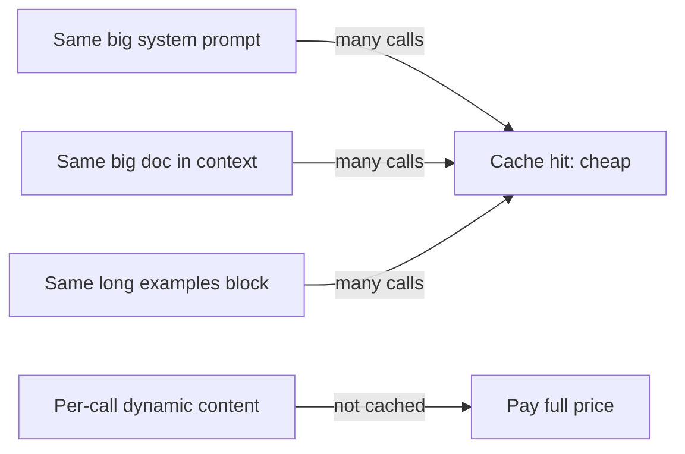
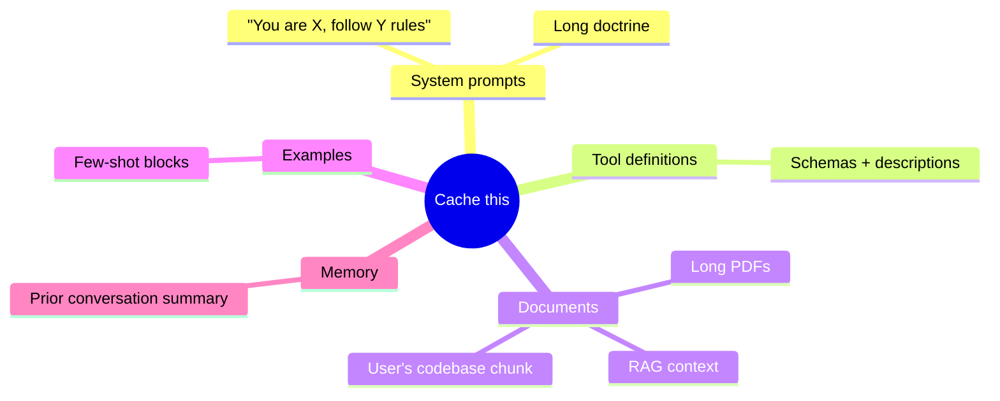

# Prompt Caching

Anthropic's prompt cache lets you mark sections of your prompt as cacheable. Subsequent calls within ~5 minutes (the TTL) reuse the cached prefix at **~10% the input cost**. **Turn this on as soon as your prompt has a stable prefix.**

## When it helps



If your prompt has a stable prefix and a small variable suffix, caching is a no-brainer.

## How to enable it

Mark the **last block** of any cacheable region with `cache_control`:

```ts
client.messages.create({
  model: "claude-opus-4-7",
  max_tokens: 1024,

  system: [
    { type: "text", text: STATIC_SYSTEM_PROMPT, cache_control: { type: "ephemeral" } }
  ],

  messages: [
    {
      role: "user",
      content: [
        { type: "text", text: BIG_DOCUMENT, cache_control: { type: "ephemeral" } },
        { type: "text", text: userQuestion },  // ← variable suffix; not cached
      ],
    },
  ],
});
```

The cache key is computed over the **entire prompt prefix up to and including** the marker. Anything before the marker is cached.

## Cache structure

You can have **up to 4 cache_control breakpoints** in a single request. They form nested prefixes:

```
[ system_prompt        ] ← cached at break 1
[ tools                ] ← cached at break 2
[ big_document         ] ← cached at break 3
[ examples             ] ← cached at break 4
[ user_question        ] ← uncached
```

If you change `examples`, only the last cached layer is invalidated; everything before it still hits cache.

## TTL

Default is **5 minutes**. Each hit *resets* the timer — high-traffic prompts stay hot. Idle for 5 minutes and you pay full price on the next miss (`cache_creation_input_tokens`).

You can also opt into a 1-hour cache (extra fee on writes, much longer life): `cache_control: { type: "ephemeral", ttl: "1h" }`.

## Cost model

Per call you'll see `usage` fields:

```json
"usage": {
  "input_tokens": 12,                       // brand-new tokens in the request
  "cache_creation_input_tokens": 0,         // tokens written to cache (this call)
  "cache_read_input_tokens": 50000,         // tokens read from cache
  "output_tokens": 200
}
```

Pricing math (rule of thumb):

| Bucket | Cost vs. base input |
|---|---|
| Cache write | 1.25× (you pay extra to fill the cache) |
| Cache read | 0.10× (you pay 10%) |
| Output | unchanged |

Net win: a 50k-token prompt called 10 times costs ~`1.25 + 9 × 0.10 = 2.15×` instead of `10×`. ~80% saved.

## What to cache



## What NOT to cache

- Tiny prompts (cache overhead > savings).
- Prompts that vary every call.
- The variable user question itself (it's the suffix; leave it uncached).

## Cache hit rate is your KPI

Track `cache_read_input_tokens / (cache_read + cache_creation + input_tokens)`. Your hit rate tells you whether your caching is actually working. Aim for >80% on production prompts.

## Common mistakes

- **Marking the wrong block.** Cache breakpoints must be contiguous — you cache *everything up to and including* a marker. You can't cache scattered ranges.
- **Forgetting to mark anything.** No `cache_control` = no cache.
- **Mutating the prefix.** Inserting today's date at the top breaks cache every day. Move dynamic bits to the suffix.
- **Caching tiny prompts.** Below ~1024 tokens it's not worth it (and may not cache at all, depending on the model).

## Practice

Take your tool-using script from the Tool Use page. Add a 5,000-token system prompt. Mark it cacheable. Call the script three times. Watch `cache_read_input_tokens` rise. Compute your hit rate.
