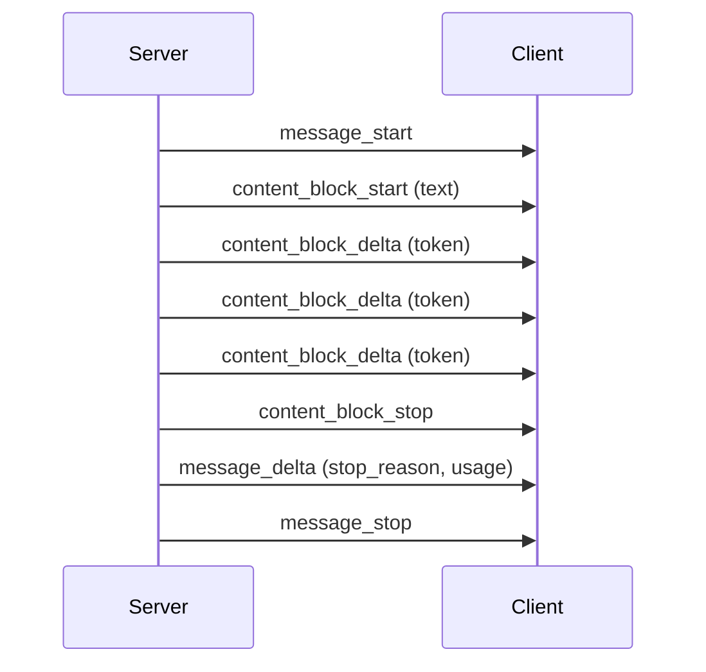

# Streaming

Streaming returns tokens as they're generated, instead of waiting for the full response. **Always stream user-facing UX.** Latency-to-first-token is the perceived speed.

## When to stream

| Use case | Stream? |
|---|---|
| Interactive chat / assistant UI | **Yes** |
| Long-form generation (essays, reports) | **Yes** |
| Code generation in an editor | **Yes** |
| Background classification / extraction | No (you only need the final answer) |
| Tool-loop steps inside an agent | No (each step is short) |

## Server-Sent Events

The API streams as SSE. The SDKs handle parsing for you.

## TypeScript

```ts
import Anthropic from "@anthropic-ai/sdk";
const client = new Anthropic();

const stream = await client.messages.stream({
  model: "claude-opus-4-7",
  max_tokens: 1024,
  messages: [{ role: "user", content: "Tell me a story." }],
});

let answer = "";
for await (const event of stream) {
  if (event.type === "content_block_delta" && event.delta.type === "text_delta") {
    process.stdout.write(event.delta.text);
    answer += event.delta.text;
  }
}

const final = await stream.finalMessage();
console.log("\n\nUsage:", final.usage);
```

## Python

```python
with client.messages.stream(
    model="claude-opus-4-7",
    max_tokens=1024,
    messages=[{"role": "user", "content": "Tell me a story."}],
) as stream:
    for text in stream.text_stream:
        print(text, end="", flush=True)

print("\n\nUsage:", stream.get_final_message().usage)
```

## Event types



| Event | Contains |
|---|---|
| `message_start` | Initial message stub with id |
| `content_block_start` | New block opening (text/tool_use/thinking) |
| `content_block_delta` | Incremental token |
| `content_block_stop` | Block done |
| `message_delta` | Final stop_reason, accumulated usage |
| `message_stop` | Stream over |

The SDK abstracts most of this. Reach for raw events only if you need fine-grained control (e.g. updating a UI block-by-block in tool-using flows).

## Streaming + tool use

Tool-using responses also stream. You watch for `tool_use` blocks and run tools when the block closes:

```ts
for await (const event of stream) {
  if (event.type === "content_block_stop") {
    const block = stream.currentMessage().content[event.index];
    if (block?.type === "tool_use") {
      // run the tool, but… you need to wait for the full message
      // before sending tool_result back, since stop_reason determines next step
    }
  }
}
const final = await stream.finalMessage();
if (final.stop_reason === "tool_use") {
  // handle tool calls
}
```

Most apps just await the final message and run tool calls afterwards.

## UX rules of thumb

- **First token under 800ms.** Anything longer feels broken — show a typing indicator.
- **Cancel cleanly.** If the user navigates away, abort the stream (`AbortController` in the SDK).
- **Buffer to graphemes, not bytes.** Multi-byte characters mid-token cause garbled output if you flush bytes naïvely. The SDKs handle this; raw HTTP doesn't.
- **Show "Stop" buttons.** Long generations are interruptible — let users.

## Server-side: stream → client

If you're streaming from your backend to a browser:

```ts
// Edge/Node handler
const stream = await client.messages.stream({ ... });
return new Response(
  new ReadableStream({
    async start(ctrl) {
      for await (const ev of stream) {
        if (ev.type === "content_block_delta" && ev.delta.type === "text_delta") {
          ctrl.enqueue(new TextEncoder().encode(ev.delta.text));
        }
      }
      ctrl.close();
    },
  }),
  { headers: { "content-type": "text/plain; charset=utf-8" } },
);
```

## Practice

Take your hello-world. Switch from `create` to `stream`. Print tokens as they arrive. Notice how much faster the experience *feels*, even though total time is identical.
