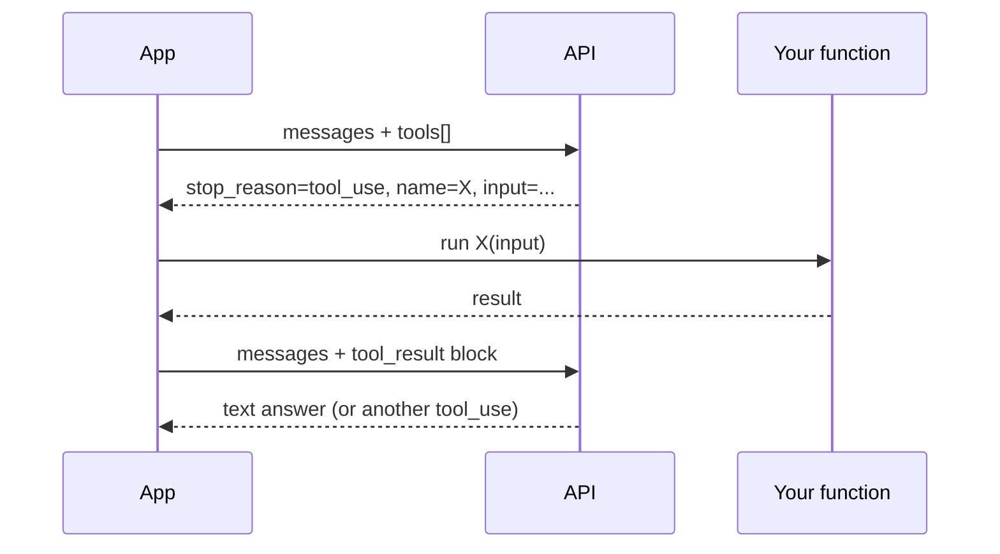

# Tool Use

Tool use lets Claude call functions you define. You describe each tool with a JSON schema, the model decides when to call it, and your code executes the call and returns the result. **This is how every agent — including Claude Code — actually works.**

## The loop



You loop until `stop_reason` is `end_turn`.

## Defining a tool

```ts
const tools = [{
  name: "get_weather",
  description: "Get the current weather for a city. Returns temperature in Celsius.",
  input_schema: {
    type: "object",
    properties: {
      city: { type: "string", description: "City name, e.g. 'Lisbon'" },
    },
    required: ["city"],
  },
}];
```

The `description` is the most important field. It's how the model decides *when* to call the tool. Be explicit about scope and edge cases.

## A complete tool-loop

```ts
import Anthropic from "@anthropic-ai/sdk";
const client = new Anthropic();

const tools: Anthropic.Tool[] = [/* as above */];

async function getWeather(city: string) {
  // your real API call here
  return { temp_c: 18, condition: "cloudy" };
}

async function chat(userText: string) {
  const messages: Anthropic.MessageParam[] = [
    { role: "user", content: userText },
  ];

  while (true) {
    const res = await client.messages.create({
      model: "claude-opus-4-7",
      max_tokens: 1024,
      tools,
      messages,
    });

    // Add the model's whole turn to history
    messages.push({ role: "assistant", content: res.content });

    if (res.stop_reason !== "tool_use") {
      // Model is done — extract text and return
      const text = res.content.find((b) => b.type === "text");
      return text?.type === "text" ? text.text : "";
    }

    // Otherwise, run every tool call and reply with results
    const toolResults: Anthropic.ToolResultBlockParam[] = [];
    for (const block of res.content) {
      if (block.type !== "tool_use") continue;
      const out = block.name === "get_weather"
        ? await getWeather((block.input as any).city)
        : { error: "unknown tool" };
      toolResults.push({
        type: "tool_result",
        tool_use_id: block.id,
        content: JSON.stringify(out),
      });
    }
    messages.push({ role: "user", content: toolResults });
  }
}

console.log(await chat("What's the weather in Lisbon?"));
```

Read it twice. That's *every* agent in 40 lines.

## Tool-choice control

Sometimes you want to force a specific tool, or forbid all tools:

```ts
tool_choice: { type: "auto" }                 // default — model decides
tool_choice: { type: "any" }                  // must call SOME tool
tool_choice: { type: "tool", name: "X" }      // must call X
tool_choice: { type: "none" }                 // no tools, prose only
```

`{ type: "any" }` is gold for structured-output flows: define one tool whose schema *is* your output shape, force-call it, parse the args.

## Design tips

- **Few high-quality tools** beats many overlapping ones. The model picks better when choices are distinct.
- **Specific descriptions.** "Returns weather" — bad. "Returns temperature in Celsius for the next 24h. Does not handle historical queries." — good.
- **Strict schemas.** Required fields, enums, length limits. The model respects them.
- **Idempotent tools.** The model may retry. Make repeated calls safe.
- **Return JSON, not prose.** The model parses tool results as data.

## Tool-use + extended thinking

Combine for the strongest agents. The model thinks → calls a tool → sees the result → thinks again → answers. Each cycle is structured and verifiable.

## Common pitfalls

- **Forgetting to push `tool_use_id` back.** The API requires the id in the `tool_result` so the model can match request to response.
- **Returning massive results.** A 50k-token tool result eats your context. Truncate or summarise.
- **Tool descriptions that are too generic.** Model calls them at random. Tighten the description.

## Practice

Define one tool — `read_file(path)`. Wire the loop. Have Claude answer questions about your repo by calling `read_file` to fetch what it needs. You just built a baby Claude Code.
