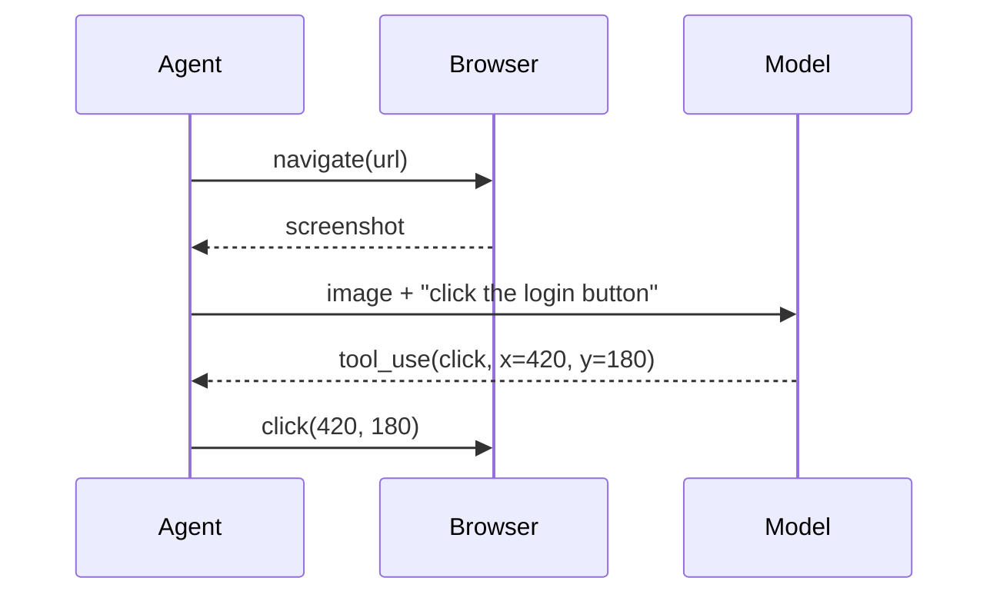

# Vision

Claude can see images. Pass them as input blocks alongside text. Useful for: screenshots, design mocks, charts, diagrams, PDFs (rendered as images), photographs of whiteboards.

## How to send an image

```ts
const response = await client.messages.create({
  model: "claude-opus-4-7",
  max_tokens: 1024,
  messages: [{
    role: "user",
    content: [
      { type: "text",  text: "What does this UI mock show? List the components and any UX issues." },
      {
        type: "image",
        source: {
          type: "base64",
          media_type: "image/png",
          data: fs.readFileSync("mock.png").toString("base64"),
        },
      },
    ],
  }],
});
```

Or via URL:

```ts
{ type: "image", source: { type: "url", url: "https://example.com/chart.png" } }
```

## What it's good at

- **Reading screenshots.** UI components, error dialogs, terminal output.
- **Reading charts.** Bar charts, line charts, dashboards. Handles axes and legends.
- **Reading handwritten notes / whiteboards.** Surprisingly good.
- **Diff-checking design mocks.** "What's different between these two mocks?"
- **OCR + comprehension.** It reads text *and* understands it together.

## What it's not great at

- **Pixel-perfect measurements.** "Is this gap 8px or 10px?" — no.
- **Complex spatial reasoning** (counting tiny objects, rotated text).
- **Very fine print** in dense screenshots.
- **Modifying images** — vision is input only; output is text. For image generation use a separate model.

## Vision + tool use — UI-driven agents

The combo unlocks UI agents:



This is roughly how computer-use / browser-use agents work.

## Costs and limits

- Images consume tokens proportional to their dimensions. A 1568×1568 image is ~1,600 tokens. Large screenshots can be expensive — resize before sending.
- Up to ~20 images per request (varies by model; check current docs).
- Supported formats: PNG, JPEG, WEBP, GIF. PDFs are typically rendered to images first; the API also has direct PDF input on some models.

## Use cases worth knowing

| Task | Prompt sketch |
|---|---|
| Triage screenshots from bug reports | "What's wrong in this screenshot? Quote any error text." |
| Convert UI mock → component code | "Generate React + Emotion code for this mock. Use these tokens: ..." |
| Audit a design for accessibility | "Check this mock for WCAG issues: contrast, target size, focus order." |
| Extract data from a chart | "Read this chart. Output a JSON array of `{label, value}`." |
| Code from a whiteboard photo | "This is an architecture sketch. Transcribe it as a mermaid diagram." |

## A real micro-recipe — design → code

```ts
const response = await client.messages.create({
  model: "claude-opus-4-7",
  max_tokens: 4000,
  system: [{
    type: "text",
    text: `You are a senior frontend engineer. Generate React + Emotion code that
matches the provided mock. Use these design tokens:
  --bg: #0d1117; --surface: #161b22; --text: #e6edf3; --accent: #58a6ff;
Hard rules: no inline hex (use tokens), responsive at 375/768/1280, accessible.`,
    cache_control: { type: "ephemeral" },
  }],
  messages: [{
    role: "user",
    content: [
      { type: "text",  text: "Generate the component for this mock." },
      { type: "image", source: { type: "base64", media_type: "image/png", data: imgB64 } },
    ],
  }],
});
```

## Practice

Take a screenshot of any of your apps. Ask Claude to identify three accessibility issues you might have missed. Then ask it to write the fix patch. Verify by running it.
