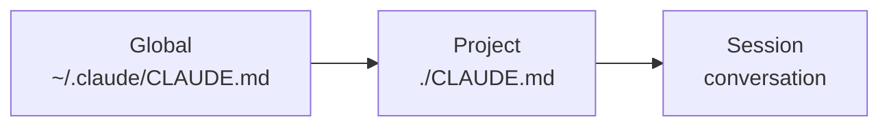

# CLAUDE.md & Memory

`CLAUDE.md` is the single most important file in your repo for AI-native work. It's the **first thing Claude reads** in every session. Get it right and every prompt afterwards is sharper.

## What lives in `CLAUDE.md`

Project-specific instructions, conventions, gotchas, and shortcuts. Not docs (`README.md` is for humans). Not a manifest. **A briefing for a smart colleague who just walked in.**

## Skeleton — copy and adapt

```markdown
# Project: Atlantis

## What this is
A pnpm monorepo of micro-frontend apps using Module Federation. Shell at `apps/shell`,
domain logic at `packages/bll`, transport at `packages/dal`.

## How to run
pnpm dev          # all apps
pnpm dev:shell    # shell only
pnpm -r typecheck # validate everything

## Conventions
- TypeScript strict, no `any` outside `declarations.d.ts`.
- Emotion `styled` for CSS. Use `theme.colors.*`, never hardcode hex.
- Translations through `@atlantis/i18n` only. Never inline `locale === 'pt' ? ...`.
- Tests live next to the code: `Foo.tsx` + `Foo.test.tsx`.

## Gotchas
- Component selectors crash in remotes (only the shell has the Emotion babel plugin).
- Don't `preventDefault` on `touchstart` — kills iPad scroll.

## Safe to do without asking
- Edit any file under `apps/` or `packages/`.
- Run pnpm test / typecheck / lint.

## Always ask first
- `git push`, `git commit --amend`, anything that mutates remote state.
- Adding new dependencies.
- Editing CI config.
```

## What makes a good `CLAUDE.md`

- **Specific, not aspirational.** "Tests live next to the code" beats "we value testing."
- **Short.** 100–300 lines. If it gets too long, split into `@docs/architecture.md` and reference it (Claude follows `@`-references).
- **Concrete examples for non-obvious rules.** Not "use the icon registry"; show the bad and good import.
- **Updated when conventions shift.** Stale `CLAUDE.md` is worse than no `CLAUDE.md`.

## Three levels of memory



| Scope | File | Use for |
|---|---|---|
| Global | `~/.claude/CLAUDE.md` | Your personal preferences across all repos. |
| Project | `<repo>/CLAUDE.md` | Project conventions. **Commit this.** |
| Session | The chat itself | Ephemeral context. Goes away on `/clear`. |

You can also reference other docs with `@`-syntax: `@docs/architecture.md` in `CLAUDE.md` will pull that file into context too.

## Auto-memory (Claude Code only)

Claude Code can also persist learnings to a structured memory directory (`~/.claude/projects/<...>/memory/`). It captures *user preferences*, *feedback*, *project state*, and *external references* — and re-reads them when relevant. You don't have to do anything; it learns from corrections and confirmations.

Worth saying out loud occasionally: *"Remember that we always run typecheck before committing."* That phrasing prompts a save.

## Anti-patterns

- **Pasting the whole README into `CLAUDE.md`.** Redundant.
- **Vague rules.** "Write clean code" — useless.
- **Stale TODOs.** Move them to issues. `CLAUDE.md` is the *operative* truth.
- **Secrets.** Never. Use env files; reference *that* you have them.

## Practice

Open the most-used repo you have. Run `/init`. Read the generated `CLAUDE.md`. Edit it down to the 50 lines a new team-mate would actually want. Commit. Notice your next session's quality jump.
