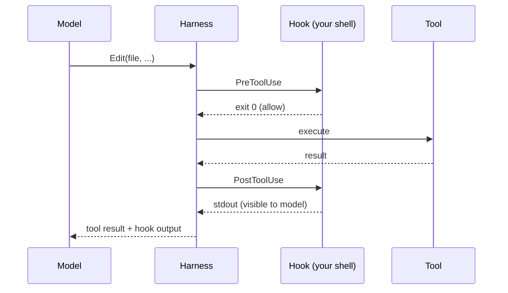

# Hooks

Hooks are **shell commands the harness runs in response to events** — like git hooks, but for the Claude Code agent. They're how you enforce policy, pipe in extra context, or make automation fire deterministically (the harness runs them, not the model).

## When to reach for a hook

- "From now on, *always* run typecheck before letting Claude finish a turn."
- "Whenever Claude edits a `.sql` file, run a linter and reject on error."
- "Show me a desktop notification when a long-running session stops."
- "Inject the current `git status` into every prompt."

If you find yourself reminding Claude of the same thing every session, **the right answer is a hook, not a memory.** Memories drift; hooks always run.

## Hook events

| Event | When it fires |
|---|---|
| `PreToolUse` | Before any tool call. Can block. |
| `PostToolUse` | After a tool call completes. |
| `UserPromptSubmit` | Right after you submit a prompt. Can inject text. |
| `Stop` | When the agent finishes a turn. |
| `SessionStart` | New session. |
| `SessionEnd` | Session closes. |

## How to configure

In `~/.claude/settings.json` (global) or `<repo>/.claude/settings.json` (project):

```json
{
  "hooks": {
    "PostToolUse": [
      {
        "matcher": "Edit|Write",
        "hooks": [
          { "type": "command", "command": "pnpm -r typecheck" }
        ]
      }
    ],
    "Stop": [
      {
        "hooks": [
          { "type": "command", "command": "afplay /System/Library/Sounds/Glass.aiff" }
        ]
      }
    ]
  }
}
```

## Real examples

### 1. Block edits to `package-lock.json`

```json
{
  "hooks": {
    "PreToolUse": [
      {
        "matcher": "Edit|Write",
        "hooks": [
          {
            "type": "command",
            "command": "case \"$TOOL_INPUT_PATH\" in *package-lock.json) echo 'Refusing to edit lockfile by hand'; exit 1;; esac"
          }
        ]
      }
    ]
  }
}
```

The hook's stderr + nonzero exit → the tool call is rejected and the model sees the message.

### 2. Inject current branch into every prompt

```json
{
  "hooks": {
    "UserPromptSubmit": [
      { "hooks": [
        { "type": "command", "command": "echo 'Current branch: '$(git branch --show-current)" }
      ] }
    ]
  }
}
```

stdout becomes context the model sees before answering.

### 3. Auto-run tests after edits

```json
{
  "hooks": {
    "PostToolUse": [
      {
        "matcher": "Edit",
        "hooks": [
          { "type": "command", "command": "pnpm test --silent --bail" }
        ]
      }
    ]
  }
}
```

## Hook flow



## Gotchas

- **Hooks run synchronously.** A slow hook slows the whole session.
- **`PreToolUse` exit ≠ 0 blocks the tool.** Use sparingly — Claude will see the rejection and can get into a stuck state.
- **Use `~/.claude/settings.json` for personal**, repo `.claude/settings.json` for team-wide. Commit the team one.
- **Don't skip hooks with `--no-verify` (git) or `--no-gpg-sign`.** The harness applies the same convention.

## Practice

Add this Stop hook to your global settings: it plays a chime when a session ends. Now you can tab away from long Claude runs and come back when it pings.

```json
{ "hooks": { "Stop": [{ "hooks": [{ "type": "command", "command": "afplay /System/Library/Sounds/Glass.aiff" }] }] } }
```
