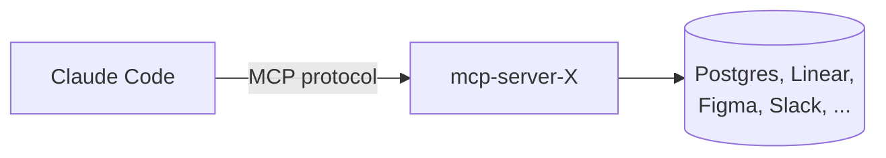

# MCP Servers

**MCP** = Model Context Protocol. An open protocol for plugging *external systems* (databases, APIs, design tools, ticket trackers, your home server) into Claude as **first-class tools**. Anthropic publishes the spec, anyone can implement a server.

## The mental model



You configure an MCP server in `~/.claude/mcp.json`. Claude starts the server as a subprocess on session start, discovers what tools it exposes, and adds them to the toolset. Now you can say *"open the Linear ticket I'm working on"* and Claude calls `linear.getIssue` — no copy-paste, no API key juggling.

## What's available today (sample)

| Server | What it exposes |
|---|---|
| `@modelcontextprotocol/server-filesystem` | Reach beyond cwd into other directories. |
| `@modelcontextprotocol/server-postgres` | Query a Postgres DB; schema introspection. |
| `@modelcontextprotocol/server-github` | Issues, PRs, code search across orgs. |
| `@modelcontextprotocol/server-slack` | Send / read messages. |
| `@modelcontextprotocol/server-google-drive` | Search and read Drive docs. |
| `@modelcontextprotocol/server-puppeteer` | Headless browser for scraping / e2e. |
| Community: Linear, Notion, Sentry, Stripe, Figma, Supabase, Cloudflare, etc. |

Browse the registry: `https://github.com/modelcontextprotocol/servers`.

## Wiring one up

```json
// ~/.claude/mcp.json
{
  "mcpServers": {
    "github": {
      "command": "npx",
      "args": ["-y", "@modelcontextprotocol/server-github"],
      "env": { "GITHUB_TOKEN": "ghp_..." }
    },
    "postgres": {
      "command": "npx",
      "args": ["-y", "@modelcontextprotocol/server-postgres", "postgres://localhost/mydb"]
    }
  }
}
```

Restart Claude. Now ask: *"List the 5 most recently opened issues in `anthropics/claude-code`."* — it'll reach for the `github` server's `list_issues` tool.

## Writing your own MCP server

You'll do this when no public server matches your need (an internal API, a proprietary system, a custom workflow). Stack: TypeScript or Python, ~50 lines for a minimal server.

```ts
// minimal example
import { Server } from "@modelcontextprotocol/sdk/server/index.js";
import { StdioServerTransport } from "@modelcontextprotocol/sdk/server/stdio.js";

const server = new Server({ name: "my-tool", version: "0.1.0" });

server.setRequestHandler("tools/list", async () => ({
  tools: [{ name: "ping", description: "Health check", inputSchema: { type: "object" } }]
}));

server.setRequestHandler("tools/call", async ({ params }) => {
  if (params.name === "ping") return { content: [{ type: "text", text: "pong" }] };
  throw new Error("unknown tool");
});

await server.connect(new StdioServerTransport());
```

Register it in `mcp.json` with `"command": "node", "args": ["./mcp-my-tool.js"]`. That's it.

## Skills vs MCP — when to pick which

| You want… | Use |
|---|---|
| To codify a *prompt + workflow* | Skill |
| To expose an *external system* as a tool | MCP server |
| Both | Skill that *uses* MCP tools |

A skill is "instructions for the model"; an MCP server is "a new capability for the model." Often you combine them: an MCP server exposes `linear.create_issue`; a skill says *"when the user runs `/triage`, use `linear.create_issue` to file follow-ups."*

## Security notes

- MCP servers are **subprocesses you trust**. Treat them like installing a CLI: pin versions, read the source for unknowns, scope tokens.
- Tokens go in env vars, not in the json config (or use OS keychain integrations).
- Some servers expose write tools — read the docs before approving the first call.

## Practice

Pick the system you copy-paste from most often (Linear, Notion, Postgres). Wire its MCP server. Re-do tomorrow's first task using only Claude — no manual lookup. Notice the latency disappear.
