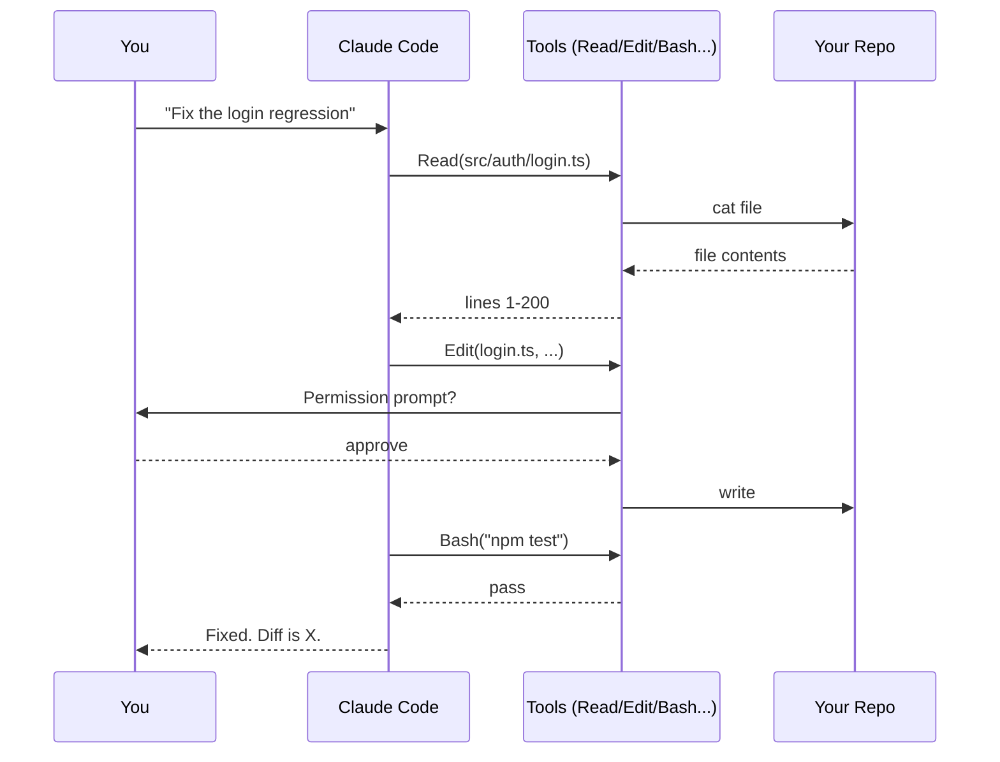

# What is Claude Code?

**Claude Code** is Anthropic's official CLI / IDE agent. It runs Claude in a loop with file-editing, shell-execution, and search tools, in a permission-aware sandbox. It's the thing that lets the model *actually do work* in your repo — not just talk about it.

It comes in four shells:

- **Terminal CLI** — the canonical one. `claude` from any directory.
- **VS Code extension** — same agent, integrated diff view, IDE selection context.
- **JetBrains plugin** — same agent inside IntelliJ / WebStorm / etc.
- **Web app** — `claude.ai/code` in the browser.

All four share the same brains, settings, and skills. Pick whichever you live in.

## How it works (mental model)



Every loop iteration: the model thinks, calls a tool, gets a result, thinks again. It stops when it decides the task is done — or when it asks you a question.

## What makes it different from "ChatGPT with autocomplete"

- **It edits files.** Real diffs, with permission prompts. Reversible via git.
- **It runs your shell.** `pnpm test`, `npm run build`, `gh pr create`. Same prompts you'd type.
- **It reads the repo.** Grep, Read, file glob, the whole tree.
- **It remembers via `CLAUDE.md`.** Your conventions auto-load every session.
- **It extends.** Slash commands, hooks, skills, MCP servers, subagents.

## The session loop

```
┌────────────────────────────────────────────┐
│ 1. You type a request                      │
│ 2. Claude reads/edits/runs in a tool loop  │
│ 3. Permission prompts on risky ops         │
│ 4. Claude writes a short summary           │
│ 5. You review the diff and continue        │
└────────────────────────────────────────────┘
```

Sessions are stateful within one chat — Claude remembers what you've done. They're stateless across chats unless you've configured memory (or stored notes in `CLAUDE.md` or skill files).

## Anatomy of `claude`

```
$ claude                              # interactive session
$ claude "fix the failing test"       # one-shot
$ claude --resume                     # last session
$ claude --print "summarise the diff" # piped, non-interactive
$ claude /init                        # generate CLAUDE.md
```

Add `--dangerously-skip-permissions` for unattended automation **only inside a sandbox**.

## Practice

Install Claude Code (`curl -fsSL https://claude.ai/install.sh | sh` or via your package manager). Cd into a real project. Run `claude`. Ask: *"Read README.md and tell me what's actually built vs. what's still TODO."* You're now using the tool.
