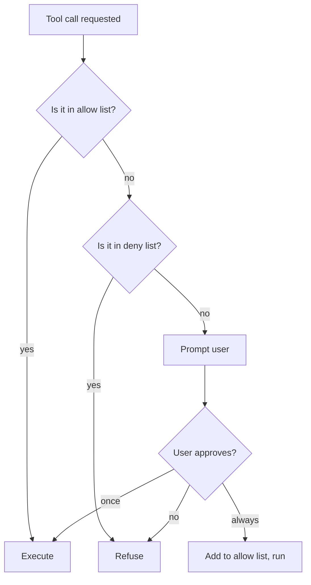

# Permissions & Safety

Claude Code runs in a **permission-aware sandbox**. Every potentially-destructive tool call (write a file, run a shell command, hit an external API) is gated. Knowing the model's permission system is how you go fast *without* getting bitten.

## Permission modes

| Mode | What it means |
|---|---|
| `default` | Prompt on every tool call the user hasn't approved before. |
| `acceptEdits` | Auto-approve `Edit` / `Write` to files. Still prompts for `Bash`, network, deletes. |
| `plan` | Read-only. Cannot edit or run. Use for analysis. |
| `bypassPermissions` | Prompts only for the most dangerous ops. Use carefully. |

Toggle via `/permissions`.

## settings.json — the durable allowlist

```json
{
  "permissions": {
    "allow": [
      "Bash(pnpm test*)",
      "Bash(pnpm typecheck*)",
      "Bash(git status)",
      "Bash(git diff*)",
      "Read(**)",
      "Edit(**)"
    ],
    "deny": [
      "Bash(rm -rf*)",
      "Bash(git push --force*)",
      "Bash(* > /etc/*)"
    ]
  }
}
```

Globs are POSIX-style. Allowed entries skip the prompt; denied entries are refused outright.

## What to allow without thinking

- Read anywhere in the repo.
- Run `pnpm test` / `pnpm lint` / `pnpm typecheck` / `pnpm build`.
- Run `git status` / `git diff` / `git log`.

## What to **always** prompt for

- `git push`, `git commit --amend`, `git rebase`.
- `gh pr create`, `gh issue create`.
- `rm -rf`, `git clean -fd`.
- Network calls to production endpoints.
- Anything that mutates a shared system (database writes, deploys, customer comms).

The rule from the system prompt is good guidance: **scope matters. Approval for one push is not approval for all pushes. Match the scope of action to what was actually requested.**

## Decision tree



## The `--dangerously-skip-permissions` flag

For unattended automation only. **Never on a real working tree.** Run it inside:

- A Docker container.
- A throwaway worktree (`git worktree add /tmp/exp`).
- A CI runner with no production credentials.

## Sandboxing for risky experiments

```bash
# spawn an isolated worktree, run Claude in it, cleanup after
git worktree add ../experiment
cd ../experiment
claude --dangerously-skip-permissions
```

Or use the agent's built-in `isolation: "worktree"` option when spawning subagents — they get their own worktree automatically.

## What the model will refuse to do

Claude has its own safety layer (independent of permissions): it will not help with mass targeting, supply-chain compromise, destructive techniques without authorization context, and so on. Dual-use security work (pentesting, CTFs, defensive research) is fine *with* clear context. State the context up front.

## Practice

Open `~/.claude/settings.json`. Add three Bash allowlist entries for commands you approve every day (`pnpm test`, `pnpm typecheck`, `git status`). Tomorrow's session will have three fewer prompts.
