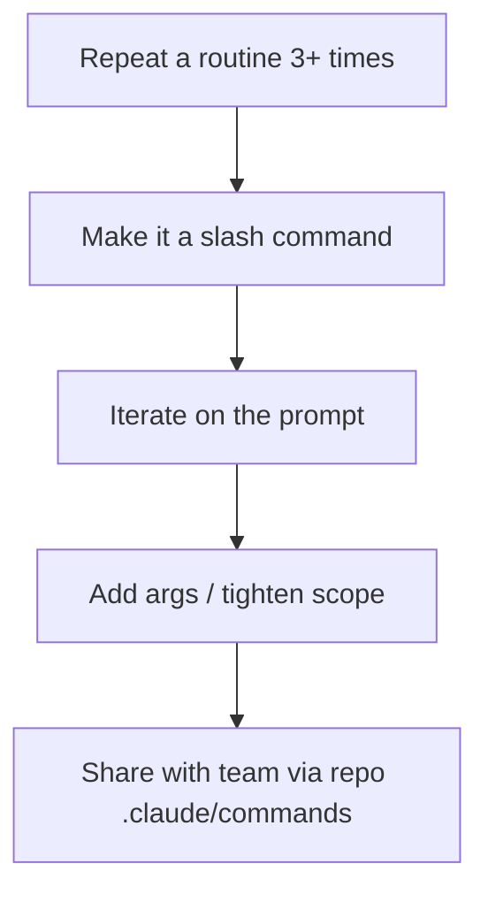

# Slash Commands

Slash commands are **named, reusable prompts** you can fire with one keystroke. Type `/`, pick one, and Claude runs the canned prompt with your arguments. They're the fastest way to encode a routine into your tooling.

## Built-ins worth knowing

| Command | What it does |
|---|---|
| `/init` | Generate / refresh `CLAUDE.md`. |
| `/clear` | Drop the current session. |
| `/resume` | Resume the last session. |
| `/help` | Open help. |
| `/login`, `/logout` | Manage auth. |
| `/config` | Edit settings (theme, model, statusline). |
| `/fast` | Toggle fast mode (Opus 4.6 with faster output). |
| `/loop <interval> <command>` | Run a command on an interval. |
| `/schedule` | Create a remote scheduled agent. |

## Custom slash commands — your superpower

You author them as **markdown files** under `.claude/commands/` (project) or `~/.claude/commands/` (global). The filename is the command name; the body is the prompt.

### Example: `.claude/commands/review-pr.md`

```markdown
---
description: Review the current branch as a senior engineer
allowed-tools: Bash, Read, Edit
---

You are a senior engineer reviewing the current branch for merge to main.

Steps:
1. Run `git log --oneline main..HEAD` to see commits.
2. Run `git diff main...HEAD` to see total diff.
3. For each non-trivial file, read it and assess: clarity, edge cases,
   test coverage, accidental scope.
4. Output:
   - **Verdict** (ship / changes-requested / block).
   - **Required changes** (must-fix).
   - **Suggestions** (nice-to-have).
   - **Praise** (what's clearly good).

Be specific: file:line citations, not vibes.
```

Now `/review-pr` runs the whole thing.

### Example: `.claude/commands/feature.md` (with arguments)

```markdown
---
description: Scaffold a new React component
---

Scaffold a new component called `$1` in `packages/ui/src/$1/`:

- `$1.tsx` — Emotion `styled`, accepts the props described in $2
- `$1.test.tsx` — RTL test for the happy path
- `index.ts` — re-export

Follow the conventions in `packages/ui/src/Button/`.
```

Use it: `/feature ToggleSwitch "checked: boolean; onChange: (next: boolean) => void"`.

## Frontmatter fields you'll actually use

```yaml
---
description: One line shown in the command palette
allowed-tools: Read, Edit, Bash       # whitelist; default is all
disallowed-tools: WebFetch            # blacklist
model: claude-sonnet-4-6              # override the session model
---
```

## Patterns that pay off



- **Code review** (`/review`, `/security-review`)
- **Branch audit** (`/branch-status` — what's left before ship)
- **Generate tests** (`/test <file>`)
- **Open a PR** (`/pr` — runs your team's PR template)
- **Daily standup digest** (`/standup` — summarise what you did)
- **One-shot refactors** (`/extract-component <range>`)

## Built-in skills already exposed as commands

The `claude-code` install ships with a few skills already wired as commands you can invoke with `Skill`: `init`, `review`, `security-review`. Plus user-installable plugins (e.g. `simplify`, `update-config`, `find-skills`, `frontend-design`). Run `/help` to see what your install has.

## Sharing with your team

`.claude/commands/` lives in the repo. Commit it. Now every teammate's Claude has the same shortcuts. **This is how you bake institutional knowledge into the toolchain.**

## Practice

Find one routine you did 3+ times in the last week (PR review, changelog drafting, test scaffolding). Make it a slash command. Run it tomorrow.
