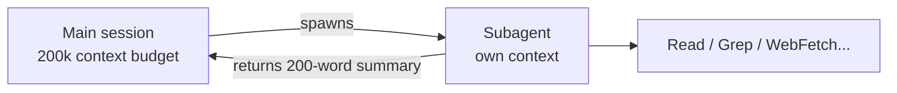

# Subagents

A **subagent** is a separate Claude session you spawn from your main session, with its own context window, its own tool whitelist, and its own scope. Think of it as **delegating to a junior** for a contained task — research, generation, validation — and getting back only the summary.

## Why bother

The main session's context is precious. If you ask it to `grep` 100 files looking for a pattern, that's 100 file reads polluting the conversation. Spawn a subagent: it does the search in its own context, returns 200 words of findings, your main context stays clean.



## When to spawn

| Use a subagent | Stay in the main session |
|---|---|
| Searching the codebase for "where is X used" | Editing 2-3 known files |
| Auditing a branch end-to-end | A focused single-file change |
| Multi-step research ("compare 4 libs and recommend") | A two-line bug fix |
| Running tests across many packages and summarising | Running one test file |
| Running things in parallel | Anything sequential and short |

## Spawn pattern

```ts
// inside Claude Code, the Agent tool
Agent({
  subagent_type: "Explore",                    // or "general-purpose", "Plan", etc.
  description: "Find all uses of X",
  prompt: "Find every call site of `getCwd` in the repo. Group by package. Report under 200 words."
});
```

Available types:

| Type | Best for |
|---|---|
| `Explore` | Read-only search, "where is X" lookups. Fast. |
| `general-purpose` | Open-ended multi-step research / tasks. |
| `Plan` | Designing implementation plans before coding. |

## Anatomy of a good subagent prompt

A subagent does **not** see your main session's context. The prompt has to be self-contained. Treat it like a smart colleague who just walked into the room:

```
GOOD:

  Audit migration `0042_user_schema.sql` for safety.
  Context: we're adding a NOT NULL column to a 50M-row table with a backfill default.
  Existing rows get a backfill default. I want a second opinion on whether the
  backfill approach is safe under concurrent writes.
  Report: is this safe, and if not, what specifically breaks? Under 200 words.

BAD:

  Audit my migration.
```

## Parallelism

Spawn N subagents in **one message** (multiple tool calls in the same response) and they run concurrently. This is how you turn an hour of sequential research into a few minutes of parallel work.

```mermaid
gantt
    dateFormat  HH:mm
    title Sequential vs Parallel Subagents
    section Sequential
    Audit deps    :a1, 09:00, 12m
    Audit tests   :a2, after a1, 12m
    Audit perf    :a3, after a2, 12m
    section Parallel
    Audit deps    :b1, 09:00, 12m
    Audit tests   :b2, 09:00, 12m
    Audit perf    :b3, 09:00, 12m
```



## Background mode

Pass `run_in_background: true` and the main session keeps moving while the subagent works. You'll get a notification on completion. Use this for long-running audits.

## Anti-patterns

- **Spawning a subagent for a 5-second task.** The overhead isn't worth it. Just do it inline.
- **Vague prompts.** "Look around the codebase" returns vague answers. Specify the question.
- **Forgetting they're isolated.** "Based on the earlier discussion…" — they don't have the earlier discussion.
- **Re-doing the agent's work on the main thread while it runs.** Wait for the result, then synthesise.

## Practice

Open a real repo. Spawn an `Explore` subagent: *"Find every TODO comment grouped by package. Sorted by count, descending. Report under 150 words."* Read the report. Then ask the main session: *"Pick three TODOs that are quick wins and propose patches."* That's the pattern: parallel research → focused edit.
