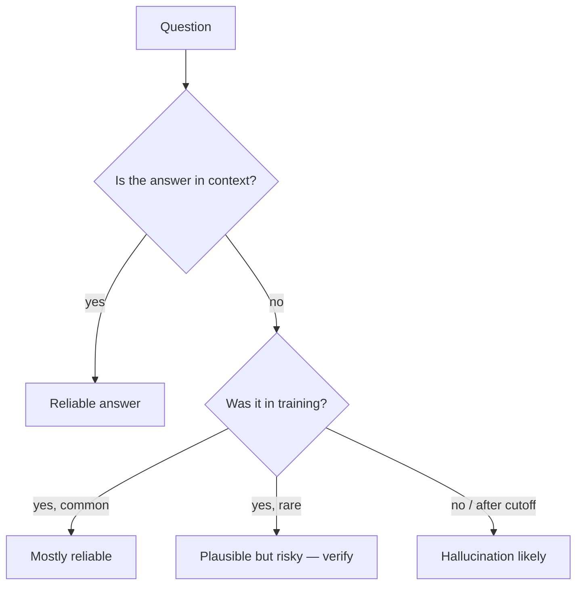

# Strengths & Limits

A clear-eyed inventory. Knowing what to delegate is half the skill.

## What Claude is genuinely good at

| Strength | Why |
|---|---|
| **Code generation** in popular languages | Massive training signal; idiomatic patterns are dense in the data. |
| **Refactoring & renaming** | Strong at local edits across many files when given good context. |
| **Reading large docs** | 200k–1M context window means you can paste the whole RFC and ask. |
| **Structured extraction** | JSON/CSV from messy text — extraction is one of its sweet spots. |
| **Translation** between idioms | Python → TypeScript, REST → GraphQL, callback → async. |
| **Explaining code** | Especially "what would this do at scale / under concurrency / with bad input." |
| **First-draft writing** | PR descriptions, RFCs, READMEs, error messages. |

## What it's good-but-not-great at

| Task | Caveat |
|---|---|
| **Math beyond arithmetic** | Use a code tool. Don't ask for closed-form solutions. |
| **Counting / sorting / dedup** | Token-level work — write a script. |
| **Citing sources** | Will invent plausible-looking URLs. Fetch them yourself or wire a tool. |
| **Reasoning over very long chains** | Quality drops past ~5–7 step deductions without scratchpad / tool use. |

## What it's bad at (don't even try)

- **Real-time facts** without a web tool. (No, it doesn't know today's stock price.)
- **Your private codebase** without context. (It does not "remember" yesterday's session unless memory is wired.)
- **Pixel-perfect design** from a vague prompt. Frontend code? Yes. Pristine UX decisions? Still yours.
- **Decisions with stakes**: production deploys, irreversible deletes, customer comms. The model proposes; you dispose.

## Hallucination — the core failure mode

**Mitigations** (in order of leverage):

1. **Give it the source.** Paste the file, link the doc, attach the PDF. Most "hallucinations" are just missing context.
2. **Wire tools.** Let it read files, fetch URLs, run code. Now it can verify.
3. **Ask for uncertainty.** Add: *"If you're not sure, say so. Do not invent function names."*
4. **Cite-check.** For factual claims, ask it to quote the exact sentence from the source.
5. **Use evals.** Catch regressions before they ship.

## A useful test

Before delegating, ask: *"Could a junior with Google access do this in an hour?"* If yes, Claude can probably do it in a minute. If no — *especially* if the answer requires judgement about your specific company / stack / users — you're going to do most of the work either way. Use Claude to *draft*, not to *decide*.

## Practice

List 5 tasks you did this week. Mark each: **delegate fully**, **draft + review**, **do yourself**. That's your map.
