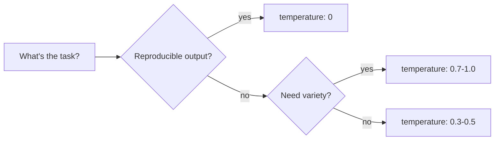

# Temperature & Sampling

The model gives you a probability distribution over the next token. **How you sample** from that distribution decides how the answer looks.

## The two knobs that matter

### `temperature` (0.0 — 1.0)

- `0.0` — deterministic-ish. Always pick the highest-probability token. Best for: extraction, classification, code edits where you want consistency.
- `0.3 – 0.5` — slight creativity. Good default for code generation and reasoning.
- `0.7 – 1.0` — creative. Brainstorms, varied prose, exploratory writing.

### `top_p` (0.0 — 1.0)

Nucleus sampling. Only consider tokens whose cumulative probability sums to `top_p`. `top_p: 0.9` means "ignore the long tail of unlikely tokens." Most users leave this at default.

> **Use one or the other, not both.** Setting both makes behaviour hard to reason about. Default to tuning `temperature` only.

## When to set what

| Task | Temperature |
|------|-------------|
| Extracting JSON from text | 0 |
| Classifying a ticket | 0 |
| Generating SQL | 0 — 0.2 |
| Writing a code patch | 0.2 — 0.4 |
| Brainstorming names | 0.8 — 1.0 |
| Writing marketing copy | 0.7 — 0.9 |
| Summarising a doc | 0.2 — 0.4 |

## A concrete example

Same prompt, three temperatures:

> *Prompt:* "Suggest a name for a CLI tool that lets developers grep their bash history with AI."

- `temperature: 0` → "histgrep" (every time)
- `temperature: 0.5` → "histai", "shellsearch", "histgrep"
- `temperature: 1.0` → "Recall", "Echoes", "shellsage", "Hindsight"

Same model. Same prompt. Different sampling. Match the knob to the job.

## Practice

Pick one prompt where you've felt the answer was inconsistent. Lower the temperature and run it five times. Then raise it and run five more. Watch the variance change.
