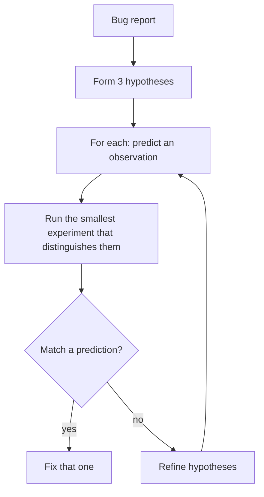

# Debugging with Claude

Done well, debugging with Claude collapses hours into minutes. Done badly, you ping-pong with the model and end up where you started. Here's the pattern that works.

## The MRE prompt — minimal reproducer

The single best debugging move: spend 5 minutes producing a *minimal reproducible example* in your prompt. Often you find the bug while trimming.

```
A ticking input that updates state on every keystroke causes a 200ms
freeze on first keypress in Safari only.

Repro:
  <input value={text} onChange={(e) => setText(e.target.value)} />

Environment:
  Safari 17.4 on macOS 14.4
  React 18.3, no other state libs
  Reproduces 100% of the time
  Chrome / Firefox: no freeze

What I've ruled out:
  - useDeferredValue: didn't help
  - The state itself is just a string, no derived heavy work

What I want:
  - A specific cause hypothesis I can verify
  - The verification I should run
```

This prompt gets you a useful hypothesis. *"My input is slow"* gets you generic advice.

## The Read-First habit

Before asking "why is this broken," paste the code. Don't summarise it.

```
Here's the failing component. Why does the test "loads on mount"
fail with `act() warning`? Show me the exact line and the cause.

[paste FoobarHook.ts]
[paste FoobarHook.test.ts]
[paste failure log]
```

You'll get a precise answer because the model isn't guessing at code shape.

## The bisect prompt

```
This used to work. Run `git log --oneline src/foo.ts` and tell me the
three most recent commits that touched this file. Then for each, look
at the diff and say which one most likely introduced the bug described
below.

Bug: <describe>
```

Combines what `git bisect` does with reading-comprehension that bisect can't do.

## The hypothesis-test loop



Prompt:

```
Given this bug, give me 3 distinct hypotheses for the root cause.
For each, propose the smallest test (a single console.log, a single
unit test, a single curl) that would distinguish it from the others.
Don't commit to one yet — just give me the experiments.
```

This is *better* science than just asking "what's wrong?" — it forces the model to propose falsifiable hypotheses.

## "Why is this slow?"

Performance debugging benefits from structure:

```
Profile this component. Tell me which renders are unnecessary,
which dependencies in useEffect / useMemo are unstable, and which
state updates trigger cascading renders. Use the actual code below.

[paste]
```

Pair with a real profiler trace if you have one — paste the JSON or screenshot.

## "Why does this test flake?"

```
This test passes locally and fails in CI 30% of the time. The error
is `expected element to be visible`. Walk through every async step
and tell me which one might race. Then propose the minimal change
to make the test deterministic.

[paste test]
```

## When the model goes in circles

Symptom: same suggestion three times, none worked.

Action: **change the prompt, not the model.** What's missing?

- Did you paste the *actual* error, or your paraphrase?
- Did you paste the *whole* relevant code, or just the part you thought was relevant?
- Did you say what you've already tried?

```
Things I've already tried (don't suggest these again):
- Wrapping in act()
- Awaiting findBy*
- Adding waitFor with 5s timeout
```

Forces the model out of the local minimum.

## Browser DevTools companion

Use Claude to interpret what DevTools shows you:

```
Here's the React Profiler flame chart for the Foo page (screenshot).
Tell me which 3 components are most expensive on initial render and
why. Then suggest the cheapest fix.
```

(Vision model does this well.)

## Practice

Take the next bug you hit. Don't ask Claude until you've written a 7-line MRE. Then prompt with the structured template above. Notice how often you find the bug in step 1 — without ever asking Claude.
