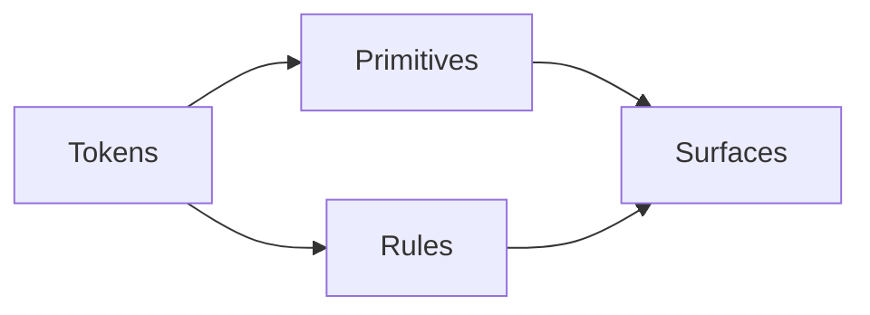

# Design Systems & Tokens

A design system is a contract: every surface uses the same tokens, primitives, and rhythm. Claude is *very* good at respecting a contract — if you put the contract in front of it.

## The contract Claude needs



- **Tokens** — colors, spacing, typography, radii, shadows.
- **Rules** — "tokens only, no hex"; "11px mono for eyebrows"; "min 44px touch targets."
- **Primitives** — Button, IconButton, Input, Pill, Badge, etc.
- **Surfaces** — pages, modals, widgets that compose primitives.

Make all of these *findable* by Claude:

1. Tokens live in one file (`theme.ts`).
2. Rules live in `CLAUDE.md` or `docs/design.md` referenced from `CLAUDE.md`.
3. Primitives live in one folder, each with the same shape.

Now Claude can read the contract in seconds and respect it.

## Putting tokens into Claude's working memory

Two options:

### Option A — `CLAUDE.md` references theme.ts

```markdown
## Design tokens
See `packages/shared/src/theme.ts`. Use only tokens from there.
Never hardcode hex; never use raw px (use theme.spacing.*).
```

Claude reads this on session start; it knows where to find tokens.

### Option B — system prompt with cached tokens

If you're using the API directly:

```ts
system: [{
  type: "text",
  text: `Design tokens (USE THESE, DO NOT INVENT):
${TOKENS_FILE_CONTENTS}

Rules:
- Theme tokens only — no hex, no raw px
- 11px mono / uppercase / 0.16em for eyebrow labels
- ...`,
  cache_control: { type: "ephemeral" },
}],
```

Caches every call. Cheap and reliable.

## Style-rule prompts that work

```
Read packages/ui/src/Button/Button.tsx and tell me three style rules
you observe (colors, spacing, typography). Then apply those same
rules when generating <Name>.
```

Self-extracting the rules from a reference is more reliable than relying on the model's training-data instincts.

## Catching style drift

After Claude writes a component, audit:

```
Audit the new component <path> against:
- Theme tokens only? (no hex, no raw px)
- Typography sizes from the locked scale? (11/13/14/16/18/22)
- Min 44px touch targets?
- Keyboard-accessible (focus ring, tabIndex)?
- Responsive at 375/768/1280?

For each violation, propose a one-line fix.
```

This audit prompt is a great candidate for a skill (`/style-audit <path>`).

## Translating designs from one DS to another

When you're moving from "we built ad-hoc" → "we have a design system":

```
Read packages/ui/src/index.ts (the new system).

Read apps/legacy/src/components/OldButton.tsx (an ad-hoc component).

Migrate OldButton to use the new design system primitives. Preserve the
public API (props). Drop any styles already covered by the new <Button>.
Don't touch call sites. Show me the diff.
```

## Generating new tokens

When you actually need to *expand* the system:

```
Propose three new spacing tokens between md (16px) and lg (24px).
The current scale is xs:4 / sm:8 / md:16 / lg:24 / xl:32 / xxl:48.
Don't break the existing scale; suggest names that fit.
```

The model is good at *consistent* expansion, less good at *originating* a system. Use it for the former.

## The bar — pairs of surfaces test

> Pick any two surfaces side by side (a widget and a modal, a list row and a palette item). If the typography scales, spacing rhythm, color system, motion budget, and chrome don't feel identical — one of them is off. Fix it.

Have Claude run this test for you:

```
Compare packages/widgets/src/finance/FinanceWidget.tsx and apps/finance/src/App.tsx.
List every typography / spacing / color inconsistency between them.
```

A 30-second sanity check before any release.

## Practice

Pick two random components in your repo. Run the audit prompt above on each. Fix what comes up. Now your design system is one notch tighter than yesterday.
