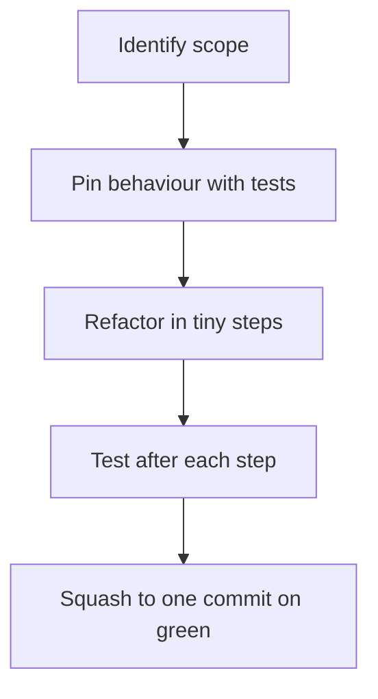

# Refactor Playbook

Refactors are where AI shines — and where it most commonly breaks production. Here's how to capture the wins without the breakage.

## The golden rule

**Never refactor without a test net.** If the code isn't covered by tests that fail when you break behaviour, write the tests *first*, then refactor. The model will help with both halves.

## The pattern



## Step 1 — Pin behaviour first

```
Read src/auth/login.ts. Generate 5–8 tests for src/auth/login.test.ts
that pin its current observable behaviour:

- Happy path
- Wrong password
- Missing email
- Locked account
- ...

Use only public API, not internals. Run the tests. They should pass.
```

Now you have a behavioural baseline.

## Step 2 — Refactor in tiny chunks

```
Now refactor src/auth/login.ts to extract the `validateInput` helper
into its own function. Don't change behaviour. Don't change other files.
Run the tests after.
```

One change, one verification. The smaller the step, the cheaper the rollback.

## Common refactors and their prompts

### Rename

```
Rename `getCwd` → `getCurrentWorkingDirectory` everywhere in the repo.
Use Grep to find all call sites. Update each. Don't rename anything else.
Run typecheck after.
```

### Inline / extract

```
Inline the `tempVar` constant in src/foo.ts. Don't change anything else.
```

```
Extract the date-formatting block in src/foo.ts:42–80 into a new
`formatRange` helper in src/utils/date.ts. Update the call site.
Add tests for the helper.
```

### Move

```
Move `useThrottle` from packages/shared/src/hooks/ to packages/utils/src/.
Update all imports across the monorepo. Don't change behaviour.
```

### Convert pattern

```
Convert all class components in src/legacy/*.tsx to function components.
Use hooks for state and effects. Preserve public props and behaviour.
After each file, run that file's test.
```

### Change a library

```
Migrate src/api/*.ts from axios to fetch. Preserve return types.
Run pnpm test after. Show me the diff for each file.
```

### Modernise types

```
Replace `any` types in src/foo.ts with precise ones. Use the actual
shape from the call sites you can find via Grep. Don't `as` your way
out — if a real type is unknown, use unknown and narrow.
```

## What not to do

- **"Make this code better."** Vague → vague output. Be specific.
- **Refactor + new feature in one prompt.** Behaviour changes mask refactor bugs. Ship them as separate commits.
- **Skip the test pinning step.** Saving 10 minutes upfront costs an hour rolling back later.
- **Refactor across 30 files in one prompt.** Even great agents drift over wide changes. Tight scope → tight diff.

## When the refactor reveals a bug

Often the refactor surfaces a bug that's been latent for months. Resist the urge to "fix it while you're in there." File a separate ticket; finish the refactor cleanly. Otherwise the diff becomes unreviewable.

> Refactor + bugfix in one diff = nobody can tell what changed.

## Branch hygiene

Use a worktree for risky refactors:

```bash
git worktree add ../refactor
cd ../refactor
claude
```

If it goes sideways, `git worktree remove ../refactor` and you're back where you started.

## Audit prompt for any refactor PR

```
Read git diff main...HEAD. For each changed file, classify the change as:
  - PURE_REFACTOR (behaviour identical)
  - BEHAVIOURAL (introduces a behaviour change)
  - STYLE_ONLY (whitespace / naming)

For BEHAVIOURAL ones, describe the change and ask if it's intentional.
```

Catches "while-I'm-here" creep before you push.

## Practice

Pick a function with no tests. (Easy — there's always one.) Pin it with 5 tests via Claude. Refactor it (extract, rename, simplify) in 3 tiny steps, running tests after each. Open a PR. That's the loop, on rails.
