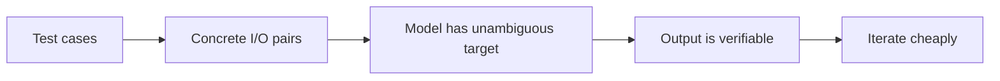

# Tests as a Spec

Tests aren't just safety. They're a *specification*: the most precise statement of what your code is supposed to do. Used right, they're also the best prompt-input you can give Claude.

## Tests-first prompting

Instead of:

> "Write a function that parses ISO durations."

Try:

> "Make these tests pass. Don't touch the tests."

```ts
// duration.test.ts
import { parseISODuration } from './duration';

test('PT1H30M → 5400000 ms', () => {
  expect(parseISODuration('PT1H30M')).toBe(5_400_000);
});
test('P1D → 86400000 ms', () => {
  expect(parseISODuration('P1D')).toBe(86_400_000);
});
test('invalid → null', () => {
  expect(parseISODuration('not-iso')).toBe(null);
});
```

The tests are the spec. The implementation is whatever passes them. This produces tighter, more correct code than free-form generation.

## Why this works



The model knows exactly what *good* looks like (the tests pass). And you can verify in seconds.

## Generating tests

The reverse direction also works. Given a function, generate tests:

```
Read src/utils/date.ts. Generate src/utils/date.test.ts covering:
- Happy path for each exported function
- Edge cases (null, empty, leap year, DST boundaries)
- Locale variations (en, pt)

Use Vitest. Match the style of src/utils/range.test.ts.
```

Iterate by running them, finding the *one* that exposes a real bug, fixing the code, and committing both.

## Test types and what AI is good at

| Type | AI quality |
|---|---|
| Unit (pure function in/out) | **Excellent** — perfect AI task |
| Integration (component + state) | **Good** — needs more context |
| E2E (browser automation) | **Decent** — verbose, iterate |
| Snapshot | **Don't.** Brittle, low-signal |
| Visual regression | Out of scope; use Chromatic etc. |

## Anti-patterns

### ❌ Snapshot-everything

```ts
expect(html).toMatchSnapshot();   // ← what does this even test?
```

Snapshots produce green tests that catch nothing. The only thing they test is "did anyone else change this?"

### ❌ Testing implementation details

```ts
// ❌ couples to internals
expect(component.state.selectedIndex).toBe(0);

// ✅ tests behaviour
expect(screen.getByRole('option', { selected: true })).toHaveTextContent('First');
```

The first breaks on every refactor; the second only breaks when behaviour changes.

### ❌ "Fix the test" instead of "fix the code"

If a test fails, the test is usually right and the code is wrong. Instruct Claude:

```
The test at line X is failing. Do NOT modify the test. Find the
bug in the implementation that causes the test to fail. Fix that.
```

Without this, models sometimes "fix" by relaxing the assertion. Catastrophic.

## RTL philosophy

React Testing Library is *opinionated*: test the component the way a user uses it. Queries by role, label, text — not by class names or test ids.

```ts
// ✅ how a user sees it
const button = screen.getByRole('button', { name: /save/i });
await userEvent.click(button);

// ❌ implementation-coupled
const button = container.querySelector('.MyButton-saveBtn');
fireEvent.click(button);
```

Tell Claude this rule explicitly:

```
Tests must use React Testing Library queries by role/label/text.
Do not use container.querySelector. Do not use test ids unless
nothing else works.
```

## Test-driven refactor

```
Refactor src/auth/login.ts to use early returns.
Tests must continue to pass — don't change them.
After your refactor, run the tests and tell me they pass.
```

Tests = behaviour contract. Refactor = changing the *how* without changing *what*. Cleanest possible loop.

## Speed and CI

If your test suite is slow, Claude is great at speeding it up:

```
Profile the test suite (`pnpm test --reporter verbose --slowTestThreshold 100`).
Show me the 5 slowest tests. For each, propose an optimisation
(remove I/O, mock the network, parallelise). Don't change behaviour.
```

## Practice

Pick a function with no tests. Have Claude generate 5 tests *and* find one bug along the way (this happens roughly 70% of the time on real code). Fix the bug. Commit both. You've improved a corner of the codebase in 10 minutes.
