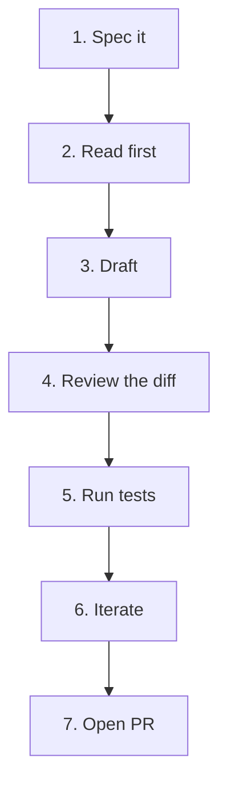

# An AI-native Frontend Workflow

How to actually use Claude day-to-day on a frontend codebase. Not theoretical — the moves that produce shippable diffs.

## The ladder



Most engineers stop at step 3 and complain that "the AI is sloppy." The wins live in steps 2, 4, and 5.

## Step 1 — Spec it (5 minutes you'll never regret)

Before typing a prompt, write a 3–7 line spec:

```
Goal: Add a SizeSelector component to the design system.
Constraints:
- Three sizes: sm/md/lg
- Use theme.colors.* tokens (no hex)
- Emotion `styled` like packages/ui/src/Button/
- A11y: arrow keys move selection
- Tests: one happy-path, one a11y
Out of scope: theming customisation
```

Now your prompt writes itself.

## Step 2 — Read first

Have Claude *read the relevant files* before generating anything:

```
Read packages/ui/src/Button/. Now read packages/ui/src/IconButton/.
Tell me the conventions you see (file layout, prop shape, emotion patterns).
DON'T write code yet.
```

Why: Claude generates by analogy. If the example isn't in context, it'll generate from training-data analogies — not your codebase. *Most "the AI doesn't know our style" is actually "you didn't show it our style."*

## Step 3 — Draft

```
Now scaffold packages/ui/src/SizeSelector/{SizeSelector.tsx, SizeSelector.test.tsx, index.ts}.
Match the conventions from Button/ exactly.
Apply the spec I gave you. Stop after creating the files — don't run tests yet.
```

Constrain *exactly* what should and shouldn't happen. "Stop after X" prevents the agent from improvising into next steps.

## Step 4 — Review the diff

The senior skill. `git diff` and read like a PR:

- Did it change anything outside scope?
- Did it follow the conventions you pointed at?
- Did it invent prop names or icon names?
- Are the imports correct?
- Are there silent regressions in adjacent files?

The summary at the end of Claude's turn says what it *thinks* it did. The diff is what it *actually* did. Always read the diff.

## Step 5 — Run tests

```
Now run pnpm --filter @atlantis/ui typecheck and pnpm test.
Fix failures one at a time. Show me the diff after each fix.
```

Failures are signal. Don't suppress them; understand them.

## Step 6 — Iterate

Real loop is small. *"Fine, but add focus styles."* Not *"fine, but redo the whole thing differently."*

The smaller the iteration, the cheaper the next wrong turn.

## Step 7 — Open PR

```
/pr
```

(Your custom slash command — see the Skills section.) Or:

```
Open a PR. Title under 70 chars. Body uses our template (see CONTRIBUTING.md).
Test plan checklist: typecheck, unit tests, manual at 375/768/1280.
```

## Before / After: a real frontend prompt

**Before:**

> Make me a button component.

**After:**

```
Read packages/ui/src/IconButton/IconButton.tsx and packages/ui/src/Button/Button.tsx.

Now scaffold a `Toggle` component in packages/ui/src/Toggle/, matching their style:
- Emotion `styled`, theme tokens only (no hex)
- Props: { checked: boolean; onChange: (next: boolean) => void; disabled?: boolean }
- Keyboard accessible (Space toggles)
- Focus ring uses theme.colors.accent
- Co-located test (packages/ui/src/Toggle/Toggle.test.tsx) covering: click, space, disabled
- Index.ts re-export

Stop after creating the files. Do not run tests yet.
```

The 5× longer prompt yields a 10× better answer.

## Mental loop summary

```
Spec → Read → Draft → Diff → Test → Iterate → Ship
```

Print it. Stick it on your monitor.

## Practice

Pick a real component you'd build this week. Walk it through all 7 steps. Time each step. Note where the time actually goes — it's almost never what you'd guess.
