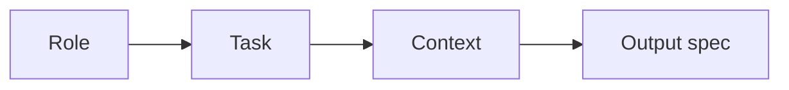

# Prompting 101

The whole craft can fit on a postcard. Here it is.

## The four-part recipe



1. **Role** — who Claude is for this task. ("You are a senior backend engineer.")
2. **Task** — what to do, in a single clear verb. ("Audit this migration.")
3. **Context** — what Claude needs to know. (The migration, the row count, the constraint.)
4. **Output spec** — what shape the answer should take. ("Reply in under 200 words: verdict + risks + mitigation.")

That's the whole thing. Most "bad prompts" are missing one of those four.

## Side-by-side

**Bad:**
```
Look at this migration and tell me if it's safe.
```

**Good:**
```
You are a senior database engineer.

Task: assess whether this migration is safe to run on a 50M-row production
table with concurrent writes.

Migration:
  ALTER TABLE users ADD COLUMN tier TEXT NOT NULL DEFAULT 'free';

Context: Postgres 16. We can take a 30-second lock window. Not more.

Output: Reply in under 200 words.
- Verdict: SAFE / RISKY / UNSAFE
- Why
- If RISKY/UNSAFE: a safer rewrite
```

The good version is roughly 4× longer and gets you a *dramatically* better answer.

## The "smart fresh colleague" test

Re-read your prompt as if you were a brilliant colleague who walked into the room two minutes ago. Ask:

- Do I know what role I'm playing?
- Do I know what to do?
- Do I have the inputs?
- Do I know what shape to reply in?

If any answer is "no", fix the prompt before you fix the model.

## Two more knobs

Beyond the four-part recipe, two patterns earn their keep:

### Examples (few-shot)

If "good" looks specific, *show* an example of good. One example beats a paragraph of description.

### Reasoning prompt

For non-trivial reasoning, add: *"Think step by step before answering."* The model uses tokens to reason instead of jumping. (See: Chain-of-Thought page.)

## Length bias

Models are trained on a *lot* of long-form text. Asking for *short* answers takes deliberate effort:

- "Reply in under 200 words."
- "One paragraph."
- "Three bullets, no preamble."

Without an explicit cap, expect prose.

## When the answer is wrong, the prompt is usually wrong

Order of operations:

1. **Reread your prompt.** Was the task clear?
2. **Add context.** Did you give Claude what it needs?
3. **Specify the output.** Did you say what shape you wanted?
4. **Add an example.** Did you show what good looks like?
5. **Lower the temperature.** Are you getting variance you don't want?
6. *Then* blame the model.

90% of "the model can't do X" is really "I haven't told the model what I want."

## Practice

Pick three prompts you sent Claude this week. Rewrite each using the four-part recipe. Compare answers. Notice which improvement made the biggest difference: usually output spec > context > role > task.
