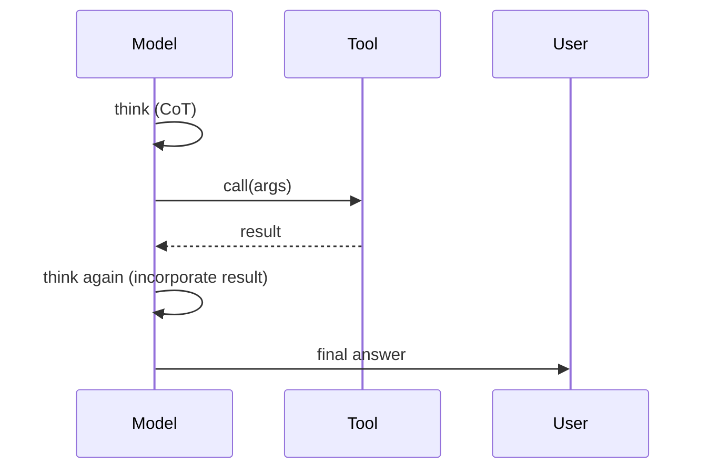

# Chain-of-Thought

Asking the model to **show its work** before committing to an answer reliably improves accuracy on multi-step problems. The reason is mechanical: each generated token influences the next. Reasoning tokens give the model a working memory.

## The simplest version

> Think step by step before answering.

That single sentence, appended to a tricky prompt, can swing accuracy noticeably on math, planning, and reasoning tasks. It's not magic — it just allocates more tokens to deliberation before the answer locks in.

## Better: scaffolded CoT

Tell the model exactly *what* to think about:

```
Before answering, think through:
1. What does the user actually want?
2. What constraints apply?
3. What are 2-3 plausible approaches?
4. What's the trade-off between them?
5. Which approach best fits?

Then give your final recommendation.
```

This produces structured reasoning instead of stream-of-consciousness.

## Hide-the-thinking pattern

For UX-sensitive surfaces, you may not want the user to see the chain of thought:

```
First, in <thinking> tags, reason step by step.
Then, in <answer> tags, give the final answer.

The user will only see the <answer>.
```

You strip the `<thinking>` block before showing the result.

## Extended Thinking — the API native version

Claude's API supports an **`extended_thinking`** mode where the model produces an internal reasoning trace, the API returns the trace + final answer separately, and you decide what to show:

```python
response = client.messages.create(
    model="claude-opus-4-7",
    thinking={"type": "enabled", "budget_tokens": 5000},
    messages=[{"role": "user", "content": "Hard problem here..."}],
)

for block in response.content:
    if block.type == "thinking": ...   # internal trace
    if block.type == "text":     ...   # the answer the user sees
```

Extended Thinking burns more tokens but produces measurably better answers on hard reasoning. Use it for: math, complex code review, multi-step planning, ambiguous specs.

## When NOT to use CoT

- **Simple lookups.** "What's the capital of France?" — CoT just wastes tokens.
- **Format-sensitive output.** If you need pure JSON, don't ask the model to reason in JSON. (Use `<thinking>` tags or extended_thinking with content-block separation.)
- **Latency-sensitive UX.** CoT adds output tokens; output tokens add latency. For interactive UX, often better to use a smaller model with no CoT.

## Self-consistency

For *really* hard problems: run the same CoT prompt N times at non-zero temperature, collect N answers, and pick the majority answer. Costs N×, often worth it for math/logic. (Anthropic supports this via the API; do it manually for cheap.)

## CoT with tools

Combine CoT with tool use for the strongest effect. The model thinks, calls a tool, sees the result, thinks again. This is exactly what Claude Code does in its agent loop:



## Practice

Pick a real engineering problem you've struggled with. Send the same prompt twice — once vanilla, once with "Think step by step about constraints, approaches, and trade-offs before answering." Compare. Notice where CoT actually helped.
