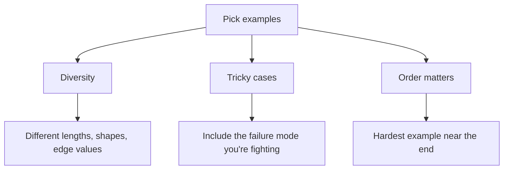

# Few-shot Examples

Showing > telling. A few examples of input → output beat paragraphs of description, especially for *format-sensitive* tasks like extraction, classification, code style, and formatting.

## The basic pattern

```
Convert each line into a JSON object with `noun`, `adjective`, `count`.

Examples:
"3 happy dogs"   → {"noun": "dogs", "adjective": "happy", "count": 3}
"a single red car" → {"noun": "car", "adjective": "red", "count": 1}
"two angry cats" → {"noun": "cats", "adjective": "angry", "count": 2}

Now convert:
"five blue houses"
```

The model picks up the *shape* from the examples and continues the pattern.

## How many examples?

| Goal | Examples |
|---|---|
| Format consistency (JSON, CSV) | 2–3 |
| Tone / style of prose | 3–5 |
| Edge-case classification | 5–10 |
| "Hard" tasks (legal, medical) | 10+ |

Diminishing returns past 5 for most engineering tasks.

## What makes a *good* example set



- **Diversity:** if all your examples are short, the model thinks short is normative. Mix lengths.
- **Tricky cases:** include the case where naïve implementations fail. ("a couple of dogs" → 2.)
- **Order:** the last example before the real input has outsized influence. Put the most-similar example last.

## Negative few-shot

You can show what a *wrong* answer looks like and ask the model to avoid it:

```
Examples of BAD outputs (don't do this):

INPUT: "ship it"
BAD:    "Sure! I'll ship it right away! 🚀"     ← apologising tone, emoji, vague
GOOD:   "Pushed to main. CI green. Done."
```

## Few-shot for classification

```
Classify each ticket as: BUG / FEATURE / CHORE.

"Login crashes on Firefox"     → BUG
"Add SSO support"              → FEATURE
"Bump dependencies"            → CHORE
"Slow page load on /dashboard" → BUG
"Document the auth flow"       → CHORE

"Users want dark mode"         →
```

## Few-shot for code style

When you want code that matches your codebase, paste 1–2 example files.

```
Here is a representative file from our codebase. Write the new
component in this exact style.

<example>
[paste FooBar.tsx here]
</example>

Now write `Toggle.tsx` with these props: ...
```

## Caveats

- **Examples eat tokens.** Cache them if they don't change between calls (see Prompt Caching).
- **The model can over-pattern-match.** If examples accidentally share an irrelevant feature, the model will think it matters. Diversify.
- **Examples can leak biases.** If all your "good ticket title" examples are from one team, expect a regional accent.

## Practice

Take a flaky classification prompt. Add 5 diverse examples (including 2 tricky cases). Run on 10 inputs you have ground truth for. Note the accuracy improvement vs. zero-shot.
