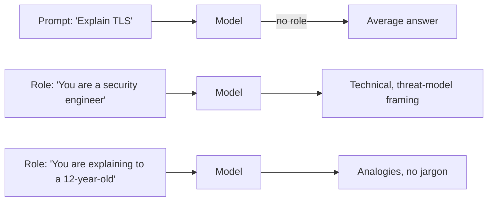

# Roles & System Prompts

Telling Claude *who it is* shifts the distribution of likely answers. It's the cheapest prompting trick that works.

## Why "You are X" matters

The model has trained on text from millions of "X" voices — engineers, doctors, teachers, lawyers, copywriters. Setting a role conditions the next-token distribution toward how *that voice* tends to speak: vocabulary, level of detail, what gets emphasised.



## System prompt vs user prompt

In the API:

- **System prompt** — a persistent role / set of rules that applies to the whole conversation. ("You are a senior engineer at a fintech. Be precise. No emoji.")
- **User prompt** — the actual turn-by-turn question.

In Claude Code:

- `CLAUDE.md` plays the system-prompt role. Plus the harness-injected instructions.
- Slash commands and skills can override / augment.

## Recipe — a strong system prompt

```
You are <role>.
Your job is <job>.
You speak like <register: precise / casual / technical>.

Hard rules:
- <rule 1>
- <rule 2>

When you don't know something, say "I don't know" rather than guessing.
```

Concrete:

```
You are a senior security engineer reviewing code.
Your job is to find vulnerabilities, not to praise.
You speak like an OWASP report: precise, citation-style, no fluff.

Hard rules:
- Cite file:line for every finding.
- Severity: CRIT / HIGH / MED / LOW.
- If a finding is borderline, say so — don't pad.
- No general advice. Only findings about THIS code.
```

## Multi-role prompts

Sometimes you want the model to play *two* roles in a single answer.

> "First, as the engineer: write the patch. Then, as a code reviewer: critique your own patch in 3 bullets."

The model will switch hats. Useful for self-review.

## Anti-roles

Sometimes the most useful role is the *adversarial* one:

> "You are a hostile pen-tester reviewing this auth flow. Find the worst bug."
> "You are a customer with a 1-star rating. Tell me what's frustrating."
> "You are a regulator. What in this design would fail an audit?"

These break the politeness bias and surface real risks.

## Don't over-do it

A 500-word backstory about Claude's "personality" doesn't help. The role should be **just enough to shift the register**. One or two sentences.

```
TOO MUCH: "You are an engineer named Sarah, who has 15 years of
experience at FAANG, lives in Berlin, prefers TypeScript over Rust,
and drinks oat-milk lattes..."

ENOUGH:   "You are a senior frontend engineer. Be precise."
```

## Practice

Take a prompt that gave you a generic answer. Add one role-setting sentence to the top. Re-run. Notice the shift in voice and depth. Compare two roles for the same task ("senior engineer" vs "junior engineer's mentor") and watch the answer shape change.
