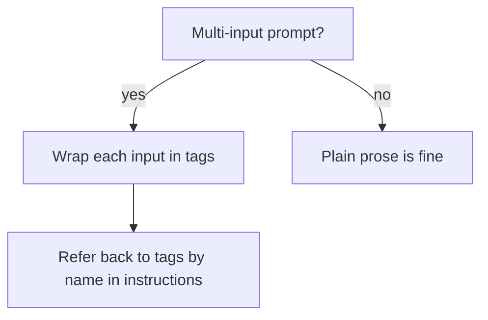

# XML Structuring

Claude was trained to be excellent at parsing XML-style tags inside prompts. Wrapping inputs in tags is the most reliable way to keep multi-input prompts unambiguous.

## Why tags work

Without structure, a prompt like *"Summarise this article in the style of these examples"* mushes the article and the examples together. With tags, the boundaries are explicit:

```xml
<article>
[the long article goes here]
</article>

<examples>
<example>...</example>
<example>...</example>
</examples>

<task>
Summarise the article in the style shown by the examples.
</task>
```

The model treats each tag as a labelled region. You can refer back to them: *"Use only facts from `<article>`."*

## Common tags

| Tag | Purpose |
|---|---|
| `<task>` | The actual instruction |
| `<context>` | Background info |
| `<examples>` + `<example>` | Few-shot examples |
| `<input>` / `<document>` / `<article>` | The data to operate on |
| `<output_format>` | Spec for how to respond |
| `<thinking>` | Reasoning scratchpad (often hidden from user) |
| `<answer>` / `<final>` | The user-visible answer |
| `<rules>` | Hard constraints |
| `<persona>` / `<role>` | Voice / role definition |

The names aren't reserved — they're just labels — but the conventions above are widely understood by the model.

## A real prompt

```xml
<role>
You are a senior reviewer commenting on a pull request.
</role>

<rules>
- Cite file:line for every comment.
- Be specific. No "consider improving readability."
- If a finding is borderline, mark it [OPTIONAL].
- No praise unless the code is genuinely surprising in a good way.
</rules>

<diff>
diff --git a/src/auth/login.ts b/src/auth/login.ts
@@ -10,6 +10,8 @@ export function login(email: string, password: string) {
+  if (!email) throw new Error('email required');
+  if (!password) throw new Error('password required');
   const user = db.users.findOne({ email });
   ...
</diff>

<output_format>
Markdown bullet list.
Group findings by severity: [CRIT] [HIGH] [MED] [LOW] [OPTIONAL].
End with a one-line verdict: SHIP / CHANGES / BLOCK.
</output_format>
```

## When to reach for XML



- Three or more distinct inputs (data + examples + spec).
- Output that requires separation (`<thinking>` vs `<answer>`).
- Re-use across calls — tag boundaries make caching easier.

## Don't over-do it

For one-line prompts, XML is overkill. The right rule:

> **Use XML when ambiguity costs more than the extra tokens.**

## Combining with output spec

A common, powerful template:

```xml
<task>...</task>
<input>...</input>
<output_format>
{ "summary": "...", "bullets": ["...", "..."] }
</output_format>
```

This often produces cleaner JSON than just asking for "JSON output."

## Practice

Pick a multi-input prompt you've struggled with. Wrap each input in a named tag. Refer back by name in the instructions. Run. Notice the answer is more on-target.
