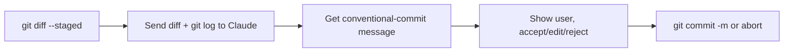

# Recipe — Commit-message generator

A 30-line CLI tool: stage your changes, run it, get a great commit message. Free your hands and your brain from the *one* part of git you should never half-ass.

## What you'll build

```bash
$ git add -p
$ commitmsg
feat(finance): split account balances into per-account inputs

- Track balance per Account, not aggregate
- Migrate existing single-balance users on load
- New SettingsRow for per-account input

(y/n/edit) >
```

## Plan



## Code

`scripts/commitmsg.ts`:

```ts
import Anthropic from "@anthropic-ai/sdk";
import { execSync } from "child_process";
import readline from "readline/promises";

const client = new Anthropic();

const SYSTEM = `You write conventional commit messages.

Rules:
- First line: <type>(<scope>): <imperative summary> — <72 chars max
- Types: feat, fix, refactor, docs, test, chore, perf, ci, build
- Optional body: explain WHY, not WHAT (the diff shows what)
- Bullets for multi-change commits
- No "I", no period at end of subject, no "and/or"
- Match the style of the recent log

Output only the commit message. No preamble, no fences, no commentary.`;

async function main() {
  const diff = execSync("git diff --staged", { encoding: "utf-8" });
  if (!diff.trim()) {
    console.error("No staged changes.");
    process.exit(1);
  }

  const recent = execSync("git log -10 --pretty=format:%s", { encoding: "utf-8" });

  const res = await client.messages.create({
    model: "claude-sonnet-4-6",
    max_tokens: 600,
    system: [{ type: "text", text: SYSTEM, cache_control: { type: "ephemeral" } }],
    messages: [{
      role: "user",
      content: `Recent commit subjects (style reference):\n${recent}\n\n` +
               `Staged diff:\n${diff.slice(0, 80_000)}`,  // safety cap
    }],
  });

  const msg = res.content[0].type === "text" ? res.content[0].text.trim() : "";
  console.log("\n" + msg + "\n");

  const rl = readline.createInterface({ input: process.stdin, output: process.stdout });
  const ans = (await rl.question("(y/n/edit) > ")).trim().toLowerCase();
  rl.close();

  if (ans === "y" || ans === "") {
    execSync(`git commit -m ${JSON.stringify(msg)}`, { stdio: "inherit" });
  } else if (ans === "edit") {
    require("fs").writeFileSync(".git/COMMIT_EDITMSG", msg);
    execSync("git commit -e -F .git/COMMIT_EDITMSG", { stdio: "inherit" });
  } else {
    console.log("Aborted.");
  }
}

main().catch(e => { console.error(e); process.exit(1); });
```

Wire it: `chmod +x scripts/commitmsg.ts`, alias to `commitmsg`, done.

## Why this works

- **Recent log as style reference.** The model matches your team's tone for free.
- **Cached system prompt.** Stable rules, cached, ~10% the cost on repeated runs.
- **Staged diff only.** Don't include unstaged noise.
- **Hard 72-char rule** in the system prompt. Models respect numerical caps.
- **Sonnet, not Opus.** This is a routine task; save Opus tokens for hard reasoning.

## Variations

- **Pre-commit hook** version that runs automatically (use a flag to opt out).
- **Multi-line bodies** — extend the system prompt with examples of bodies you like.
- **Co-author detection** — read `git log --pretty=format:%an` of the touched files; suggest `Co-Authored-By` for multi-touch files.
- **Issue linker** — grep the branch name for `JIRA-123` and append `Refs: JIRA-123`.

## Practice

Build it. Run it on three real commits today. Iterate the system prompt until you'd hit `y` 9 times out of 10.
