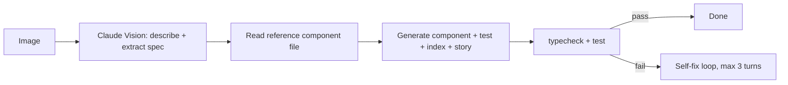

# Recipe — Design mock to component

Drop a screenshot on a CLI; get a working React + Emotion component in your design system. The most satisfying frontend automation you can build in an evening.

## What you'll build

```bash
$ mock2comp ~/Downloads/SizeSelector.png

→ Read packages/ui/src/Button/Button.tsx for style reference
→ Generated packages/ui/src/SizeSelector/SizeSelector.tsx
→ Generated packages/ui/src/SizeSelector/SizeSelector.test.tsx
→ Generated packages/ui/src/SizeSelector/index.ts
→ Storybook story: packages/ui/src/SizeSelector/SizeSelector.stories.tsx

Done in 38s. typecheck: PASS. tests: PASS (2/2).
```

## Plan



## Code

`scripts/mock2comp.ts` (compressed):

```ts
import Anthropic from "@anthropic-ai/sdk";
import { readFileSync, writeFileSync, mkdirSync } from "fs";
import { execSync } from "child_process";
import path from "path";

const client = new Anthropic();
const REFERENCE = "packages/ui/src/Button/Button.tsx";

const SYSTEM = `You are a senior frontend engineer at Atlantis.

Output: a JSON object via the create_component tool. The component must:
- Use Emotion 'styled' (default export style of the reference)
- Theme tokens only: theme.colors.*, theme.spacing.*, theme.borderRadius.*
- No raw hex, no raw px (use spacing tokens)
- Responsive at 375 / 768 / 1280
- Keyboard accessible (focus ring, role/aria-*)
- Tests use React Testing Library queries by role/label/text

Match the file structure of the reference exactly.`;

const tool: Anthropic.Tool = {
  name: "create_component",
  description: "Emit the four component files.",
  input_schema: {
    type: "object",
    required: ["name", "componentTsx", "testTsx", "indexTs", "storyTsx"],
    properties: {
      name:         { type: "string" },
      componentTsx: { type: "string" },
      testTsx:      { type: "string" },
      indexTs:      { type: "string" },
      storyTsx:     { type: "string" },
    },
  },
};

async function main() {
  const imgPath = process.argv[2];
  const img64   = readFileSync(imgPath).toString("base64");
  const refSrc  = readFileSync(REFERENCE, "utf-8");

  const res = await client.messages.create({
    model: "claude-opus-4-7",
    max_tokens: 6000,
    system: [{ type: "text", text: SYSTEM, cache_control: { type: "ephemeral" } }],
    tools: [tool],
    tool_choice: { type: "tool", name: "create_component" },
    messages: [{
      role: "user",
      content: [
        { type: "text", text: `Reference component (style/file shape only):\n\n${refSrc}` },
        { type: "text", text: "Generate a new component matching the design in the image." },
        { type: "image", source: { type: "base64", media_type: "image/png", data: img64 } },
      ],
    }],
  });

  const call = res.content.find(b => b.type === "tool_use");
  if (call?.type !== "tool_use") throw new Error("no tool call");
  const args = call.input as any;

  const dir = `packages/ui/src/${args.name}`;
  mkdirSync(dir, { recursive: true });
  writeFileSync(`${dir}/${args.name}.tsx`,         args.componentTsx);
  writeFileSync(`${dir}/${args.name}.test.tsx`,    args.testTsx);
  writeFileSync(`${dir}/${args.name}.stories.tsx`, args.storyTsx);
  writeFileSync(`${dir}/index.ts`,                 args.indexTs);

  console.log(`→ Generated ${dir}/`);
  execSync(`pnpm --filter @atlantis/ui typecheck`, { stdio: "inherit" });
  execSync(`pnpm --filter @atlantis/ui test ${args.name}`, { stdio: "inherit" });
}

main().catch(e => { console.error(e); process.exit(1); });
```

## Why this works

- **Vision + tool-call.** Image input, schema-validated output. No prose, no fences.
- **Reference file in context.** Model imitates style instead of inventing.
- **Cached system prompt.** Style rules cached; iterating on different mocks costs ~10%.
- **Tool-call forces structure.** Four named string fields. No way to forget the test file.
- **Hard typecheck/test gate.** If the output doesn't compile or pass, you'd know immediately.

## Failure modes & fixes

| Symptom | Fix |
|---|---|
| Hex codes in styled output | Add bad-example to system prompt: "BAD: `color: #58a6ff`. GOOD: `color: theme.colors.accent`." |
| Tests use `container.querySelector` | Add: "Tests must use queries by role/label/text. NEVER container.querySelector." |
| Component imports lucide directly | Add: "Icons via `<Icon name='...'>` from @atlantis/ui only." |
| Wrong filename casing | Pass canonical name in user message; don't let the model derive it. |

## Variations

- **Self-healing loop.** If `pnpm test` fails, append the error to messages and re-call. Max 3 iterations.
- **Multi-mock batch.** Drop 10 PNGs in a folder; generate 10 components.
- **Storybook screenshot back.** After generation, render the story, screenshot, ask Claude to compare to the input mock. "Match yes/no? If no, what's off?"

## Practice

Build it. Take a screenshot of any existing component on your site. Run mock2comp. Compare to the original implementation. The output won't be identical — it'll be different in instructive ways.
