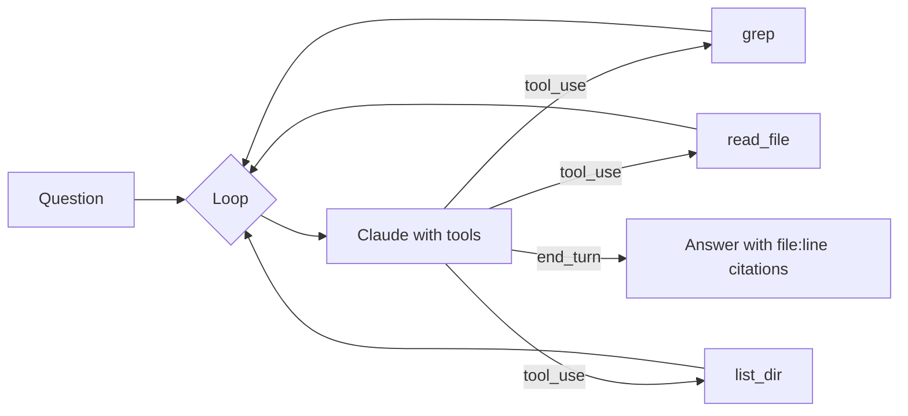

# Recipe — Repo-aware Q&A bot

Ask questions about your codebase from the terminal. The bot reads files on demand via tool use; no embedding pipeline, no vector DB, just Claude + grep + read.

## What you'll build

```bash
$ repoask "where is the rate limit logic? how is the value configured?"

Looking at packages/dal/src/kernel/throttle.ts:34, the rate limit is
implemented in `enforceRateLimit()`. Configuration comes from
packages/appConfig/src/config.yml under `dal.rateLimit.{rpm, burst}`.
The default is 60 rpm / 10 burst. Set ATLANTIS_RPM env to override.
```

## Plan



The agent decides which files to read. You don't pre-index anything.

## Code

`scripts/repoask.ts`:

```ts
import Anthropic from "@anthropic-ai/sdk";
import { execSync } from "child_process";
import { readFileSync, statSync } from "fs";

const client = new Anthropic();
const ROOT = process.cwd();

const tools: Anthropic.Tool[] = [
  {
    name: "grep",
    description: "Search the repo for a regex. Returns up to 50 matches with file:line.",
    input_schema: {
      type: "object",
      properties: {
        pattern: { type: "string" },
        path:    { type: "string", description: "Glob like 'src/**/*.ts'. Default: '.'" },
      },
      required: ["pattern"],
    },
  },
  {
    name: "read_file",
    description: "Read a file. Returns up to 8000 chars; pass `start` to read further.",
    input_schema: {
      type: "object",
      properties: {
        path:  { type: "string" },
        start: { type: "integer", default: 0 },
      },
      required: ["path"],
    },
  },
  {
    name: "list_dir",
    description: "List files in a directory.",
    input_schema: {
      type: "object",
      properties: { path: { type: "string", default: "." } },
    },
  },
];

async function execTool(name: string, input: any): Promise<string> {
  if (name === "grep") {
    const path = input.path || ".";
    try {
      const out = execSync(
        `rg --no-heading -n -m 50 -- ${JSON.stringify(input.pattern)} ${JSON.stringify(path)}`,
        { encoding: "utf-8", cwd: ROOT },
      );
      return out.slice(0, 8000);
    } catch { return "(no matches)"; }
  }
  if (name === "read_file") {
    try {
      const buf = readFileSync(input.path, "utf-8");
      const start = input.start ?? 0;
      return buf.slice(start, start + 8000);
    } catch (e: any) { return `error: ${e.message}`; }
  }
  if (name === "list_dir") {
    try {
      const out = execSync(`ls -la ${JSON.stringify(input.path || ".")}`, { encoding: "utf-8" });
      return out;
    } catch (e: any) { return `error: ${e.message}`; }
  }
  return `unknown tool: ${name}`;
}

const SYSTEM = `You answer questions about a codebase the user is in.

Use the tools to find evidence before answering. Always cite file:line.
Don't invent function names — if you can't find something, say so.
Stop when you have enough evidence; don't grep forever.`;

async function ask(question: string) {
  const messages: Anthropic.MessageParam[] = [{ role: "user", content: question }];
  const MAX_TURNS = 12;

  for (let turn = 0; turn < MAX_TURNS; turn++) {
    const res = await client.messages.create({
      model: "claude-opus-4-7",
      max_tokens: 2000,
      system: [{ type: "text", text: SYSTEM, cache_control: { type: "ephemeral" } }],
      tools,
      messages,
    });

    messages.push({ role: "assistant", content: res.content });

    if (res.stop_reason !== "tool_use") {
      const text = res.content.find(b => b.type === "text");
      console.log(text?.type === "text" ? text.text : "(no answer)");
      return;
    }

    const results: Anthropic.ToolResultBlockParam[] = [];
    for (const block of res.content) {
      if (block.type !== "tool_use") continue;
      const out = await execTool(block.name, block.input);
      results.push({ type: "tool_result", tool_use_id: block.id, content: out });
    }
    messages.push({ role: "user", content: results });
  }
  console.log("(stopped: too many turns)");
}

ask(process.argv.slice(2).join(" ")).catch(e => { console.error(e); process.exit(1); });
```

## Why this works

- **No vector DB, no embeddings.** The model decides what to grep based on the question. Simpler, fewer moving parts, and surprisingly accurate for repos under ~100k LOC.
- **Read-only tools.** Nothing destructive can happen. Permission-free.
- **Truncation.** Caps both grep matches and file reads — prevents context blow-up.
- **Cached system prompt.** ~10% input cost on repeat runs.

## When to switch to RAG

This pattern works up to medium repos. For huge codebases (or knowledge bases that aren't code), see `Agents → Retrieval (RAG)`.

## Practice

Wire it. Ask 5 real questions about your repo. Notice when it grep-spirals; tighten the system prompt with anti-patterns when that happens.
