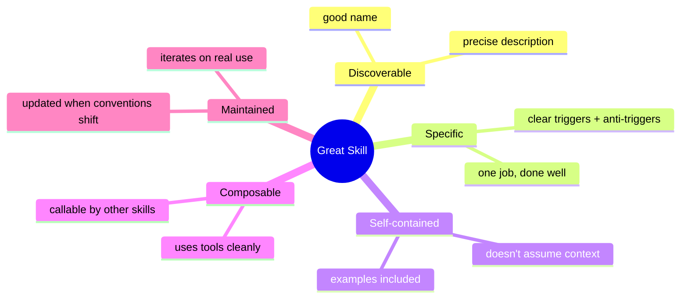

# Anatomy of a Great Skill

You've shipped one. Here's what separates a skill that gets used daily from one that rots in `.claude/skills/`.

## The five qualities



## 1. Discoverable

The model picks skills via the `description`. If yours is generic, it'll never fire.

**Bad:**
```
description: Helps with code reviews.
```

**Good:**
```
description: Run a senior-level code review on the diff of the current branch.
TRIGGER when: the user says "review", "PR review", "code review", "what's wrong with this branch".
SKIP when: the user is asking for a refactor, a fix, or a one-line edit — those should be done directly.
```

The all-caps `TRIGGER`/`SKIP` is convention, not syntax — but the model picks up the structure.

## 2. Specific

One skill, one job. If you find yourself writing "and also if X, do Y", split into two skills.

| Bad | Good |
|---|---|
| `dev-tools` (does 12 things) | `changelog`, `scaffold-component`, `audit-deps` |
| `helper` | `migrate-imports`, `extract-i18n`, `update-deps` |

## 3. Self-contained

Remember: the skill body becomes part of the prompt. It cannot refer to "the discussion above" or "the earlier file" — there isn't one. Spell out:

- What to read.
- What to do, in order.
- What format to output.
- What examples look like (good *and* bad).

## 4. Composable

A skill that calls `git diff`, `pnpm test`, and writes one file is composable. A skill that hijacks the entire conversation isn't.

Use **`allowed-tools` frontmatter** to scope what your skill can touch:

```yaml
---
name: changelog
description: ...
allowed-tools: Bash, Read
---
```

Now the skill cannot accidentally `Edit` files. Safer, and the model knows its lane.

## 5. Maintained

Treat skills like docs:

- After three real uses, edit the skill with what you learned.
- When the underlying convention shifts (new lint rule, new CI step), update the skill.
- Delete skills no one's used in six months. Dead skills clog the picker.

## Frontmatter cheatsheet

```yaml
---
name: my-skill                                  # required, kebab-case
description: |                                  # required, multi-line OK
  When this should fire and when it shouldn't.
allowed-tools: Read, Edit, Bash                 # optional whitelist
disallowed-tools: WebFetch                      # optional blacklist
model: claude-sonnet-4-6                        # optional model override
---
```

## File layout for non-trivial skills

```
.claude/skills/audit-deps/
  SKILL.md                # the entry point
  README.md               # docs for humans
  examples/
    sample-output.md      # "this is what good looks like"
  scripts/
    check-licenses.sh     # called from the skill body
```

Reference the supporting files from `SKILL.md` (`See examples/sample-output.md for the format`). The model will read them when invoked.

## Tone of the body

Imperative, specific, surgical:

```markdown
## Steps

1. Run `pnpm outdated --long`.
2. Group by minor / major.
3. For each major bump, read the package's CHANGELOG.md (latest 3 entries).
4. Output a table: package | current | latest | breaking changes.
5. Do not propose upgrades. Just report.
```

Not:

```markdown
## Steps

Try to figure out what's outdated. Use your best judgement.
Output something useful.
```

## Practice

Pick the skill from your last lesson (`changelog`). Audit it against the five qualities. Score each 1–5. Fix the weakest one before moving on.
