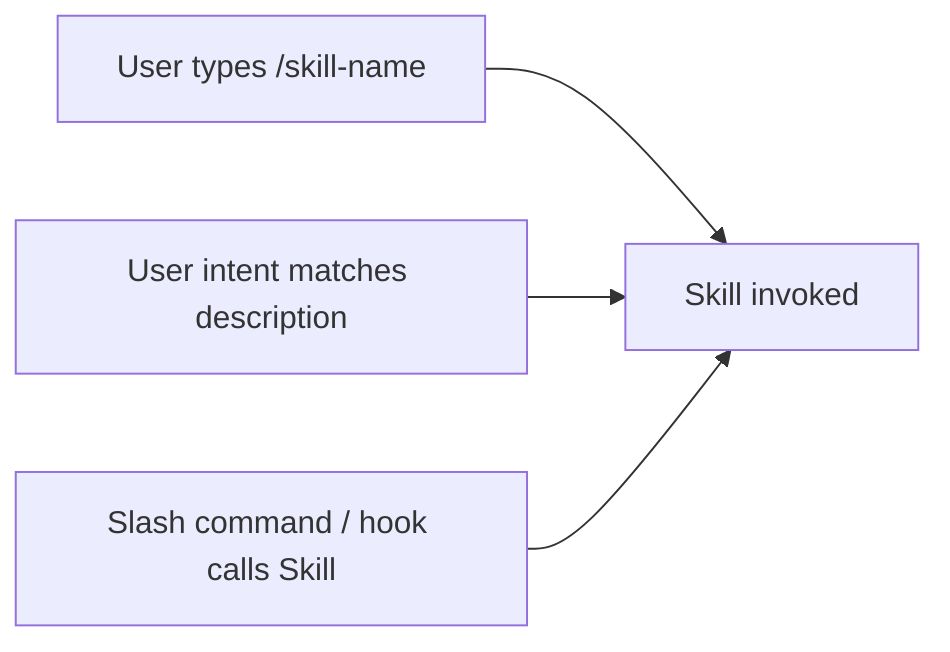

# What is a Skill?

A **skill** is a packaged, reusable capability you (or someone else) can invoke from inside Claude. Mechanically: it's a markdown file with a YAML frontmatter that declares *when* the skill should fire and *what* the skill does, plus optional supporting files. Conceptually: it's how you teach Claude a new trick that persists across sessions and across machines.

If a slash command is "a saved prompt," a skill is "a saved prompt + metadata + scripts + context — wrapped as a callable unit."

## Why skills matter

Without skills, every session starts from scratch. You explain your conventions, you re-state the recipe, you re-paste the template. **Skills let you express something once and have Claude carry it forever.**

Two practical examples from the wild:

- **`init`** — generates a tailored `CLAUDE.md` for whatever repo it's invoked in. You don't write the prompt; you call `/init`.
- **`security-review`** — runs a structured security audit on the pending changes. You don't remember the OWASP categories; the skill does.

Skills are often shipped as **plugins** — you install them once, they appear in your Claude install everywhere.

## The shape of a skill

```
.claude/skills/my-skill/
  SKILL.md        # the entry point — frontmatter + instructions
  scripts/        # optional helper scripts
  examples/       # optional canonical examples
```

`SKILL.md` looks like:

```markdown
---
name: my-skill
description: One-line summary of when and why this skill should fire.
---

# Instructions

When invoked:
1. Step one.
2. Step two.
3. Output format.
```

That's it. The `description` is the most important field — Claude uses it to decide when the skill applies. Be specific: "Triggers on requests about X. Skip on Y."

## How a skill gets invoked

Three ways:



1. **Explicit slash:** the user types `/security-review`.
2. **Implicit match:** the user says *"audit this branch"*; the model picks `security-review` from the registry.
3. **Programmatic:** another skill or hook invokes it.

## Skill vs slash command vs MCP

| Need | Pick |
|---|---|
| A canned prompt with arguments | **Slash command** |
| A reusable workflow with steps, examples, scripts | **Skill** |
| A new external tool / system | **MCP server** |

Skills can *use* MCP tools and *be invoked by* slash commands. They compose.

## Where skills live

- **Repo-local:** `<repo>/.claude/skills/<name>/SKILL.md`. Committed to git, shared with team.
- **User:** `~/.claude/skills/<name>/SKILL.md`. Personal toolbox.
- **Plugin:** installed via the marketplace, namespaced as `plugin:skill-name`.

## Practice

Run `/help` and look at what skills are already installed in your Claude. (Hint: there are several useful ones out of the box — `init`, `review`, `security-review`, `simplify`, etc.) Pick one. Read its `SKILL.md`. Notice the structure. That's your template for the next page.
