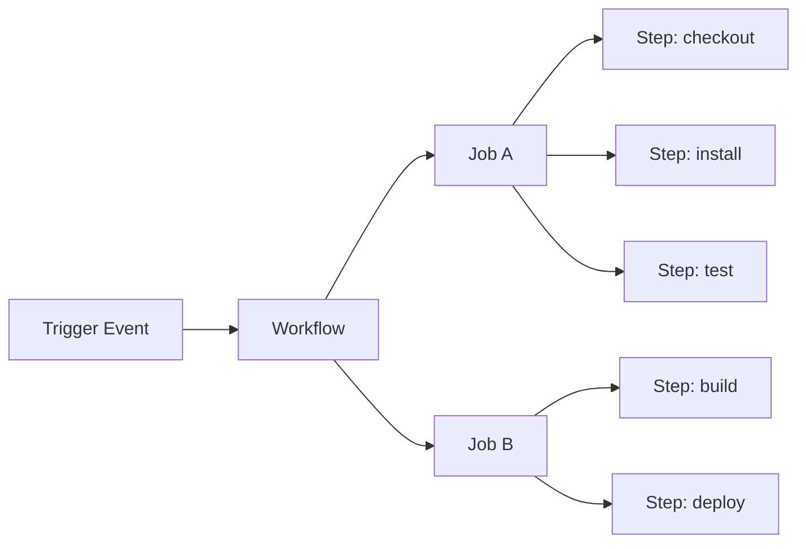

# GitHub Actions

GitHub Actions automates CI/CD workflows directly in your repository. Workflows are defined as YAML files in `.github/workflows/`.

---

## Core Concepts



| Concept | Description |
|---------|-------------|
| **Workflow** | A YAML file in `.github/workflows/` |
| **Trigger** | Event that starts the workflow (`push`, `pull_request`, etc.) |
| **Job** | A set of steps running on one runner |
| **Step** | A single command or action |
| **Action** | A reusable unit (from Marketplace or local) |
| **Runner** | The VM that executes jobs (`ubuntu-latest`, `macos-latest`, etc.) |

---

## Minimal Workflow

```yaml
name: CI

on:
  push:
    branches: [main]
  pull_request:

jobs:
  test:
    runs-on: ubuntu-latest
    steps:
      - uses: actions/checkout@v4
      - uses: actions/setup-node@v4
        with:
          node-version: 20
          cache: pnpm
      - run: pnpm install --frozen-lockfile
      - run: pnpm test
```

---

## Common Triggers

```yaml
on:
  push:
    branches: [main, develop]
    paths:
      - 'apps/**'
      - 'packages/**'

  pull_request:
    types: [opened, synchronize, reopened]

  schedule:
    - cron: '0 8 * * 1'   # every Monday at 08:00 UTC

  workflow_dispatch:        # manual trigger (adds "Run workflow" button)
    inputs:
      environment:
        description: Target environment
        required: true
        default: staging
        type: choice
        options: [staging, production]

  workflow_call:            # called from another workflow (reusable)
```

---

## Jobs & Dependencies

```yaml
jobs:
  lint:
    runs-on: ubuntu-latest
    steps:
      - uses: actions/checkout@v4
      - run: pnpm lint

  test:
    runs-on: ubuntu-latest
    steps:
      - uses: actions/checkout@v4
      - run: pnpm test

  deploy:
    runs-on: ubuntu-latest
    needs: [lint, test]     # waits for both to succeed
    if: github.ref == 'refs/heads/main'
    steps:
      - run: echo "Deploying..."
```

---

## Matrix Builds

Test across multiple versions in parallel:

```yaml
jobs:
  test:
    strategy:
      matrix:
        node: [18, 20, 22]
        os: [ubuntu-latest, macos-latest]
    runs-on: ${{ matrix.os }}
    steps:
      - uses: actions/setup-node@v4
        with:
          node-version: ${{ matrix.node }}
```

---

## Secrets & Environment Variables

```yaml
jobs:
  deploy:
    environment: production       # links to GitHub Environment (with protection rules)
    env:
      NODE_ENV: production
    steps:
      - run: ./deploy.sh
        env:
          API_KEY: ${{ secrets.API_KEY }}         # repo/org secret
          DEPLOY_TOKEN: ${{ secrets.DEPLOY_TOKEN }}
```

> Set secrets in **Settings → Secrets and variables → Actions**.

---

## Caching

```yaml
- uses: actions/cache@v4
  with:
    path: ~/.pnpm-store
    key: pnpm-${{ runner.os }}-${{ hashFiles('pnpm-lock.yaml') }}
    restore-keys: pnpm-${{ runner.os }}-

# Or use the built-in cache in setup actions:
- uses: actions/setup-node@v4
  with:
    node-version: 20
    cache: pnpm
```

---

## Artifacts

```yaml
- uses: actions/upload-artifact@v4
  with:
    name: build-output
    path: dist/
    retention-days: 7

# In a later job:
- uses: actions/download-artifact@v4
  with:
    name: build-output
    path: dist/
```

---

## Useful Actions

| Action | Purpose |
|--------|---------|
| `actions/checkout@v4` | Checkout the repo |
| `actions/setup-node@v4` | Set up Node.js |
| `actions/cache@v4` | Cache dependencies |
| `actions/upload-artifact@v4` | Save build outputs |
| `actions/github-script@v7` | Run JS against GitHub API |
| `dorny/test-reporter@v1` | Publish test results |
| `codecov/codecov-action@v4` | Upload coverage to Codecov |

---

## Reusable Workflows

```yaml
# .github/workflows/reusable-deploy.yml
on:
  workflow_call:
    inputs:
      environment:
        required: true
        type: string
    secrets:
      DEPLOY_KEY:
        required: true

jobs:
  deploy:
    runs-on: ubuntu-latest
    steps:
      - run: echo "Deploying to ${{ inputs.environment }}"

# Caller:
jobs:
  deploy-staging:
    uses: ./.github/workflows/reusable-deploy.yml
    with:
      environment: staging
    secrets:
      DEPLOY_KEY: ${{ secrets.DEPLOY_KEY }}
```

---

## Best Practices

- **Pin action versions** to a full SHA (`actions/checkout@11bd71901bbe5b1630ceea73d27597364c9af683`) to prevent supply chain attacks — or at minimum pin to a major tag (`@v4`)
- **Use `--frozen-lockfile`** (pnpm) / `--ci` (npm) in CI to catch lockfile drift
- **Separate lint, test, build** into different jobs so they run in parallel and failures are isolated
- **Use environments** with required reviewers for production deployments
- **Set `timeout-minutes`** on jobs to avoid runaway billing from hung processes
- **Cache aggressively** — a cache hit can cut install time from 60s to 5s
- **Never log secrets** — mask them with `::add-mask::` if you compute them dynamically

```yaml
- run: echo "::add-mask::$MY_SECRET"
```
