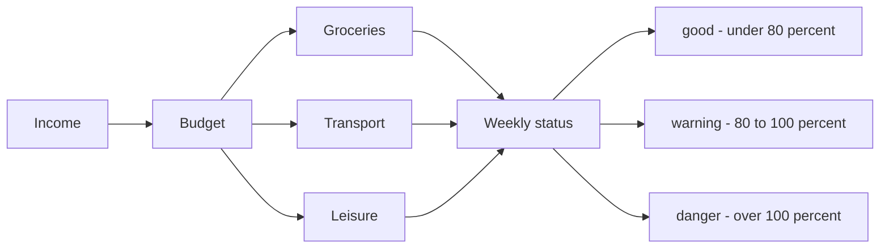
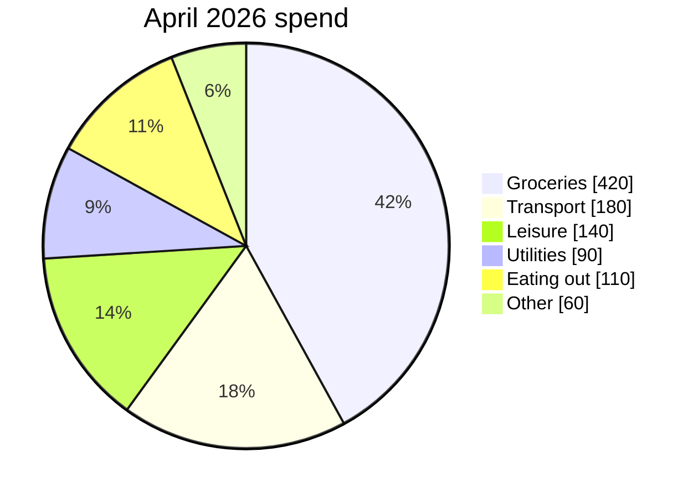
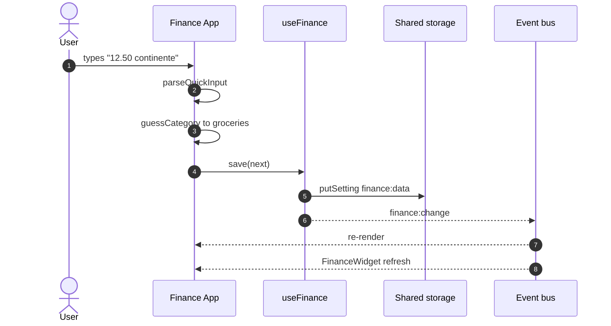
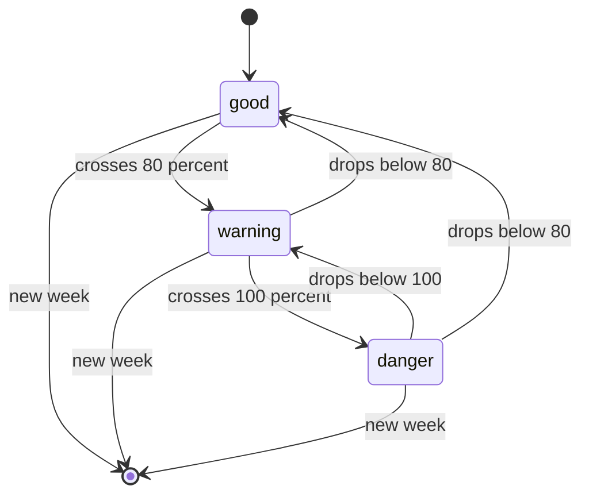
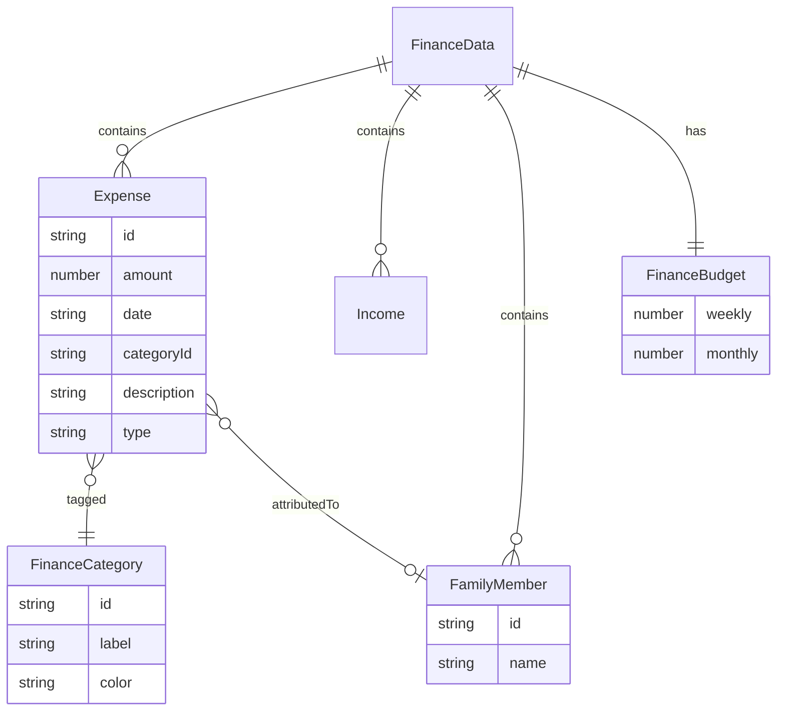
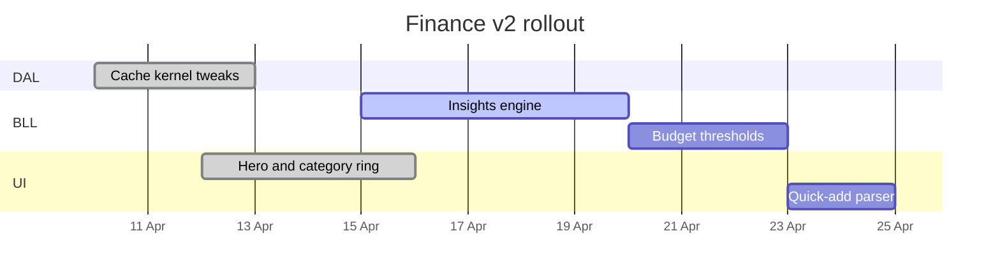
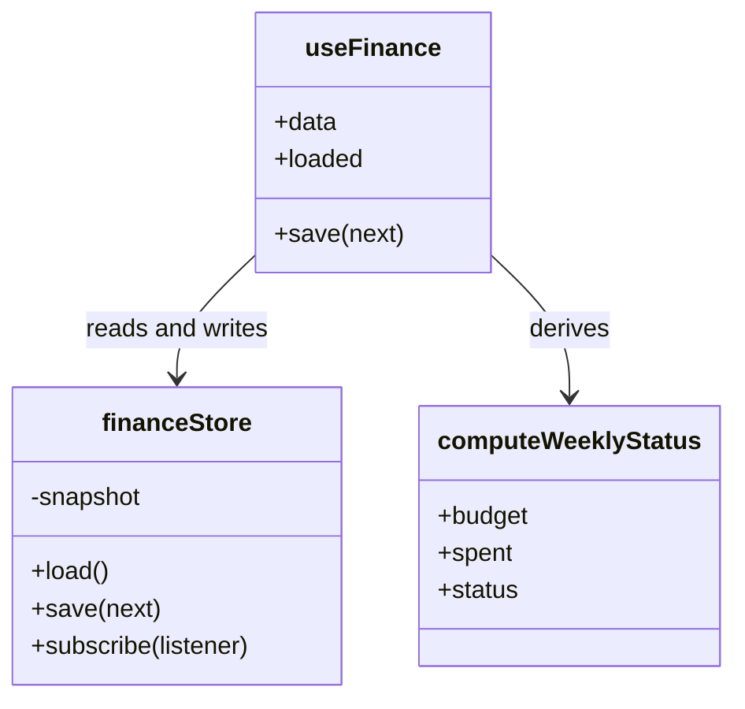

# Diagrams with Mermaid

Fenced code blocks tagged `mermaid` render as diagrams. The library is
lazy-loaded and the container matches the Atlantis finance-card look —
surface background, 2px green left accent, tabular-nums inside labels.

Every example below uses the **Family Finance** app as a running
domain, so the diagrams double as reference for how that app is wired.

## Flowchart — expense flow

Income lands, gets classified, rolls up into the weekly status
indicator.

## Pie — spending by category

Month-to-date split. The palette maps to the Atlantis accent ring.

## Sequence — adding an expense

Happy path for the quick-add input: parse, auto-classify, persist,
emit a BLL event so every mounted finance surface refreshes.

## State — weekly budget status

The status badge transitions as the week's running total crosses each
threshold.

## Entity Relationship — finance model

The persisted shape of `finance:data`.

## Gantt — a finance sprint

## Class — BLL shape

## Tips

- Mermaid is **lazy-loaded** — the library only ships once a diagram
  is rendered on the page.
- The palette follows the Atlantis dark theme: surface background,
  finance-green left accent on the card, muted edges, tabular-nums
  inside labels.
- Invalid or empty diagrams fall back to the raw source instead of
  leaving a ghost box behind.
- Avoid `<` / `>` / `&lt;` inside labels — Mermaid treats them as
  syntax. Write "under" / "over" or use words instead.
