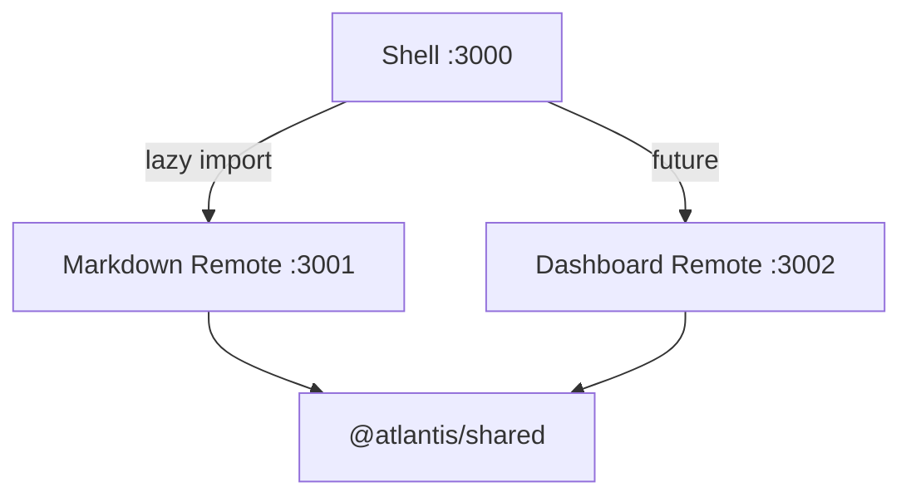
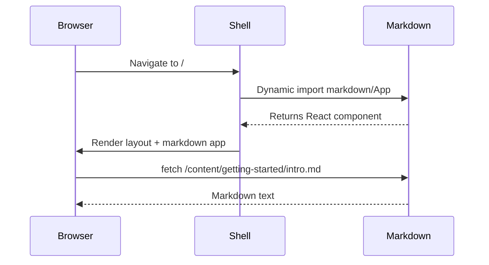
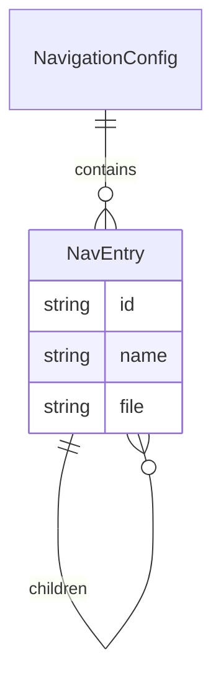

# Diagrams with Mermaid

Mermaid diagrams are rendered automatically from fenced code blocks with the `mermaid` language tag.

## Flowchart

## Sequence Diagram

## Entity Relationship

## Tips

- Mermaid is **lazy-loaded** — the library is only fetched when a diagram is first rendered.
- The diagram theme follows the dark color palette from `@atlantis/shared`.
- Invalid diagrams show an error message instead of crashing the page.
