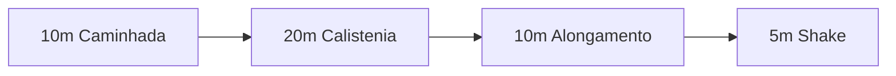

# Iron Foundation — Plano de Treino e Nutrição Adaptado

Um plano de calistenia, mobilidade e jejum intermitente para
"reset" do corpo, escalável de **65 kg** a **160 kg+**, para
mulheres e homens. Foco em **descompressão da coluna**, base
muscular e gasto calórico sem impacto.

> [!CAUTION]
> Isto **não substitui** acompanhamento médico. Se tens dor
> lombar irradiada, formigueiro ou perda de força nas pernas,
> ou condições cardíacas/articulares, fala com o teu médico
> **antes** de começar. Para qualquer corpo acima de 100 kg,
> exames de pressão arterial e função renal são prioridade
> antes de fazer dietas com alto teor de proteína.

---

## Para quem é este plano

Pensado para:

- Pessoas com sobrepeso ou obesidade que querem voltar a
  treinar **sem agravar dores nas costas, joelhos ou tornozelos**.
- Quem trabalha 9 às 18 e só tem a hora de almoço para mexer.
- Quem prefere comer pouco ao almoço (jejum 16:8 ou shake) e
  uma refeição familiar à noite.

> [!NOTE]
> O plano original foi desenhado para um corpo de 1,82 m / 160 kg
> com dor lombar e formigueiro nas pernas (suspeita de
> compressão do nervo ciático). Em baixo encontras as escalas
> para outros pesos e géneros.

---

## O ciclo de duas semanas alternadas

Alternar duas semanas evita "fritar" o sistema nervoso e dá
tempo aos tendões para recuperarem.

| Semana | Foco | Objetivo |
|--------|------|----------|
| **A — Reparação** | Mobilidade, core profundo, caminhada lenta | Eliminar dor / formigueiro, preparar tendões |
| **B — Ativação** | Calistenia inclinada, isometria, marcha rápida | Maximizar gasto calórico, manter massa magra |

A regra é simples: se tiveres formigueiro ou dor irradiada,
**fica em Semana A** até passar. Não passes para B só porque é
"a vez dela".

---

## Hora de almoço de combate (45 min)

| Bloco | Tempo | O que fazer |
|-------|-------|-------------|
| Aquecer | 10 min | Caminhada lenta + marcha estática, respiração nasal |
| Treino | 20 min | Bloco da semana A ou B (tabela em baixo) |
| Descomprimir | 10 min | Cat-Cow, Bird-Dog, alongamento de psoas |
| Repor | 5 min | Shake de proteína + 500 ml de água |

> [!TIP]
> Se sentires formigueiro a meio do bloco de treino, **para**.
> Salta para o bloco de descompressão. Não tentes "acabar a
> série" — a coluna não é uma série, é uma estrutura.

---

## Exercícios fundamentais

Foco em **alavancas curtas** e **base larga**. Pés afastados
para estabilidade, joelhos atrás dos dedos dos pés, coluna
neutra.

### Semana A — Reparação

| Exercício | Séries × Reps | Foco |
|-----------|---------------|------|
| **Cat-Cow** | 2 × 10 | Mobilidade da coluna |
| **Bird-Dog** | 3 × 8 (cada lado) | Core profundo, coluna neutra |
| **Dead Bug** | 3 × 8 | Estabilidade lombar |
| **Ponte de glúteo** | 3 × 12 | Tira carga da lombar |
| **Marcha estática** | 3 × 60 s | Coordenação, base aeróbica |
| **Decompression Hang** *(barra ou borda de porta)* | 3 × 20 s | Espaço entre vértebras |

### Semana B — Ativação

| Exercício | Séries × Reps | Foco |
|-----------|---------------|------|
| **Wall Push-up** | 3 × 12 | Peito / ombros sem carga |
| **Chair Squat** *(sentar e levantar)* | 3 × 10 | Pernas, anca |
| **Wall Sit** *(isometria)* | 3 × 30 s | Quadríceps, glúteos |
| **Inclined Push-up** *(bancada)* | 3 × 8 | Progressão da flexão na parede |
| **Marcha militar com mochila leve** | 3 × 90 s | Cardio, postura |
| **Ponte de glúteo com pausa** | 3 × 10 (3 s no topo) | Glúteos com tempo sob tensão |

> [!IMPORTANT]
> **Forma > carga > velocidade.** Em corpos grandes, a
> alavanca é longa e o erro custa caro. Faz menos repetições
> com forma perfeita do que muitas com a coluna a ceder.

---

## Forma visual — como ficar

Cada figura mostra a posição-chave do exercício. **Verde** =
parte ativa / o que tens de sentir trabalhar. **Linhas
tracejadas** = chão ou parede de apoio.

### Cat-Cow

<svg viewBox="0 0 480 200" style="width:100%;max-width:420px;height:auto;" stroke="currentColor" stroke-width="2.5" fill="none" stroke-linecap="round" stroke-linejoin="round" aria-label="Cat-Cow — coluna arqueada em cima e em baixo">
<g transform="translate(20,0)">
<line x1="0" y1="150" x2="200" y2="150" stroke="currentColor" stroke-width="1" stroke-dasharray="3 4" opacity="0.4"/>
<circle cx="40" cy="80" r="10" fill="currentColor" stroke="none"/>
<path d="M 50 78 Q 110 35 170 78" stroke="#7fb77e" stroke-width="3"/>
<line x1="55" y1="82" x2="55" y2="150"/>
<line x1="165" y1="82" x2="175" y2="150"/>
<text x="100" y="178" text-anchor="middle" font-size="11" fill="currentColor" stroke="none" font-family="monospace" font-weight="600">CAT · expira</text>
</g>
<g transform="translate(260,0)">
<line x1="0" y1="150" x2="200" y2="150" stroke="currentColor" stroke-width="1" stroke-dasharray="3 4" opacity="0.4"/>
<circle cx="40" cy="65" r="10" fill="currentColor" stroke="none"/>
<path d="M 50 70 Q 110 115 170 80" stroke="#7fb77e" stroke-width="3"/>
<line x1="55" y1="72" x2="55" y2="150"/>
<line x1="165" y1="82" x2="175" y2="150"/>
<text x="100" y="178" text-anchor="middle" font-size="11" fill="currentColor" stroke="none" font-family="monospace" font-weight="600">COW · inspira</text>
</g>
</svg>

- Mãos por baixo dos ombros, joelhos por baixo da anca.
- **Cat** (gato): empurra o teto com as costas, queixo ao peito.
- **Cow** (vaca): deixa a barriga descer, olha para cima.
- Movimento lento, 2 segundos por posição.

### Bird-Dog

<svg viewBox="0 0 320 200" style="width:100%;max-width:360px;height:auto;" stroke="currentColor" stroke-width="2.5" fill="none" stroke-linecap="round" stroke-linejoin="round" aria-label="Bird-Dog — braço e perna oposta esticados">
<line x1="0" y1="160" x2="320" y2="160" stroke="currentColor" stroke-width="1" stroke-dasharray="3 4" opacity="0.4"/>
<circle cx="80" cy="100" r="10" fill="currentColor" stroke="none"/>
<line x1="90" y1="98" x2="200" y2="98" stroke="#7fb77e" stroke-width="3"/>
<line x1="90" y1="100" x2="90" y2="160"/>
<line x1="200" y1="100" x2="210" y2="160"/>
<line x1="80" y1="98" x2="40" y2="60" stroke="#7fb77e"/>
<circle cx="40" cy="60" r="3" fill="#7fb77e" stroke="none"/>
<line x1="200" y1="100" x2="270" y2="80" stroke="#7fb77e"/>
<circle cx="270" cy="80" r="3" fill="#7fb77e" stroke="none"/>
<text x="160" y="190" text-anchor="middle" font-size="11" fill="currentColor" stroke="none" font-family="monospace" font-weight="600">COLUNA NEUTRA · BRAÇO E PERNA OPOSTOS</text>
</svg>

- Coluna **plana** como uma mesa — não suba nem desça.
- Estende o braço **direito** e a perna **esquerda** ao mesmo
  tempo (depois troca).
- Se sentes a anca a rodar, baixa o membro e foca em ficar
  estável.
- Erro a evitar: arquear a lombar para cima ao esticar a perna.

### Dead Bug

<svg viewBox="0 0 320 200" style="width:100%;max-width:360px;height:auto;" stroke="currentColor" stroke-width="2.5" fill="none" stroke-linecap="round" stroke-linejoin="round" aria-label="Dead Bug — deitado com braço e perna oposta esticados">
<line x1="0" y1="160" x2="320" y2="160" stroke="currentColor" stroke-width="1" stroke-dasharray="3 4" opacity="0.4"/>
<circle cx="60" cy="140" r="10" fill="currentColor" stroke="none"/>
<line x1="70" y1="142" x2="250" y2="142" stroke="#7fb77e" stroke-width="3"/>
<line x1="100" y1="142" x2="100" y2="80"/>
<line x1="100" y1="80" x2="120" y2="80"/>
<line x1="180" y1="142" x2="190" y2="80"/>
<line x1="190" y1="80" x2="210" y2="80"/>
<line x1="220" y1="142" x2="290" y2="135" stroke="#7fb77e"/>
<circle cx="290" cy="135" r="3" fill="#7fb77e" stroke="none"/>
<line x1="80" y1="142" x2="30" y2="100" stroke="#7fb77e"/>
<circle cx="30" cy="100" r="3" fill="#7fb77e" stroke="none"/>
<text x="160" y="190" text-anchor="middle" font-size="11" fill="currentColor" stroke="none" font-family="monospace" font-weight="600">LOMBAR COLADA AO CHÃO</text>
</svg>

- Deitado de costas, cintura **colada** ao chão.
- Braços e joelhos para o teto. Baixa o braço **direito** e
  a perna **esquerda** lentamente.
- Volta e troca. Se a lombar levanta, baixa menos.

### Ponte de glúteo

<svg viewBox="0 0 320 200" style="width:100%;max-width:360px;height:auto;" stroke="currentColor" stroke-width="2.5" fill="none" stroke-linecap="round" stroke-linejoin="round" aria-label="Ponte de glúteo — anca subida em linha reta">
<line x1="0" y1="160" x2="320" y2="160" stroke="currentColor" stroke-width="1" stroke-dasharray="3 4" opacity="0.4"/>
<circle cx="60" cy="140" r="10" fill="currentColor" stroke="none"/>
<line x1="70" y1="138" x2="180" y2="80" stroke="#7fb77e" stroke-width="3"/>
<line x1="180" y1="80" x2="240" y2="160"/>
<line x1="65" y1="148" x2="40" y2="160"/>
<line x1="65" y1="148" x2="50" y2="120"/>
<text x="160" y="190" text-anchor="middle" font-size="11" fill="currentColor" stroke="none" font-family="monospace" font-weight="600">APERTA O RABO · LINHA RETA OMBROS-JOELHOS</text>
</svg>

- Pés a uma distância de anca, joelhos a 90°.
- Empurra o chão com os calcanhares e **aperta o rabo** —
  é dali que sobes, não da lombar.
- No topo, ombros, anca e joelhos formam uma **linha reta**.
- Variante isométrica: aguenta 3–5 s no topo.

### Wall Push-up

<svg viewBox="0 0 320 220" style="width:100%;max-width:340px;height:auto;" stroke="currentColor" stroke-width="2.5" fill="none" stroke-linecap="round" stroke-linejoin="round" aria-label="Wall push-up — flexão contra a parede">
<line x1="20" y1="20" x2="20" y2="200" stroke="currentColor" stroke-width="2" stroke-dasharray="4 4" opacity="0.5"/>
<line x1="20" y1="200" x2="300" y2="200" stroke="currentColor" stroke-width="1" stroke-dasharray="3 4" opacity="0.4"/>
<circle cx="160" cy="60" r="10" fill="currentColor" stroke="none"/>
<line x1="160" y1="70" x2="200" y2="170" stroke="#7fb77e" stroke-width="3"/>
<line x1="200" y1="170" x2="180" y2="200"/>
<line x1="200" y1="170" x2="240" y2="200"/>
<line x1="160" y1="80" x2="40" y2="90" stroke="#7fb77e"/>
<line x1="155" y1="100" x2="40" y2="120" stroke="#7fb77e"/>
<text x="170" y="215" text-anchor="middle" font-size="11" fill="currentColor" stroke="none" font-family="monospace" font-weight="600">CORPO RETO · COTOVELOS A 45°</text>
</svg>

- Pés afastados a uma distância de **anca larga**, longe da
  parede o suficiente para os braços ficarem esticados.
- Mãos à largura dos ombros, **cotovelos a 45°** do tronco
  (não a 90°, dói nos ombros).
- Corpo em linha reta dos calcanhares ao topo da cabeça —
  não dobres a anca.
- Para subir a dificuldade: passa para uma **bancada baixa**
  (Inclined Push-up) e depois mais baixa.

### Chair Squat

<svg viewBox="0 0 480 220" style="width:100%;max-width:440px;height:auto;" stroke="currentColor" stroke-width="2.5" fill="none" stroke-linecap="round" stroke-linejoin="round" aria-label="Chair squat — sentar e levantar de uma cadeira">
<g transform="translate(0,0)">
<line x1="20" y1="200" x2="220" y2="200" stroke="currentColor" stroke-width="1" stroke-dasharray="3 4" opacity="0.4"/>
<rect x="120" y="160" width="80" height="40" stroke="currentColor" stroke-dasharray="4 3" opacity="0.5"/>
<circle cx="100" cy="50" r="10" fill="currentColor" stroke="none"/>
<line x1="100" y1="60" x2="100" y2="120" stroke="#7fb77e" stroke-width="3"/>
<line x1="100" y1="120" x2="100" y2="200"/>
<line x1="100" y1="120" x2="120" y2="200"/>
<line x1="100" y1="80" x2="70" y2="120"/>
<line x1="100" y1="80" x2="130" y2="120"/>
<text x="120" y="218" text-anchor="middle" font-size="11" fill="currentColor" stroke="none" font-family="monospace" font-weight="600">EM PÉ</text>
</g>
<g transform="translate(240,0)">
<line x1="20" y1="200" x2="220" y2="200" stroke="currentColor" stroke-width="1" stroke-dasharray="3 4" opacity="0.4"/>
<rect x="120" y="150" width="80" height="50" stroke="currentColor" stroke-dasharray="4 3" opacity="0.5"/>
<circle cx="120" cy="80" r="10" fill="currentColor" stroke="none"/>
<line x1="120" y1="90" x2="160" y2="150" stroke="#7fb77e" stroke-width="3"/>
<line x1="160" y1="150" x2="160" y2="200"/>
<line x1="160" y1="150" x2="100" y2="200"/>
<line x1="120" y1="100" x2="80" y2="130"/>
<line x1="120" y1="100" x2="170" y2="130"/>
<text x="120" y="218" text-anchor="middle" font-size="11" fill="currentColor" stroke="none" font-family="monospace" font-weight="600">SENTAR · JOELHOS ATRÁS DOS DEDOS</text>
</g>
</svg>

- Pés à largura dos ombros, dedos ligeiramente para fora.
- Desce com o **rabo para trás** como se fosses sentar — não
  com os joelhos para a frente.
- Toca **ao de leve** na cadeira e volta a subir empurrando
  com os calcanhares.
- Erro: encolher os ombros à frente. Olhar em frente, peito
  aberto.

### Wall Sit

<svg viewBox="0 0 320 220" style="width:100%;max-width:340px;height:auto;" stroke="currentColor" stroke-width="2.5" fill="none" stroke-linecap="round" stroke-linejoin="round" aria-label="Wall sit — encostado à parede em isometria">
<line x1="40" y1="20" x2="40" y2="200" stroke="currentColor" stroke-width="2" stroke-dasharray="4 4" opacity="0.5"/>
<line x1="40" y1="200" x2="280" y2="200" stroke="currentColor" stroke-width="1" stroke-dasharray="3 4" opacity="0.4"/>
<circle cx="60" cy="65" r="10" fill="currentColor" stroke="none"/>
<line x1="60" y1="75" x2="60" y2="135"/>
<line x1="60" y1="135" x2="180" y2="135" stroke="#7fb77e" stroke-width="3"/>
<line x1="180" y1="135" x2="180" y2="200" stroke="#7fb77e" stroke-width="3"/>
<line x1="60" y1="90" x2="100" y2="135"/>
<line x1="60" y1="90" x2="140" y2="100"/>
<text x="170" y="215" text-anchor="middle" font-size="11" fill="currentColor" stroke="none" font-family="monospace" font-weight="600">JOELHOS A 90° · COSTAS COLADAS</text>
</svg>

- Costas e cabeça **coladas à parede**.
- Coxas paralelas ao chão (joelhos a 90°), joelhos por cima
  dos tornozelos (nunca à frente).
- Aguenta 30 s; sobe para 60 s quando deixar de tremer.
- Se dói o joelho, sobe um pouco (ângulo > 90°). Não desças
  abaixo de 90°.

### Inclined Push-up

<svg viewBox="0 0 360 220" style="width:100%;max-width:380px;height:auto;" stroke="currentColor" stroke-width="2.5" fill="none" stroke-linecap="round" stroke-linejoin="round" aria-label="Inclined push-up — flexão com mãos numa bancada">
<line x1="20" y1="200" x2="340" y2="200" stroke="currentColor" stroke-width="1" stroke-dasharray="3 4" opacity="0.4"/>
<rect x="60" y="120" width="80" height="80" stroke="currentColor" stroke-dasharray="4 3" opacity="0.5"/>
<circle cx="180" cy="70" r="10" fill="currentColor" stroke="none"/>
<line x1="180" y1="80" x2="300" y2="180" stroke="#7fb77e" stroke-width="3"/>
<line x1="300" y1="180" x2="280" y2="200"/>
<line x1="300" y1="180" x2="320" y2="200"/>
<line x1="180" y1="90" x2="100" y2="120" stroke="#7fb77e"/>
<line x1="175" y1="100" x2="100" y2="120" stroke="#7fb77e"/>
<text x="190" y="215" text-anchor="middle" font-size="11" fill="currentColor" stroke="none" font-family="monospace" font-weight="600">BANCADA · CORPO EM LINHA</text>
</svg>

- Progressão da flexão na parede. Quanto **mais baixa** a
  superfície, mais difícil.
- Cotovelos a 45° do corpo (não para fora a 90°).
- Corpo em linha reta — anca não cai nem sobe.
- Quando 3 × 12 ficar fácil, baixa a superfície.

### Marcha estática / militar

<svg viewBox="0 0 320 220" style="width:100%;max-width:300px;height:auto;" stroke="currentColor" stroke-width="2.5" fill="none" stroke-linecap="round" stroke-linejoin="round" aria-label="Marcha estática — joelho levantado em postura militar">
<line x1="20" y1="200" x2="300" y2="200" stroke="currentColor" stroke-width="1" stroke-dasharray="3 4" opacity="0.4"/>
<circle cx="160" cy="40" r="10" fill="currentColor" stroke="none"/>
<line x1="160" y1="50" x2="160" y2="130" stroke="#7fb77e" stroke-width="3"/>
<line x1="160" y1="130" x2="140" y2="200"/>
<line x1="160" y1="130" x2="220" y2="120" stroke="#7fb77e"/>
<line x1="220" y1="120" x2="220" y2="170"/>
<line x1="160" y1="65" x2="120" y2="120"/>
<line x1="160" y1="65" x2="200" y2="40"/>
<text x="160" y="218" text-anchor="middle" font-size="11" fill="currentColor" stroke="none" font-family="monospace" font-weight="600">JOELHO À ANCA · OMBROS PARA TRÁS</text>
</svg>

- Costas direitas, ombros para trás, peito aberto.
- Sobe **um joelho até à altura da anca**, baixa, troca.
- Braços a oscilar contralaterais (braço direito sobe quando
  joelho esquerdo sobe).
- Se a coluna ceder ou perderes equilíbrio, agarra-te a uma
  parede com uma mão.

### Decompression Hang

<svg viewBox="0 0 280 240" style="width:100%;max-width:280px;height:auto;" stroke="currentColor" stroke-width="2.5" fill="none" stroke-linecap="round" stroke-linejoin="round" aria-label="Decompression hang — pendurado numa barra">
<line x1="20" y1="40" x2="260" y2="40" stroke="currentColor" stroke-width="3"/>
<line x1="20" y1="20" x2="20" y2="40" stroke="currentColor" opacity="0.5"/>
<line x1="260" y1="20" x2="260" y2="40" stroke="currentColor" opacity="0.5"/>
<line x1="120" y1="40" x2="120" y2="80" stroke="#7fb77e" stroke-width="3"/>
<line x1="160" y1="40" x2="160" y2="80" stroke="#7fb77e" stroke-width="3"/>
<circle cx="140" cy="95" r="11" fill="currentColor" stroke="none"/>
<line x1="140" y1="106" x2="140" y2="200" stroke="#7fb77e" stroke-width="3"/>
<line x1="140" y1="200" x2="120" y2="230"/>
<line x1="140" y1="200" x2="160" y2="230"/>
<text x="140" y="220" text-anchor="middle" font-size="11" fill="currentColor" stroke="none" font-family="monospace" font-weight="600" transform="translate(0,-2)"></text>
<text x="140" y="240" text-anchor="middle" font-size="11" fill="currentColor" stroke="none" font-family="monospace" font-weight="600">DEIXA PENDER · LIBERTA A COLUNA</text>
</svg>

- Agarra uma barra (ou o topo de uma porta sólida) com as
  duas mãos.
- **Não puxes** — apenas pendura. Os pés podem tocar no
  chão se for preciso.
- Respira fundo, deixa os ombros relaxarem.
- Alternativa segura para corpos pesados: deita-te de costas
  no chão e põe as pernas apoiadas a 90° numa cadeira (efeito
  de descompressão semelhante, sem carga nos braços).

### Knee-to-chest (SOS)

<svg viewBox="0 0 360 200" style="width:100%;max-width:360px;height:auto;" stroke="currentColor" stroke-width="2.5" fill="none" stroke-linecap="round" stroke-linejoin="round" aria-label="Knee-to-chest — joelho ao peito">
<line x1="0" y1="160" x2="360" y2="160" stroke="currentColor" stroke-width="1" stroke-dasharray="3 4" opacity="0.4"/>
<circle cx="60" cy="140" r="10" fill="currentColor" stroke="none"/>
<line x1="70" y1="142" x2="220" y2="142"/>
<line x1="120" y1="142" x2="120" y2="100" stroke="#7fb77e" stroke-width="3"/>
<line x1="120" y1="100" x2="160" y2="120" stroke="#7fb77e" stroke-width="3"/>
<line x1="100" y1="135" x2="140" y2="100"/>
<line x1="100" y1="135" x2="160" y2="120"/>
<line x1="220" y1="142" x2="290" y2="142"/>
<text x="180" y="180" text-anchor="middle" font-size="11" fill="currentColor" stroke="none" font-family="monospace" font-weight="600">JOELHO AO PEITO · 30 s POR LADO</text>
</svg>

- Deitado de costas, puxa um joelho para o peito com as duas
  mãos.
- Aguenta 30 s, troca. Depois faz com **os dois joelhos** ao
  mesmo tempo.
- Sentes alongamento na lombar e glúteos — **não dor**.
  Se dói, baixa a intensidade ou para.

> [!TIP]
> Tira fotografia ao espelho a meio do exercício pelo menos
> uma vez por semana. A perceção da forma engana — a foto não.

---

## Referências por peso e género

A intensidade, hidratação, proteína e progressão escalam com o
peso e a composição corporal. As tabelas abaixo são pontos de
partida — afina-as com o teu médico.

### Hidratação diária (água total)

Fórmula base: **30–35 ml por kg de peso corporal**.

| Peso | Água/dia | Notas |
|------|----------|-------|
| 60 kg | 1,8–2,1 L | Distribuir em 6 tomas |
| 75 kg | 2,3–2,6 L | +500 ml em dias de treino |
| 90 kg | 2,7–3,2 L | +500 ml em dias quentes |
| 110 kg | 3,3–3,9 L | Levar garrafa de 1 L |
| 130 kg | 3,9–4,6 L | Meta diária ≥ 4 L |
| 150 kg+ | 4,5–5,3 L | ≥ 4 L; eletrólitos se houver suor |

### Proteína diária (alvo, jejum 16:8)

Em obesidade, calcula com o **peso ideal** ou com **1,2–1,5 g
por kg de peso atual** para não sobrecarregar os rins. Se tens
função renal limitada, fica em 0,8–1,0 g/kg.

| Faixa | Mulher | Homem |
|-------|--------|-------|
| Baixo / saudável (60–75 kg M / 70–85 kg H) | 75–110 g | 90–130 g |
| Sobrepeso (75–90 kg M / 85–105 kg H) | 90–135 g | 105–155 g |
| Obesidade I–II (90–110 kg M / 105–130 kg H) | 110–140 g | 130–160 g |
| Obesidade III (110 kg+ M / 130 kg+ H) | 130–170 g | 150–200 g |

> [!NOTE]
> Um shake típico (Dymatize Elite, scoop ~33 g) tem ~25 g de
> proteína. Distribui o resto por pequeno-almoço (jejum off) ou
> jantar. Iogurte grego, ovos, peito de frango, peixe, tofu,
> leguminosas combinadas com cereal.

### Janela de jejum sugerida

| Faixa de peso | Janela alimentar | Refeições |
|---------------|------------------|-----------|
| Mulher 60–80 kg | 14:10 ou 16:8 | Pequeno-almoço + jantar |
| Mulher 80–100 kg | 16:8 | Shake almoço + jantar |
| Mulher 100 kg+ | 16:8 (avaliar 18:6) | Shake almoço + jantar |
| Homem 75–95 kg | 14:10 ou 16:8 | Pequeno-almoço + jantar |
| Homem 95–120 kg | 16:8 | Shake almoço + jantar |
| Homem 120 kg+ | 16:8 (avaliar 18:6) | Shake almoço + jantar |

> [!WARNING]
> Mulheres em pré-menopausa: jejuns muito longos (≥ 18 h)
> podem desregular o ciclo. Se notares alterações menstruais,
> alterações de humor marcadas ou perda de cabelo, encurta a
> janela de jejum.

### Progressão de exercícios por faixa de peso

| Faixa | Push-up | Agachamento | Caminhada (almoço) |
|-------|---------|-------------|---------------------|
| 60–85 kg | Push-up no chão (joelhos ou completo) | Agachamento livre | 10 min ritmo médio |
| 85–105 kg | Inclined Push-up (bancada baixa) | Chair Squat | 10 min ritmo médio |
| 105–130 kg | Inclined Push-up (bancada alta) | Chair Squat lento | 10 min ritmo lento |
| 130–150 kg | Wall Push-up | Sentar-levantar com apoio | 8 min ritmo lento |
| 150 kg+ | Wall Push-up (passo afastado) | Sentar-levantar segurando apoio | 5–8 min ritmo muito lento |

---

## Checklist diária

- [ ] **Antes do trabalho:** 500 ml de água + alongamento 5 min
- [ ] **10:30:** 500 ml de água
- [ ] **Almoço (45 min):** caminhada → treino → descompressão → shake
- [ ] **15:00:** 500 ml de água
- [ ] **18:00 (saída):** 500 ml de água + foco em postura ao
      ir buscar os miúdos / chegar a casa
- [ ] **Jantar (≤ 20:00):** prato com palma da mão de proteína,
      duas mãos de vegetais, punho de carbo
- [ ] **Antes de dormir:** Cat-Cow 2 × 10 + Bird-Dog 2 × 8

---

## SOS Costas — descompressão imediata

Quando a lombar dispara, faz isto **antes** de qualquer outra
coisa. Tempo total: 6–8 minutos.

1. **Decompression hang** — 3 × 20 s (segura numa barra ou
   no topo de uma porta sólida, deixa o corpo pendurar; se não
   conseguires, deita-te de costas no chão com as pernas
   sobre uma cadeira a 90°).
2. **Cat-Cow** — 2 × 10 reps lentas, expira na Cat (curva).
3. **Knee-to-chest** — deitado, joelho ao peito, 30 s cada
   lado, depois ambos.
4. **Glute Bridge isométrica** — 3 × 20 s. Aperta o rabo no
   topo. Tira carga da lombar.
5. **Caminhada lenta** — 3 minutos a passo curto.

Se a dor não baixa em 24 h ou tens **formigueiro persistente,
perda de força ou perda de controlo de bexiga**, vai ao médico
hoje.

---

## Sinais de alerta — para imediatamente

> [!CAUTION]
> Para o treino e procura ajuda médica se sentires:
>
> - Formigueiro que não passa em 5 minutos.
> - Perda de força numa perna ou braço.
> - Tonturas, visão turva ou peito apertado.
> - Dor torácica que irradia para o braço.
> - Falta de ar desproporcional ao esforço.
> - Dor lombar com perda de controlo da bexiga ou intestino.

Estes não são "sinais de fraqueza" — são alarmes. Ignorar
qualquer um custa muito mais do que parar 24 h.

---

## Como adaptar o plano

- **Sentes-te bem 4 semanas seguidas?** Sobe um degrau na
  tabela de progressão (ex: Wall Push-up → Inclined Push-up).
- **Magoaste-te ou doente?** Volta dois degraus, fica
  uma semana em mobilidade pura.
- **Falhaste 3 dias?** Recomeça em Semana A. Não tentes
  recuperar com volume — o corpo não funciona assim.

> [!TIP]
> Regista cada sessão (data, exercícios, séries, como te
> sentiste, água do dia). A app Daily Manager (`#/daily`) ou
> Finance Tracker (`#/finance`) servem para hábitos rápidos.
> Sem registo, não há progressão — só memória seletiva.

---

## Referências e leituras

- **NIH — Physical Activity Guidelines:** intensidade
  recomendada por idade e condição.
- **ACSM — Position Stand on Obesity:** progressão de exercício
  segura para BMI > 30.
- **Stuart McGill — *Back Mechanic*:** referência para Bird-Dog,
  Dead Bug e proteção da coluna.
- **ISSN — Position Stand on Protein:** intervalos de proteína
  por kg para diferentes objetivos.

> [!IMPORTANT]
> Este blog é um diário de campo, não um manual médico. Cada
> número aqui pode estar a ±20 % do ideal para o teu corpo.
> O melhor plano é o que consegues seguir 6 meses a fio.
